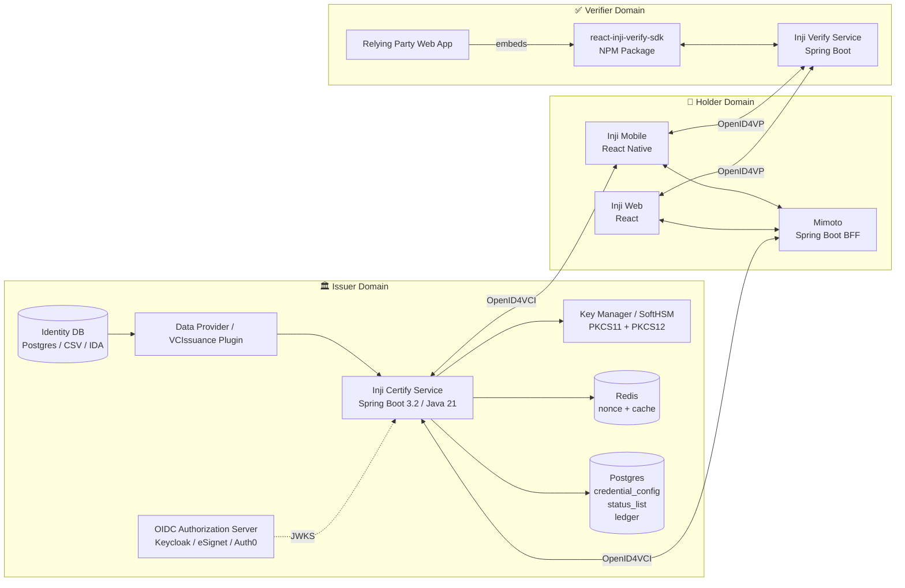

# MOSIP Inji — Local Development Workspace

A full-stack monorepo for developing, extending, and deploying the **MOSIP Inji Verifiable Credential stack**. It bundles the Inji Certify issuer service (Java/Spring Boot), a custom React portal frontend, a complete Docker Compose environment, and a comprehensive internal developer documentation suite.

> **Prerequisite reading:** [OpenID4VCI Draft 13](https://openid.net/specs/openid-4-verifiable-credential-issuance-1_0-ID1.html) · [W3C Verifiable Credentials Overview](https://www.w3.org/TR/vc-overview/)

---

## Table of Contents

- [Overview](#overview)
- [Repository Structure](#repository-structure)
- [Architecture](#architecture)
- [Technology Stack](#technology-stack)
- [Quick Start](#quick-start)
- [Frontend](#frontend)
- [Backend — Inji Certify](#backend--inji-certify)
- [Plugin System](#plugin-system)
- [Credential Formats](#credential-formats)
- [Deployment](#deployment)
- [Configuration](#configuration)
- [Developer Documentation](#developer-documentation)
- [API Reference](#api-reference)
- [Contributing](#contributing)
- [License](#license)

---

## Overview

**Inji** is MOSIP's open-standards Verifiable Credential (VC) ecosystem. This workspace focuses on the **Issuer** side of the Triangle of Trust:

```
Issuer  ──(OpenID4VCI)──▶  Holder Wallet  ──(OpenID4VP)──▶  Verifier
```

**Inji Certify** is an OpenID4VCI-compliant (Draft 13) credential issuer service. It:

- Issues credentials in **JSON-LD**, **SD-JWT**, and **mDoc/mDL** formats
- Connects to any identity data source via a **plugin architecture**
- Works with any OIDC-compliant Authorization Server (eSignet, Keycloak, Auth0, Okta, Azure AD)
- Supports both **Pre-Authorized Code Flow** and **Authorization Code Flow**

| Feature | Status |
|---|---|
| Issuer Metadata | ✅ |
| Access Token Validation | ✅ |
| Credential Issuance | ✅ |
| Credential Binding (DID keys) | ✅ |
| Credential Binding (JWT proof) | ✅ |
| JSON-LD VC Format (`ldp_vc`) | ✅ |
| SD-JWT VC Format (`vc+sd-jwt`) | ✅ |
| Revocation (JSON-LD) | ✅ |
| Pre-Authorized Code Flow | ✅ |
| Authorization Code Flow | ✅ |
| mDoc/mDL Format (full) | 🔜 Upcoming |

---

## Repository Structure

```
mosip's inji/
├── frontend/                        # React 19 + TanStack Start portal (Inji Certify UI)
│   ├── src/
│   │   ├── components/              # Reusable React components
│   │   ├── routes/                  # TanStack Router pages
│   │   ├── hooks/                   # Custom React hooks
│   │   ├── contexts/                # React Context state
│   │   ├── lib/                     # Utility helpers
│   │   └── types/                   # TypeScript type definitions
│   ├── vite.config.ts               # Vite + Cloudflare Workers config
│   ├── package.json                 # Dependencies (Bun)
│   └── wrangler.jsonc               # Cloudflare Workers config
│
├── inji-certify/                    # Spring Boot 3.2 issuer service (v0.14.0)
│   ├── certify-core/                # Shared DTOs, interfaces, constants
│   ├── certify-integration-api/     # Plugin SPI (DataProvider, VCIssuance, Audit)
│   ├── certify-service/             # Main application (controllers, services, entities)
│   │   └── src/main/java/io/mosip/certify/
│   │       ├── controller/          # REST endpoints
│   │       ├── services/            # Business logic
│   │       ├── entity/              # JPA entities
│   │       ├── credential/          # VC format implementations
│   │       ├── proof/               # JWT proof validators
│   │       └── plugin/              # Bundled mock plugin implementations
│   ├── db_scripts/                  # PostgreSQL DDL & seed scripts
│   ├── docker-compose/
│   │   └── docker-compose-injistack/ # Full local stack (Postgres, Nginx, services)
│   ├── helm/inji-certify/           # Kubernetes Helm chart
│   ├── docs/                        # Backend-specific documentation (26 files)
│   ├── setup-local.sh               # Automated local dev setup script
│   └── .github/workflows/           # GitHub Actions CI/CD pipelines
│
├── internal developer docs/         # 17-part comprehensive developer reference
│   ├── 01-Introduction-and-Overview.md
│   ├── 02-Architecture-and-Components.md
│   ├── 03-Sandbox-Exploration.md
│   ├── 04-Sample-Setup-Guide.md
│   ├── 05-Codebase-Exploration.md
│   ├── 06-Pre-Auth-Flow-Without-eSignet.md
│   ├── 07-Plugins-And-Modules.md
│   ├── 08-Modularity-Aspects.md
│   ├── 09-External-Data-Sources.md
│   ├── 10-Platform-Integration-Strategies.md
│   ├── 11-VC-Formats-and-Implementations.md
│   ├── 12-Inji-Verify-Integration.md
│   ├── 13-Inji-Wallet-Integration.md
│   ├── 14-API-Reference.md
│   ├── 15-Deployment-Guide.md
│   ├── 16-Troubleshooting-and-Best-Practices.md
│   └── 17-Glossary-and-References.md
│
├── INJI_CERTIFY_DOCS.md             # Spring Boot architecture guide (FastAPI → Spring Boot)
├── OID4VCI_PreAuthorized_Code_Flow.md # Pre-auth flow specification deep-dive
└── issuance.json                    # Sample issued credential (test fixture)
```

---

## Architecture



### Layered Request Flow

```
HTTP Request
    │
    ▼
AccessTokenValidationFilter  (JWT bearer token validation)
    │
    ▼
Controller Layer             (VCIssuanceController, WellKnownController, etc.)
    │
    ▼
Service Layer                (VCIssuanceServiceImpl, CertifyIssuanceServiceImpl)
    │
    ▼
Plugin Layer                 (DataProviderPlugin / VCIssuancePlugin)
    │
    ▼
CredentialFactory            (selects ldp_vc / vc+sd-jwt / mso_mdoc formatter)
    │
    ▼
ProofGenerator               (Ed25519Signature2020 / COSE signer)
    │
    ▼
Repository Layer             (LedgerRepository, CredentialConfigRepository)
    │
    ▼
PostgreSQL
```

---

## Technology Stack

| Layer | Technology |
|---|---|
| **Frontend Framework** | React 19.2.0 (TypeScript) |
| **Meta-Framework** | TanStack Start (Vite-based SSR) |
| **UI Components** | Radix UI + Tailwind CSS 4.2 |
| **Forms** | React Hook Form 7 + Zod 3 |
| **Data Fetching** | TanStack React Query 5 |
| **Routing** | TanStack React Router |
| **Edge Deployment** | Cloudflare Workers |
| **Package Manager** | Bun |
| **Backend Framework** | Spring Boot 3.2.3 |
| **Backend Language** | Java 21 |
| **Build Tool** | Maven 3 (multi-module) |
| **Database** | PostgreSQL (`inji_certify` schema) |
| **ORM** | JPA / Hibernate |
| **Caching** | Spring Cache → Redis or In-Memory |
| **Key Management** | SoftHSM / PKCS11 + PKCS12 keystores |
| **Template Engine** | Apache Velocity (VC rendering) |
| **Protocol** | OpenID4VCI Draft 13, OpenID4VP |
| **Containerization** | Docker + Docker Compose |
| **Orchestration** | Kubernetes + Helm |
| **Service Mesh** | Istio (VirtualService, Gateway) |
| **Monitoring** | Prometheus (ServiceMonitor) |
| **CI/CD** | GitHub Actions |
| **SAST** | GitHub CodeQL |
| **License** | Mozilla Public License 2.0 |

---

## Quick Start

### Option 1 — Docker Compose (Recommended)

The fastest way to run the complete Inji stack locally.

```bash
cd inji-certify/docker-compose/docker-compose-injistack

# Create required directories
mkdir -p data/CERTIFY_PKCS12 certs loader_path/certify

# Start the full stack (Postgres, Certify, Nginx, Mimoto)
docker compose up -d
```

See [docker-compose-injistack/README.md](./inji-certify/docker-compose/docker-compose-injistack/README.md) and [internal developer docs/04-Sample-Setup-Guide.md](./internal%20developer%20docs/04-Sample-Setup-Guide.md) for the complete walkthrough including Postman collection setup.

**Ports exposed by default:**

| Service | Port |
|---|---|
| Certify (via Nginx) | `8090` |
| Mimoto | `8099` |
| PostgreSQL | `5432` |

### Option 2 — Manual Local Setup

For debugging and deep codebase exploration.

```bash
cd inji-certify

# Run automated setup (creates DB schema, keystore, default config)
chmod +x setup-local.sh
./setup-local.sh

# Build all Maven modules
./mvnw clean install -DskipTests

# Start the service
./mvnw spring-boot:run -pl certify-service \
  -Dspring-boot.run.profiles=local
```

See [inji-certify/docs/Local-Development.md](./inji-certify/docs/Local-Development.md) for prerequisites and detailed steps.

---

## Frontend

A production-quality portal for interacting with Inji Certify — credential issuance, record management, verification, and a dashboard.

### Setup

```bash
cd frontend

# Install dependencies
bun install

# Start development server (proxies /api/certify → localhost:8090)
bun run dev

# Build for Cloudflare Workers production
bun run build

# Lint and format
bun run lint
bun run format
```

### Key Routes

| Route | Purpose |
|---|---|
| `/` | Landing page |
| `/_app/dashboard` | Issuance statistics dashboard |
| `/_app/issuance` | Issue a new credential |
| `/_app/credentials` | Credential management |
| `/_app/verify` | Credential verification |

### Proxy Configuration

Development proxying is configured in `vite.config.ts`:

```
/api/certify  →  http://localhost:8090
/api/verify   →  http://localhost:8095
```

### Production Deployment

The frontend deploys to **Cloudflare Workers** via `wrangler`. Configure `wrangler.jsonc` with your Cloudflare account details before deploying.

---

## Backend — Inji Certify

### Maven Multi-Module Structure

```
inji-certify/                    (parent POM — version 0.14.0)
├── certify-core/                Shared DTOs, constants, exception classes, cache config
├── certify-integration-api/     Plugin SPI contracts (DataProviderPlugin, VCIssuancePlugin, AuditPlugin)
└── certify-service/             Deployable Spring Boot application
```

### Key Packages (`certify-service/src/main/java/io/mosip/certify/`)

| Package | Responsibility |
|---|---|
| `controller/` | REST endpoints: VC issuance, `.well-known/*`, OAuth, pre-auth code, config, status, records |
| `services/` | Business logic orchestration |
| `credential/` | VC format implementations: `W3CJsonLD`, `SDJWT`, `MDocCredential`, `CredentialFactory` |
| `proof/` | JWT proof validation: `ProofValidatorFactory`, `JwtProofValidator` |
| `proofgenerators/` | Cryptographic signers: Ed25519Signature2020, COSE (mDoc) |
| `entity/` | JPA entities: `CredentialConfig`, `Ledger`, `PersonRecord`, `RenderingTemplate`, `StatusListCredential` |
| `filter/` | `AccessTokenValidationFilter` — JWT bearer token validation middleware |
| `plugin/` | Bundled mock plugin implementations for local dev |

### Database Schema

PostgreSQL database `inji_certify` with 5 tables:

| Table | Purpose |
|---|---|
| `credential_config` | Credential type definitions and schemas |
| `ledger` | Issuance audit trail |
| `person_record` | Identity data store (local data provider) |
| `rendering_template` | Velocity templates for VC rendering |
| `status_list_credential` | Revocation bitstring (StatusList2021) |

DDL scripts: [`inji-certify/db_scripts/inji_certify/`](./inji-certify/db_scripts/inji_certify/)

---

## Plugin System

Inji Certify is extended via **JARs implementing one of two plugin interfaces**:

### DataProviderPlugin

Certify fetches raw identity data; then **Certify builds, signs, and issues** the VC.

```java
public interface DataProviderPlugin {
    // Return raw claim data for the given subject identifier
    Map<String, Object> fetchData(String subjectId, List<String> requestedClaims);
}
```

Use when: you own the identity data and want Certify to handle all VC formatting and signing.

### VCIssuancePlugin

Certify acts as a **proxy** — your plugin returns a fully-formed, pre-signed VC.

```java
public interface VCIssuancePlugin {
    // Return a fully-signed VC string in the requested format
    String getVerifiableCredential(VCRequestDto vcRequestDto, String heldSubjectId, Map<String, Object> identityAttributes);
}
```

Use when: you have an existing system that already produces signed VCs and you just need OpenID4VCI wrapping.

### Bundled Plugin Integrations

| Plugin | Data Source | Format |
|---|---|---|
| MockCSVDataProviderPlugin | CSV file | JSON-LD |
| PostgresDataProviderPlugin | PostgreSQL table | JSON-LD / SD-JWT |
| MDocMockVCIssuancePlugin | Mock identity | mDoc/mDL |
| MOSIP IDA Plugin | MOSIP Identity API | JSON-LD |

### Deploying a Plugin

Plugins are distributed as JARs. Two deployment methods:

1. **Bundled image** — Use `inji-certify-with-plugins` Docker image (includes all official plugins)
2. **Runtime drop-in** — Place plugin JAR in `loader_path/certify/` directory

See [`internal developer docs/07-Plugins-And-Modules.md`](./internal%20developer%20docs/07-Plugins-And-Modules.md) for authoring and deployment details.

---

## Credential Formats

| Format ID | Standard | Description |
|---|---|---|
| `ldp_vc` | W3C VCDM 1.1/2.0 | JSON-LD with Linked Data Proof (Ed25519Signature2020) |
| `vc+sd-jwt` | IETF SD-JWT VC | Selective Disclosure JWT with holder binding |
| `mso_mdoc` | ISO 18013-5 | mDoc/mDL with COSE signing (mock today, full upcoming) |

VC rendering uses **Apache Velocity templates** stored in the `rendering_template` table. See [`inji-certify/docs/Rendering-Template.md`](./inji-certify/docs/Rendering-Template.md).

---

## Deployment

### Local Development (Docker Compose)

Runs the full Inji stack locally with PostgreSQL, Nginx reverse proxy, Certify, and Mimoto.

```bash
cd inji-certify/docker-compose/docker-compose-injistack
docker compose up -d
```

### Kubernetes (Production)

Helm chart at [`inji-certify/helm/inji-certify/`](./inji-certify/helm/inji-certify/) includes:

- `Deployment` with configurable replicas and resource limits
- `Service` (ClusterIP)
- Istio `VirtualService` and `Gateway` for ingress
- `ServiceMonitor` for Prometheus scraping
- `ServiceAccount` and `ClusterRoleBinding` for RBAC

```bash
helm install inji-certify ./inji-certify/helm/inji-certify \
  --namespace inji \
  --values my-values.yaml
```

Refer to [internal developer docs/15-Deployment-Guide.md](./internal%20developer%20docs/15-Deployment-Guide.md) for full Kubernetes deployment including hardening and custom plugin deployment.

### Upgrade Path

| From | To | Guide |
|---|---|---|
| 0.11.0 | 0.12.0 | [`docs/Migration-Guide-0.11.0-to-0.12.0.md`](./inji-certify/docs/Migration-Guide-0.11.0-to-0.12.0.md) |

---

## Configuration

### OIDC / Authorization Server

Certify validates access tokens by fetching JWKS from your OIDC provider. No eSignet dependency — any OAuth 2.0-compliant server works.

```properties
mosip.certify.authorization.url=https://your-keycloak/auth/realms/inji
mosip.certify.authn.issuer-uri=${mosip.certify.authorization.url}
mosip.certify.authn.jwk-set-uri=${mosip.certify.authorization.url}/protocol/openid-connect/certs
mosip.certify.identifier=${mosip.certify.domain.url}
mosip.certify.domain.url=https://your-certify-domain.example.com
```

See [`internal developer docs/06-Pre-Auth-Flow-Without-eSignet.md`](./internal%20developer%20docs/06-Pre-Auth-Flow-Without-eSignet.md) for the complete Keycloak integration guide.

### Environment-Specific Profiles

| File | Purpose |
|---|---|
| `application.properties` | Default (production-safe base config) |
| `application-local.properties` | Local development overrides |
| `application-dev.properties` | Dev environment config |

Activate with: `-Dspring-boot.run.profiles=local`

---

## Developer Documentation

This workspace ships a **17-part internal developer documentation suite** at [`internal developer docs/`](./internal%20developer%20docs/):

| # | Document | Audience |
|---|---|---|
| 01 | Introduction & Overview | All |
| 02 | Architecture & Components | Architects, Backend |
| 03 | Sandbox Exploration | All |
| 04 | Sample Setup Guide | DevOps, Backend |
| 05 | Codebase Exploration | Backend, Plugin Authors |
| 06 | Pre-Auth Flow Without eSignet | Backend |
| 07 | Plugins & Modules | Plugin Authors |
| 08 | Modularity Aspects | Architects |
| 09 | External Data Sources | Backend, Plugin Authors |
| 10 | Platform Integration Strategies | Architects, Backend |
| 11 | VC Formats & Implementations | Backend, Standards |
| 12 | Inji Verify Integration | Frontend |
| 13 | Inji Wallet Integration | Frontend, Backend |
| 14 | API Reference | All |
| 15 | Deployment Guide | DevOps |
| 16 | Troubleshooting & Best Practices | All |
| 17 | Glossary & References | All |

**Additional deep-dives:**
- [`INJI_CERTIFY_DOCS.md`](./INJI_CERTIFY_DOCS.md) — Spring Boot architecture guide for FastAPI/Python developers
- [`OID4VCI_PreAuthorized_Code_Flow.md`](./OID4VCI_PreAuthorized_Code_Flow.md) — Pre-authorized code flow specification

---

## API Reference

Base URL: `https://your-domain/v1/certify`

| Endpoint | Method | Description |
|---|---|---|
| `/.well-known/openid-credential-issuer` | GET | Issuer metadata discovery |
| `/.well-known/jwks.json` | GET | Public key set |
| `/issuance/credential` | POST | Issue a verifiable credential |
| `/issuance/credential_offer` | GET | Generate pre-auth credential offer |
| `/oauth/token` | POST | Token endpoint (pre-auth flow) |
| `/issuance/credential-configurations` | GET/POST | Manage credential type configs |
| `/issuance/status/{credentialId}` | GET | Credential status / revocation |
| `/system/info` | GET | Service health and version |

Interactive API docs: [Inji Certify on Stoplight](https://mosip.stoplight.io/docs/inji-certify) · OpenAPI spec: [`inji-certify/docs/inji-certify-openapi.yaml`](./inji-certify/docs/inji-certify-openapi.yaml)

Postman collection: [`inji-certify/docs/postman-collections/`](./inji-certify/docs/postman-collections/)

---

## CI/CD

| Workflow | Trigger | Action |
|---|---|---|
| `push-trigger.yml` | Push / PR / Release | Maven build → publish to Maven Central (OSSRH) with GPG signing → Slack notification |
| `chart-lint-publish.yml` | Push | Helm chart lint and publish |
| `codeql.yml` | Push / Schedule | Static Application Security Testing (SAST) |
| `manual-docker-build.yml` | Manual dispatch | Build and push Docker images |

---

## Contributing

Contributions are welcome.

- **Code contributions:** Follow the [MOSIP contribution guide](https://docs.inji.io/readme/contribution/code-contribution)
- **Issues & questions:** Post in the [MOSIP Community Forum](https://community.mosip.io/)
- **Standards:** Familiarize yourself with OpenID4VCI Draft 13 and W3C VCDM before submitting VC-format changes

---