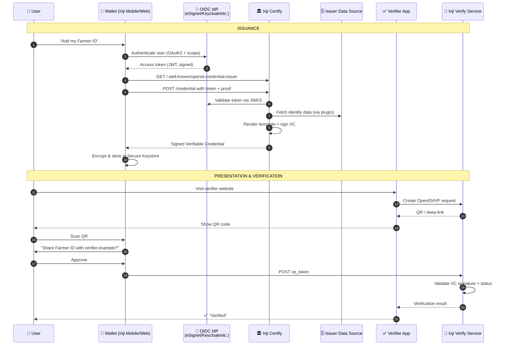
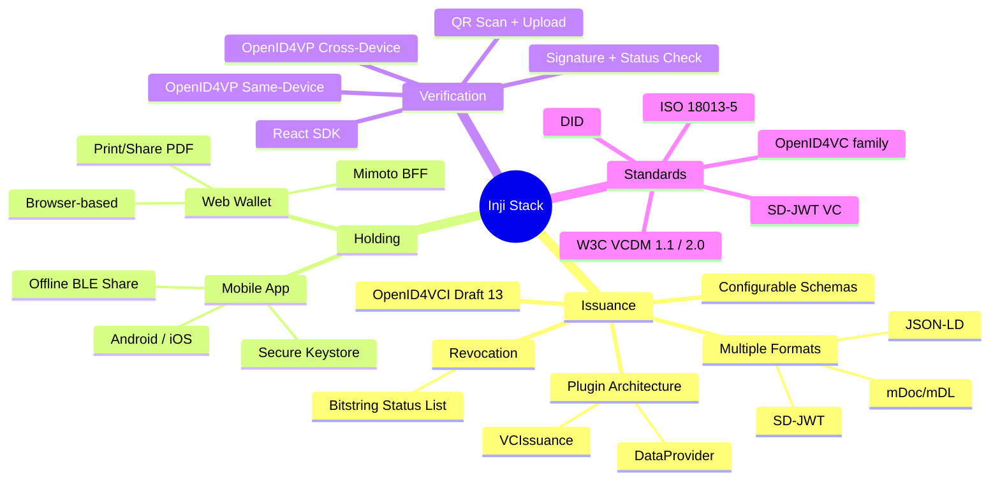

# 01 · Introduction & Overview

> The 30-minute conceptual primer. Read this before touching any code or YAML.

---

## 1.1 What is Inji?

**Inji** is MOSIP's open-source **Verifiable Credential (VC) stack**. It implements the *issuer → holder → verifier* triangle using globally adopted standards, and it ships three deployable products plus a constellation of supporting libraries.

A Verifiable Credential is a tamper-evident, cryptographically signed digital claim about a subject — a degree, a national ID, a vaccination record, a driver's licence. Unlike a paper certificate, a VC can be verified instantly, offline, by anyone, anywhere, without phoning the issuer.

> Inji's philosophy: **users hold their credentials, issuers sign them once, verifiers check cryptography — not a database.**

---

## 1.2 The Triangle of Trust

```mermaid
flowchart LR

    %% =========================================================
    %% Entities
    %% =========================================================

    I[🏛️ Issuer<br/><br/>Issues & signs Verifiable Credentials<br/>using issuer private key]

    H[👤 Holder Wallet<br/><br/>Stores VC securely<br/>and creates Verifiable Presentation]

    V[✅ Verifier<br/><br/>Validates credential authenticity,<br/>signature, expiry, and trust chain]

    K[(🔑 DID Document / JWKS<br/><br/>Issuer Public Keys)]

    %% =========================================================
    %% Issuance Flow
    %% =========================================================

    I -- "1️⃣ Credential Issuance<br/><br/>OpenID4VCI Flow<br/>• Authentication<br/>• Credential Offer<br/>• Signed VC Delivery" --> H

    %% =========================================================
    %% Presentation Flow
    %% =========================================================

    H -- "2️⃣ Credential Presentation<br/><br/>OpenID4VP Flow<br/>• Holder Consent<br/>• VP Creation<br/>• Selective Disclosure" --> V

    %% =========================================================
    %% Verification Flow
    %% =========================================================

    V -. "3️⃣ Public Key Resolution<br/><br/>Resolve DID / Fetch JWKS" .-> K

    K -. "4️⃣ Signature Verification<br/><br/>Validate issuer signature<br/>and credential integrity" .-> V

    %% =========================================================
    %% Styling
    %% =========================================================

    classDef entity fill:#EAF4FF,stroke:#0F62FE,stroke-width:2px,color:#111,font-weight:bold;
    classDef infra fill:#FFF7E6,stroke:#FF9900,stroke-width:2px,color:#111;

    class I,H,V entity;
    class K infra;
```

Three roles, three contracts, **no live runtime dependency between issuer and verifier**. That is the magic.

| Role | Inji Module | Repo |
|------|-------------|------|
| Issuer | **Inji Certify** | `inji/inji-certify` |
| Holder | **Inji Wallet** = *Inji Mobile* (Android/iOS) + *Inji Web* (browser) | `inji/inji-mobile`, `inji/inji-web` |
| Verifier | **Inji Verify** + `@mosip/react-inji-verify-sdk` | `inji/inji-verify` |
| BFF for wallets | **Mimoto** | `inji/mimoto` |

---

## 1.3 Why Verifiable Credentials Matter

| Pain Today | What VCs Solve |
|-----------|----------------|
| Verifying a degree means emailing the university registrar | Verifier checks the signature, done in milliseconds, even offline |
| Service providers store sensitive PII just to "verify it" | Holders share only what is needed (selective disclosure with SD-JWT / BBS) |
| Cross-border or cross-system verification breaks | W3C / OpenID standards make VCs portable across borders and wallets |
| Manual fraud checks are slow and error-prone | Cryptographic signatures are tamper-evident by design |

Concrete domains where Inji has been used or proposed:

| Domain | Sample Credential |
|--------|------------------|
| Healthcare | Immunization record, lab result, medical fitness |
| Education | Degree, training completion, learning record |
| Social welfare | Benefit eligibility, ration entitlement |
| Finance | KYC attestation, account opening claim |
| Mobility | Driving licence (mDL per ISO 18013-5), transport pass |
| Employment | Work permit, background check |

---

## 1.4 The Three Pillars in One Line Each

### 🏛️ Inji Certify — *Issue*
An **OpenID4VCI (draft 13) compliant** Spring Boot service that turns rows in your existing database (or VCs from another system) into signed Verifiable Credentials and delivers them to wallets over standard OAuth2 + HTTP.

### 👤 Inji Wallet — *Hold*
- **Inji Mobile**: Android + iOS native app for downloading, storing (in Secure Keystore), and presenting VCs. Offline-friendly via BLE.
- **Inji Web**: Browser-based wallet for users without smartphones; can also produce printable PDFs.

### ✅ Inji Verify — *Verify*
A verifier reference application plus a **React SDK** (`@mosip/react-inji-verify-sdk`) you embed in any relying-party site. Supports QR-code scanning, image upload, and the full **OpenID4VP** online-share flow (same-device and cross-device).

---

## 1.5 Lifecycle of a Credential

> Every arrow above is implemented over published standards — there is no proprietary protocol in this loop.

---

## 1.6 Standards Inji Adheres To

| Standard | Where in Inji |
|---------|----------------|
| **W3C Verifiable Credentials Data Model 1.1 & 2.0** | Certify's `ldp_vc` format |
| **OpenID for VC Issuance (OpenID4VCI) — Draft 13** | Certify's `/credential` endpoint, issuer metadata |
| **OpenID for VP (OpenID4VP) — Draft 23** | Inji Verify cross/same-device flow, `inji-openid4vp` libs |
| **IETF SD-JWT VC** | Certify's `vc+sd-jwt` format |
| **ISO/IEC 18013-5 — mDL/mDoc** | Certify's `mso_mdoc` format (mock today, full upcoming) |
| **Decentralized Identifiers (DID)** — `did:web`, `did:jwk` | Issuer identity, verifier client IDs |
| **W3C Bitstring Status List v1.0** | Revocation in Certify |
| **OAuth 2.0 / OIDC (RFC 6749, OpenID Core)** | Authentication for issuance |
| **Claim 169 (Selective Disclosure for JSON-LD)** | Privacy-preserving disclosure |

---

## 1.7 Inji's Key Capabilities — Quick Reference

---

## 1.8 What Inji is **Not**

To set expectations honestly:

- Inji is **not an identity wallet for cryptocurrencies**. It deals with credentials about people, not coins.
- Inji is **not a substitute for your foundational ID system**. It *consumes* identity from MOSIP (or any IdP) and turns claims into VCs.
- Inji Certify is **not an OAuth Authorization Server** by itself — it is an OAuth2 *resource server*. You bring your own IdP (eSignet, Keycloak, etc.).
- Inji is **not a closed ecosystem**. Wallets compliant with OpenID4VCI / OpenID4VP from third parties (EUDIW, Sphereon, Trinsic, etc.) can interoperate. Likewise, Certify can issue to non-Inji wallets.

---

## 1.9 Versioning & Maturity (as of this writing)

| Module | Current Stream | Status of Features |
|--------|----------------|-------------------|
| Inji Certify | 0.13.x / 0.14.x | Issuance, JSON-LD revocation, Pre-Auth Code flow ✅. mDoc/mDL full, Auth-code flow with redirect, CWT proof = coming |
| Inji Verify | 0.13.x / 0.14.x | OpenID4VP cross-device ✅, same-device ✅, SDK published on npm |
| Inji Wallet (Mobile) | 0.16.x+ | Production-grade, BLE share, multi-issuer |
| Mimoto | 0.19.x+ | BFF for Inji Web / Mobile |

> Always re-confirm against the `releases` page of each repository before pinning versions.

---

## 1.10 What's Next

Continue to **[02 · Architecture & Components](./02-Architecture-and-Components.md)** for the layered architecture, dependency diagrams, and how the pieces wire together at the code level.
