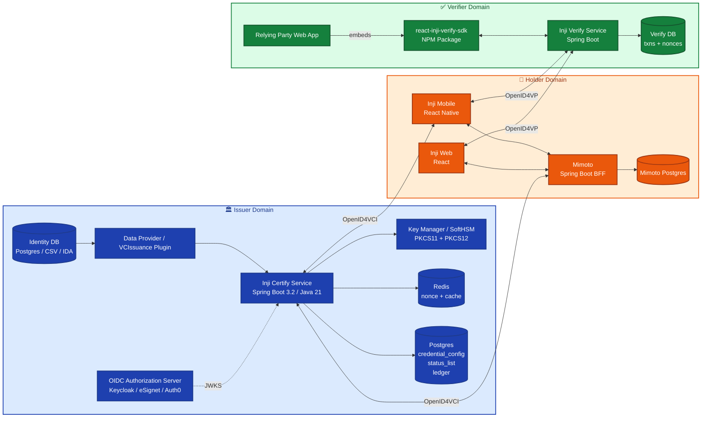
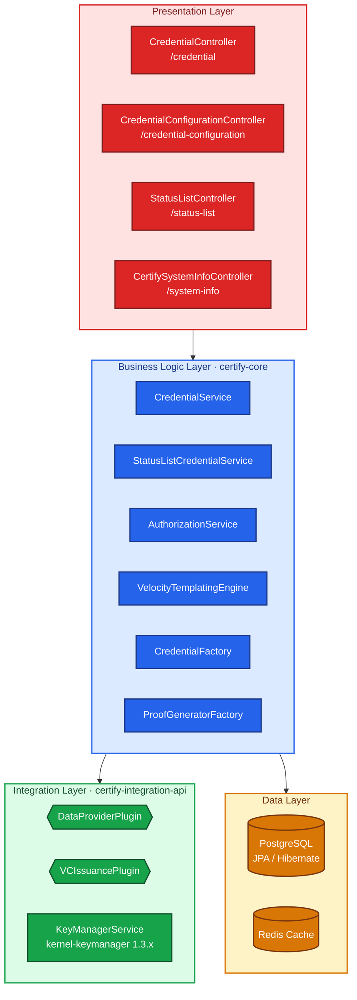
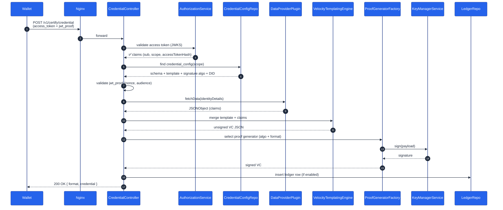
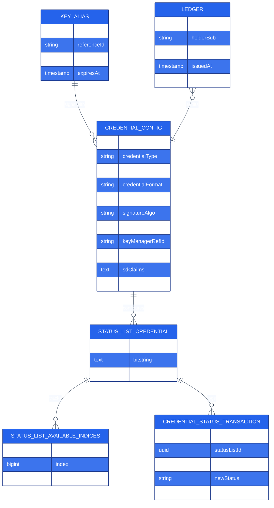
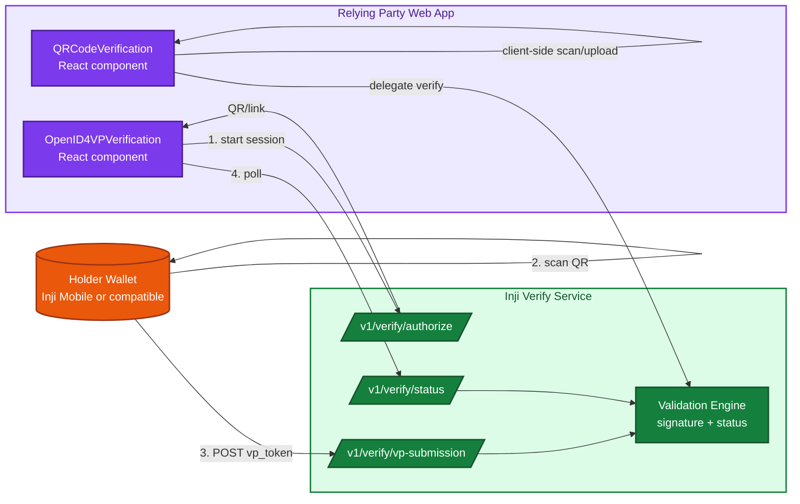
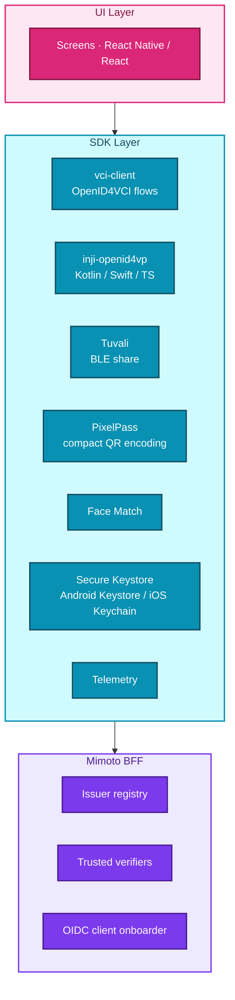
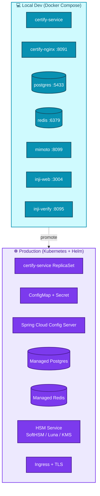

# 02 · Architecture & Components

> A code-level architecture tour. The Mermaid diagrams here are the canonical mental model that the rest of this documentation references.

---

## 2.1 The Big Picture

Inji is best understood as **three loosely coupled subsystems** that talk over standardized protocols.



---

## 2.2 Inji Certify — Layered Architecture

Certify follows a strict **four-layer** design with one-way dependencies.



### Module dependency

```
certify-integration-api  ← interfaces only (plugins compile against this)
        ▲
certify-core             ← services, repositories, templating
        ▲
certify-service          ← Spring Boot app, controllers, config
        ▲
certify-service-with-plugins  ← optional fat-image variant
```

Plugin JARs never have a compile dependency on `certify-service`. They only depend on `certify-integration-api`. This is what makes them swappable at runtime.

---

## 2.3 Inji Certify — Request Flow (Issuance, DataProvider mode)



For **VCIssuance** mode the flow is shorter: `CC → VCIssuancePlugin.getVerifiableCredential(...)` returns a *pre-signed* VC, Certify is just an OpenID4VCI proxy.

---

## 2.4 Technology Stack

### 2.4.1 Inji Certify

| Layer | Technology | Version (typical) |
|-------|-----------|-------------------|
| Language | Java | **21 (LTS)** |
| Framework | Spring Boot | **3.2.3** |
| Web | spring-boot-starter-web | 3.2.x |
| Persistence | Spring Data JPA + Hibernate | with HikariCP |
| DB | PostgreSQL | 14+ |
| Cache | Redis | 7.x (alpine) |
| Templating | Apache Velocity | 1.7 + velocity-tools-generic 3.1 |
| JWT/JWS | nimbus-jose-jwt | 9.41.2 |
| Crypto | Google Tink, BouncyCastle | 1.13.0 |
| SD-JWT | sd-jwt | 1.5 |
| HSM client | kernel-keymanager-service | 1.3.0-beta.5 |
| Distributed lock | ShedLock | 6.8.0 |
| Config | Spring Cloud Config | 2023.0.0 |
| JSON-B in Hibernate | hypersistence-utils-hibernate-63 | 3.9.9 |

### 2.4.2 Inji Verify (Service + SDK)

| Layer | Technology |
|-------|-----------|
| Backend service | Spring Boot (Java) |
| SDK | TypeScript + React 18.2.0 |
| Package | `@mosip/react-inji-verify-sdk` |
| QR engine | embedded camera + image upload (PNG/JPG/PDF) |

### 2.4.3 Inji Wallet

| Component | Technology |
|-----------|-----------|
| Inji Mobile | React Native (Android + iOS) |
| Inji Web | React (browser) |
| Mimoto BFF | Spring Boot (Java) |
| Secure Storage | Android Keystore / iOS Keychain |
| Offline share | Tuvali (BLE library) |
| VCI client | `vci-client` library |
| OpenID4VP | `inji-openid4vp-android-kotlin`, `inji-openid4vp-ios-swift` |

---

## 2.5 Cryptographic Algorithms Supported

| Algorithm | Key Type | Format | Notes |
|----------|----------|--------|-------|
| **EdDSA** | Ed25519 | `ldp_vc` (Ed25519Signature2020) | Recommended default, smallest signatures |
| **RS256** | RSA-2048 | `vc+sd-jwt`, `jwt_vc_json` | Universal compatibility |
| **ES256K** | secp256k1 | `vc+sd-jwt` | Ethereum / DID:key compatible |
| **ES256** | P-256 | `vc+sd-jwt`, `mso_mdoc` | FIPS-friendly |

All signing operations route through `KeyManagerService` which abstracts PKCS#12 (file-based) and PKCS#11 (HSM-based, e.g. SoftHSM/Luna/CloudHSM).

---

## 2.6 Database Schema (Certify) — High-Level



Initialization scripts live in `db_scripts/mosip_certify/` and are run by `deploy.sh`.

---

## 2.7 Inji Verify — High-Level Architecture



Two distinct components in the SDK:

| Component | Use case |
|-----------|---------|
| `OpenID4VPVerification` | Online sharing — generates a QR / deep link; wallet pushes VP to verifier |
| `QRCodeVerification` | Offline / static QR — verifier scans a QR/PDF that *contains* the VC |

---

## 2.8 Inji Wallet — Layered View



Each SDK below the wallet is an independent library you can use in your own non-Inji wallet:

- `vci-client` for OpenID4VCI flows
- `inji-openid4vp-android-kotlin` / `inji-openid4vp-ios-swift` for OpenID4VP wallet-side
- `tuvali` for BLE-based offline VC presentation
- `pixelpass` for compact QR encoding
- `secure-keystore` for native secure storage abstractions

---

## 2.9 Mimoto — What It Does

Mimoto is the **Backend-for-Frontend** that sits between Inji Web/Mobile and any number of issuers. It hides:

- OIDC client onboarding details (P12 keystores, partner keys)
- Multiple issuer well-known endpoints
- Wallet binding (BPP keys)
- Optional Google / social login for Inji Web

```
Inji Web/Mobile ⇄ Mimoto ⇄ [Issuer A, Issuer B, Issuer C, …]
```

Why does this matter? Because **you can run Mimoto and Inji Web alone, point them at *your* Certify (or even a third-party OpenID4VCI issuer), and skip Inji Mobile entirely.** That decoupling is by design.

---

## 2.10 Deployment Topologies



| Environment | Image |
|-------------|-------|
| Demo / dev | `mosipid/inji-certify-with-plugins:<version>` (bundles plugins) |
| Production | `mosipid/inji-certify:<version>` + custom plugin JARs mounted into `loader_path` |

Detailed setup is in [04 · Sample Setup](./04-Sample-Setup-Guide.md) and [15 · Deployment Guide](./15-Deployment-Guide.md).

---

## 2.11 Where to Look in the Source Tree

| You want to change … | Open this folder |
|----------------------|------------------|
| Issuer metadata / well-known | `certify-service/src/main/java/io/mosip/certify/controller/CertifyWellKnownController.java` |
| Credential issuance endpoint | `certify-service/.../controller/CredentialController.java` |
| Template processing | `certify-service/.../vcformatters/VelocityTemplatingEngineImpl.java` |
| Token validation | `certify-service/.../services/AuthorizationServiceImpl.java` |
| Plugin contracts | `certify-integration-api/src/main/java/io/mosip/certify/api/spi/` |
| Status list (revocation) | `certify-core/.../core/services/StatusListCredentialService*` |
| Default properties | `certify-service/src/main/resources/application-default.properties` |
| Docker config | `docker-compose/docker-compose-injistack/` |
| Helm charts | `helm/inji-certify/` |
| SQL migrations | `db_scripts/mosip_certify/` and `db_upgrade_script/` |

Detailed module walkthrough: [05 · Codebase Exploration](./05-Codebase-Exploration.md).

---

## 2.12 Architectural Decisions Worth Knowing

1. **Spring Boot 3 + Java 21** is non-negotiable. Plugins must compile to Java 21 bytecode or lower.
2. **`hibernate.ddl-auto=none`** — schema is managed by SQL scripts in `db_scripts/`. Don't expect Hibernate to migrate for you.
3. **JWT proofs are mandatory** for the OpenID4VCI `/credential` call. The wallet must produce a `jwt` proof bound to a one-time `c_nonce`.
4. **Templates are Velocity, stored in DB.** Editing a template is a SQL update, not a code change.
5. **Status lists are GZIP+base64url-encoded bitstrings** per W3C BSL v1.0, signed and re-signed by a scheduled batch job (`StatusListUpdateBatchJob` with `@SchedulerLock`).
6. **Plugin loading is classpath-scan based**, controlled by `mosip.certify.integration.scan-base-package`.

---

## 2.13 What's Next

Continue to **[03 · Sandbox Exploration](./03-Sandbox-Exploration.md)** to see all this running on MOSIP's public Collab environment without installing anything.
