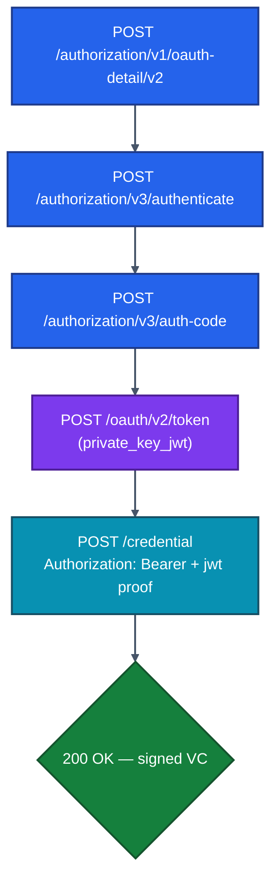

# 03 · Sandbox Exploration

> "I haven't installed anything yet, but I want to **see Inji running today**." This chapter walks you through the publicly hosted MOSIP Collab sandbox, what to click, what to expect, and the URLs/credentials needed.

---

## 3.1 What Is The MOSIP Collab Sandbox?

`*.collab.mosip.net` is a shared, ephemeral, **publicly hosted demo environment** maintained by MOSIP. It hosts working instances of every Inji module wired together with mock data. It is the fastest path from "I read the docs" to "I see a verified VC on my screen."

> ⚠️ Collab is **not** for load testing, real PII, or persistence. Data resets periodically. Treat it as a learning sandbox only.

### Key Sandbox URLs (as of writing — confirm in current docs)

| Module | URL | Purpose |
|--------|-----|---------|
| Inji Web (browser wallet) | `https://injiweb.collab.mosip.net` | Download VC into a browser wallet |
| Inji Certify (mock issuer) | `https://injicertify-mock.collab.mosip.net` | OpenID4VCI endpoints, well-known metadata |
| Inji Verify | `https://injiverify.collab.mosip.net` | Scan / upload VC, run OpenID4VP |
| eSignet (Auth Server) | `https://esignet.collab.mosip.net` | OIDC IdP backing Certify in this demo |
| Keycloak (alternate IdP) | `https://keycloak-26.collab.mosip.net/auth/realms/inji` | Used for the no-eSignet auth flow |

---

## 3.2 The End-to-End "First Run" Path


### Step-by-step

#### 1. Open Inji Web

Navigate to `https://injiweb.collab.mosip.net`. You will land on the **issuer selection** page. The available issuers come from Mimoto's `mimoto-issuers-config.json` deployed in Collab.

#### 2. Pick an Issuer

You'll typically see entries like *Mock Identity Provider*, *Farmer Card*, *MOSIP National ID*. Pick **"Mock IDA"** or similar.

#### 3. Authenticate

You'll be redirected to **eSignet**, the default OIDC IdP in Collab. Enter a known mock UIN such as:

- `5860356276` or `2154189532`

When prompted for an OTP, use the **mock OTP** `111111` (eSignet Collab is configured to accept this).

> *If you replace eSignet with Keycloak (see Chapter 06), the credentials are different and you'd see Keycloak's login screen instead. The downstream flow is identical from Inji Web's perspective.*

#### 4. VC Downloaded

Inji Web stores the VC client-side (or via Mimoto session) and you see the credential card displayed.

#### 5–8. Verify the VC

1. Open **`https://injiverify.collab.mosip.net`** in a separate tab / device.
2. Choose **"Online sharing"** (OpenID4VP flow). A QR code appears.
3. In Inji Web, open your VC and tap **"Share"** (or **"Scan & Share"**).
4. Scan the verifier's QR with Inji Web's QR scanner.
5. Approve the consent prompt.
6. The verifier page shows ✅ **Verified** along with the disclosed claims.

That is the **full Triangle of Trust executed in <2 minutes** without writing a line of code.

---

## 3.3 Things to Click, Things to Notice

While the demo runs, open dev-tools (F12) and watch the network traffic. You will see exactly the protocol exchanges from Chapter 02.

### Issuer-side requests to inspect

| Endpoint | What you're seeing |
|----------|--------------------|
| `GET /v1/certify/.well-known/openid-credential-issuer` | The issuer metadata — supported VC types, credential endpoint, formats, schemas |
| `GET /v1/certify/.well-known/did.json` | The issuer's DID document containing its public key |
| `POST /v1/certify/credential` | The actual VC issuance call (Authorization: Bearer …, body has `jwt` proof) |
| Token endpoint at eSignet/Keycloak | OAuth2 code → token exchange |

### Verifier-side requests to inspect

| Endpoint | What you're seeing |
|----------|--------------------|
| `POST /v1/verify/...authorize` | Verifier creates a presentation session |
| `POST /v1/verify/...vp-submission` | Wallet pushes `vp_token` + `presentation_submission` |
| `GET /v1/verify/...status?txnId=` | UI polls for the result |

### A sample issuer well-known response (shape)

```json
{
  "credential_issuer": "https://injicertify-mock.collab.mosip.net",
  "authorization_servers": ["https://esignet.collab.mosip.net"],
  "credential_endpoint": "https://injicertify-mock.collab.mosip.net/v1/certify/credential",
  "credential_configurations_supported": {
    "MockVerifiableCredential": {
      "format": "ldp_vc",
      "scope": "mosip_identity_vc_ldp",
      "credential_definition": {
        "@context": ["https://www.w3.org/ns/credentials/v2"],
        "type": ["VerifiableCredential", "MockVerifiableCredential"]
      },
      "proof_types_supported": {
        "jwt": { "proof_signing_alg_values_supported": ["RS256", "EdDSA"] }
      },
      "credential_signing_alg_values_supported": ["Ed25519Signature2020"]
    }
  }
}
```

This metadata file is the *entire wire contract* for an OpenID4VCI issuer. If you can read it, you can integrate.

---

## 3.4 The Postman Way (No UI Needed)

The repo ships ready-made Postman collections you can run against Collab without any UI:

```
inji-certify/docs/postman-collections/
├── inji-certify-with-mock-identity.postman_collection.json
├── inji-certify-with-mock-identity.postman_environment.json
├── inji-certify-with-keycloak.postman_collection.json
└── inji-certify-with-mdoc.postman_collection.json
```

Before importing:

1. Install **Postman**.
2. Install the **pmlib** Postman utility library (it is referenced inside collection scripts). Steps at https://joolfe.github.io/postman-util-lib/.
3. Import the collection + matching environment.
4. Adjust environment variables:
   - `authServerUrl` → `https://esignet.collab.mosip.net/v1/esignet` (or your IdP)
   - `aud` → token audience (matches issuer's well-known)
   - `clientId`, `privateKey_jwk`, `publicKey_jwk` → from an OIDC client you create in the IdP if using `private_key_jwt` auth.

### Typical request flow inside the collection



> **Tip:** every collection request has a pre-request script that generates the JWT proof on the fly using `pmlib`. Read those scripts — they are the exact algorithm a wallet must implement.

---

## 3.5 Exploring `well-known/openid-credential-issuer` Live

Open these URLs in a browser today (they should respond with JSON):

- `https://injicertify-mock.collab.mosip.net/v1/certify/.well-known/openid-credential-issuer`
- `https://injicertify-mock.collab.mosip.net/v1/certify/.well-known/did.json`

These are the foundational "discovery" endpoints. Treat them as the source of truth.

---

## 3.6 What You Have Learned by End of Sandbox

After spending 30–60 minutes in the sandbox you should be able to answer:

- [ ] Which URL serves the issuer metadata?
- [ ] What does a `jwt` proof look like in the `/credential` request body?
- [ ] How does the wallet know what scope to request from the IdP?
- [ ] What does the verifier's QR code actually encode? (Hint: an `openid4vp://` URL with `client_id`, `response_uri`, `presentation_definition` or `_uri`.)
- [ ] Where does the VC live after it's issued?

If yes to all — proceed to **[04 · Sample Setup](./04-Sample-Setup-Guide.md)** to run it on your own laptop.

---

## 3.7 Common Sandbox Gotchas

| Symptom | Cause / Fix |
|---------|-------------|
| Collab is slow or down | It's shared; retry or run locally (Chapter 04) |
| QR scan fails between two tabs on same device | Same-device flow requires `isSameDeviceFlowEnabled=true` or use two devices |
| `invalid_dpop_proof`-style errors | Clock skew between client and server; sync NTP |
| OTP `111111` rejected | eSignet config may have changed; check `https://docs.inji.io` releases page |
| CORS errors hitting Certify directly | Always go through the `certify-nginx` gateway (port 8091 / public URL), never `:8090` directly |
