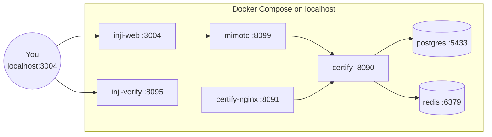

# 04 · Sample Setup Guide

> The pragmatic "what do I clone, what do I run" chapter. By the end of this you'll have **Inji Certify + Mimoto + Inji Web + Inji Verify** running on your laptop with mock data.

---

## 4.1 What You'll Build



All containers are on a shared Docker network, exposed at predictable ports. A single `docker-compose up -d` brings the whole thing online.

---

## 4.2 Prerequisites

| Tool | Minimum version | Note |
|------|-----------------|------|
| Docker | 26.0.0 | Engine + CLI |
| Docker Compose | 2.25 | The v2 plugin (`docker compose`) |
| Git | recent | To clone the repos |
| Git Bash (Windows) | recent | Scripts assume bash |
| GNU sed (macOS) | `brew install gnu-sed` | The bundled BSD `sed` won't work |
| A public hostname | optional but recommended | To host the issuer's DID document so wallets/verifiers can fetch it |

**Apple Silicon (M-series Mac) users**: prepend `export DOCKER_DEFAULT_PLATFORM=linux/amd64` to your shell *before* running compose. Inji images are not yet published for `linux/arm64`.

---

## 4.3 Clone the Repository

```bash
git clone https://github.com/inji/inji-certify.git
cd inji-certify
git checkout v0.13.1   # or latest stable tag
cd docker-compose/docker-compose-injistack
```

This directory is purposefully self-contained — the entire sandbox is here.

### What's in the directory

```
docker-compose-injistack/
├── docker-compose.yaml           # the whole stack
├── nginx.conf                    # routes /v1/certify, /.well-known/*
├── certify_init.sql              # seeds credential_config + key_alias
├── mimoto_init.sql               # seeds Mimoto issuer tables
│
├── certs/
│   └── oidckeystore.p12          # ← you place this (PKCS12 keystore)
│
├── data/
│   └── CERTIFY_PKCS12/           # ← runtime-generated p12 (auto-mkdir)
│
├── loader_path/
│   └── certify/                  # ← drop your custom plugin JARs here
│
├── config/
│   ├── certify-default.properties
│   ├── certify-csvdp-farmer.properties
│   ├── certify-mock-mdl.properties
│   ├── mimoto-default.properties
│   ├── mimoto-issuers-config.json
│   ├── mimoto-trusted-verifiers.json
│   ├── credential-template.html
│   └── farmer_identity_data.csv  # CSV plugin's input data
│
└── context/
    └── farmer.json               # JSON-LD context for FarmerCredential
```

---

## 4.4 Choose a Use Case

The repo ships with two ready-made use cases:

| Use case | `active_profile_env` | Config file | Plugin |
|----------|----------------------|-------------|--------|
| Farmer Identity Card (default) | `default,csvdp-farmer` | `certify-csvdp-farmer.properties` | `MockCSVDataProviderPlugin` (CSV) |
| Mobile Driving Licence (mDL) | `default,mock-mdl` | `certify-mock-mdl.properties` | `MDocMockVCIssuancePlugin` |

Set the active profile by editing `docker-compose.yaml`:

```yaml
services:
  certify:
    image: mosipid/inji-certify-with-plugins:0.13.1
    environment:
      - active_profile_env=default,csvdp-farmer   # ← change here
```

> **Note**: `inji-certify-with-plugins` already bundles the mock plugins. You only need to mount your own JAR into `loader_path/certify/` if you wrote a custom plugin.

---

## 4.5 (Recommended) Use the Bundled-Plugins Image

If you go with the default Farmer use case, no plugin work is needed. The image `mosipid/inji-certify-with-plugins:<version>` already has every reference plugin baked in.

To override:

```bash
mkdir -p loader_path/certify
cp /path/to/my-plugin-1.0.0.jar loader_path/certify/

# Then in docker-compose.yaml, uncomment the volume:
#  - ./loader_path/certify:/home/mosip/additional_jars/
```

---

## 4.6 Configure the Issuer DID

The wallet and verifier must be able to **fetch the issuer's public key** to verify VCs. That public key is hosted as a DID document at `<certify-nginx>/.well-known/did.json`.

You have two choices:

### Option A: Expose locally via ngrok (fastest)

```bash
ngrok http 8091
```

Note the assigned hostname (e.g. `https://abc123.ngrok-free.app`). Then edit `config/certify-csvdp-farmer.properties`:

```properties
mosip.certify.data-provider-plugin.did-url=did:web:abc123.ngrok-free.app
mosip.certify.identifier=https://abc123.ngrok-free.app
mosip.certify.domain.url=https://abc123.ngrok-free.app
mosipbox_public_url=https://abc123.ngrok-free.app
```

Also update `certify_init.sql` `credential_config.didUrl` to the same value.

### Option B: Host on GitHub Pages

1. `curl http://localhost:8091/.well-known/did.json > did.json` after the stack is up.
2. Commit `did.json` into a GitHub Pages site at `https://<user>.github.io/<repo>/.well-known/did.json`.
3. Use `did:web:<user>.github.io:<repo>` as the DID.

> 💡 The `didUrl` in the `credential_config` table is per-VC-type. `mosip.certify.data-provider-plugin.did-url` is the *issuer's* DID. Keep them the same unless you have a strong reason not to.

---

## 4.7 Configure the Authentication Service

The default compose points Certify at **eSignet Collab** for OIDC authentication. If you want to swap eSignet for **Keycloak (self-hosted)** or any other OIDC provider, see **[06 · Pre-Auth Flow Without eSignet](./06-Pre-Auth-Flow-Without-eSignet.md)** — it's a full chapter.

Default Collab eSignet values (in `certify-csvdp-farmer.properties`):

```properties
mosip.certify.authorization.url=https://esignet.collab.mosip.net
mosip.certify.authn.issuer-uri=${mosip.certify.authorization.url}/v1/esignet
mosip.certify.authn.jwk-set-uri=${mosip.certify.authorization.url}/.well-known/jwks.json
mosip.certify.authn.allowed-audiences=...
```

---

## 4.8 (Optional) Configure Inji Web Onboarding to Mimoto

Inji Web talks to Mimoto, and Mimoto authenticates to the issuer (eSignet/Keycloak) as an **OIDC client**. That requires a P12 keystore:

1. **Onboard Mimoto** as an OIDC client in your IdP (eSignet collection at `https://github.com/inji/mimoto/blob/master/docs/postman-collections` does this).
2. Download the resulting **PKCS12** file — typically named `oidckeystore.p12`.
3. Place it at `certs/oidckeystore.p12`.
4. In `docker-compose.yaml`, set:

```yaml
services:
  mimoto-service:
    environment:
      - oidc_p12_password=<your p12 password>
      - IDP_PARTNER_ENCRYPTION_KEY=<encryption key>
      - WALLET_BINDING_PARTNER_API_KEY=<wallet binding key>
```

> If you skip this, you can still test issuance directly via **Postman** but Inji Web won't work end-to-end.

---

## 4.9 Bring the Stack Up

```bash
docker network create mosip_network    # only the first time
docker compose up -d
```

Verify everything is up:

```bash
docker compose ps
```

You should see `certify`, `certify-nginx`, `database`, `redis`, `mimoto-service`, `inji-web` all in `running (healthy)` state. Inji Verify is **commented out by default** in `docker-compose.yaml` — uncomment it if you want the verifier locally.

### Health Endpoints

```bash
curl http://localhost:8090/v1/certify/actuator/health
curl http://localhost:8091/.well-known/did.json
curl http://localhost:8091/.well-known/openid-credential-issuer
```

The first should return `{"status":"UP"}`. The second should return a DID document. The third should return issuer metadata.

---

## 4.10 First Issuance — End-to-End

### Via UI

1. Open `http://localhost:3004` (Inji Web).
2. Pick the seeded issuer (Farmer / Agriculture Dept).
3. Authenticate. If using Collab eSignet, OTP `111111`. Use UIN `5860356276` or `2154189532` (these exist in the Collab mock IDA and in `farmer_identity_data.csv`).
4. Click **Continue as guest** for the fastest path (no Google login setup).
5. The Farmer Credential renders. Done.

### Via Postman

1. Import `inji-certify/docs/postman-collections/inji-certify-with-mock-identity.postman_collection.json` (and the matching `*environment.json`).
2. Install pmlib library in Postman.
3. Run the requests in the order listed in the collection.
4. The final `Get Credential` request returns a signed JSON-LD VC.

---

## 4.11 Anatomy of the Compose File

```yaml
version: "3.9"
services:
  database:
    image: postgres:latest
    ports: ["5433:5432"]
    environment:
      POSTGRES_PASSWORD: postgres
    volumes:
      - ./certify_init.sql:/docker-entrypoint-initdb.d/01-certify.sql
      - ./mimoto_init.sql:/docker-entrypoint-initdb.d/02-mimoto.sql

  redis:
    image: redis:alpine
    ports: ["6379:6379"]

  certify:
    image: mosipid/inji-certify-with-plugins:0.13.1
    environment:
      - active_profile_env=default,csvdp-farmer
      - spring_config_label_env=...
      - spring_config_name_env=certify-default
    volumes:
      - ./config:/home/mosip/config
      - ./data/CERTIFY_PKCS12:/home/mosip/certs
      # - ./loader_path/certify:/home/mosip/additional_jars/
    depends_on: [database, redis]

  certify-nginx:
    image: nginx:stable
    ports: ["8091:80"]
    volumes:
      - ./nginx.conf:/etc/nginx/conf.d/default.conf:ro

  mimoto-service:
    image: mosipid/mimoto:0.19.2
    ports: ["8099:8088"]
    environment:
      - oidc_p12_password=...
      - active_profile_env=default
    volumes:
      - ./certs:/home/mosip/certs:ro
      - ./config:/home/mosip/config

  inji-web:
    image: mosipid/inji-web:0.14.1
    ports: ["3004:3000"]
    environment:
      - MIMOTO_HOST=http://mimoto-service:8088
```

### NGINX directive cheat sheet

| Block | Purpose |
|-------|---------|
| `location /v1/certify/` | Proxies to `http://certify:8090/v1/certify/` |
| `location /.well-known/did.json` | Serves DID document |
| `location /.well-known/openid-credential-issuer` | Serves OpenID4VCI metadata |
| `add_header Access-Control-Allow-*` | Adds CORS headers (required for browser wallets) |
| `error_page 500 502 503 504` | Custom 50x page |

---

## 4.12 Quick Smoke-Test Checklist

After `docker compose up -d`:

- [ ] `docker compose ps` shows everything `Up`.
- [ ] `curl localhost:8090/v1/certify/actuator/health` → `UP`.
- [ ] `curl localhost:8091/.well-known/did.json` → valid JSON.
- [ ] `curl localhost:8091/.well-known/openid-credential-issuer` → `credential_configurations_supported` block present.
- [ ] `http://localhost:3004` loads Inji Web home page.
- [ ] A test issuance via Postman returns a signed VC.

If any of these fail — head to **[16 · Troubleshooting](./16-Troubleshooting-and-Best-Practices.md)**.

---

## 4.13 Tearing Down

```bash
docker compose down          # stop containers, keep volumes
docker compose down -v       # also delete volumes (resets DB)
```

For a *complete* clean: also remove `data/CERTIFY_PKCS12/` (which holds the auto-generated keys) so Certify regenerates fresh keys on next start.

---

## 4.14 What's Next

- For a deeper look at *what's actually in the source code*, go to **[05 · Codebase Exploration](./05-Codebase-Exploration.md)**.
- To swap eSignet for Keycloak, **[06 · Pre-Auth Flow Without eSignet](./06-Pre-Auth-Flow-Without-eSignet.md)**.
- To write your own plugin, **[07 · Plugins & Modules](./07-Plugins-And-Modules.md)**.
