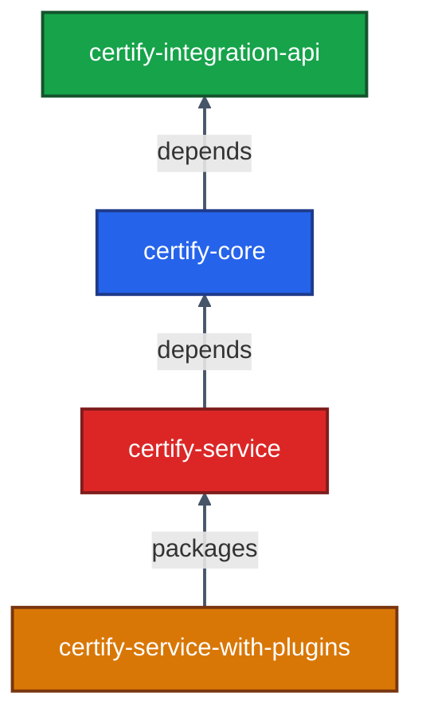

# 05 · Codebase Exploration

> A guided tour of the Inji Certify source tree (and pointers into the other repos). After this chapter you should know **where to put a breakpoint** for any flow.

---

## 5.1 Repositories at a Glance

| Repository | What lives here |
|-----------|-----------------|
| `inji/inji-certify` | Issuer service (Spring Boot) + Helm + Docker Compose |
| `inji/digital-credential-plugins` | Reference plugins (CSV, Postgres, MOSIP IDA, Sunbird RC, mock mDL) |
| `inji/inji-verify` | Verifier service + React SDK (`@mosip/react-inji-verify-sdk`) |
| `inji/inji-mobile` | Inji Mobile (React Native) |
| `inji/inji-web` | Inji Web wallet (React) |
| `inji/mimoto` | Backend-for-Frontend (Spring Boot) |
| `inji/inji-openid4vp` | Kotlin OpenID4VP library for Android wallets |
| `inji/inji-openid4vp-ios-swift` | Swift OpenID4VP library for iOS wallets |
| `inji/vci-client` | OpenID4VCI client library (used by wallets) |

This chapter focuses on **`inji-certify`** because it is the heart of the issuance stack and the most code-rich repo.

---

## 5.2 Top-Level Layout

```
inji-certify/
├── README.md
├── pom.xml                      ← parent POM, manages versions
│
├── certify-integration-api/     ← Module 1: PUBLIC plugin SPI
├── certify-core/                ← Module 2: business logic + repos
├── certify-service/             ← Module 3: Spring Boot deployable
├── certify-service-with-plugins/← Module 4: image that bundles plugins
│
├── api-test/                    ← Postman / TestNG api integration tests
├── db_scripts/mosip_certify/    ← canonical SQL schema
├── db_upgrade_script/           ← migration scripts between versions
├── docker-compose/              ← Compose stacks (injistack, etc.)
├── deploy/                      ← shell scripts used by Helm
├── docs/                        ← additional markdown docs
└── helm/inji-certify/           ← production Helm chart
```



**Why this split matters**: plugins compile against `certify-integration-api` *only*. They never see Spring or any internal class. This is what makes them runtime-pluggable.

---

## 5.3 Module 1 — `certify-integration-api`

The **public contract**. If you write a plugin, this is your only dependency.

Key types (under `io.mosip.certify.api.spi`):

```java
public interface DataProviderPlugin {
    JSONObject fetchData(Map<String, Object> identityDetails)
            throws DataProviderExchangeException;
}

public interface VCIssuancePlugin {
    VCResult<?> getVerifiableCredentialWithLinkedDataProof(
            VCRequestDto vcRequestDto, String holderId,
            Map<String, Object> identityDetails) throws VCIExchangeException;

    VCResult<?> getVerifiableCredential(
            VCRequestDto vcRequestDto, String holderId,
            Map<String, Object> identityDetails) throws VCIExchangeException;
}

public interface AuditPlugin { ... }
public interface KeyManagerService { ... }
```

Supporting DTOs (under `io.mosip.certify.api.dto`):

- `VCRequestDto` — what the wallet asked for (format, type, context, vct, doctype, claims).
- `VCResult<T>` — typed wrapper for the produced VC (string for JWT/SD-JWT, Map for JSON-LD).
- `VCIExchangeException`, `DataProviderExchangeException` — checked exceptions you throw from plugins.

> 🔧 **Plugin author rule of thumb**: depend on this module with `<scope>provided</scope>`. You are not packaging it.

---

## 5.4 Module 2 — `certify-core`

The **business logic** layer. No web concerns here.

```
certify-core/src/main/java/io/mosip/certify/core/
├── services/
│   ├── CredentialService.java
│   ├── StatusListCredentialService.java
│   ├── AuthorizationService.java
│   └── ...
├── repository/
│   ├── CredentialConfigRepository.java
│   ├── StatusListCredentialRepository.java
│   ├── LedgerRepository.java
│   └── ...
├── entity/
│   ├── CredentialConfig.java
│   ├── StatusListCredential.java
│   ├── Ledger.java
│   └── ...
├── proof/                    ← proof-of-possession & VC signing
├── config/PluginConfig.java  ← @Configuration that wires plugins
└── exception/CertifyException.java
```

Highlights:

| Class | Role |
|-------|------|
| `CredentialConfig` (entity) | Per-VC-type config: template, signature algo, DID URL, keyManager IDs, selective-disclosure paths |
| `CredentialService` | Orchestrates the issuance pipeline |
| `StatusListUpdateBatchJob` | `@Scheduled(fixedDelay=…)` with `@SchedulerLock` — updates W3C bitstring status lists |
| `VCFormatter` (interface) | Implemented by `VelocityTemplatingEngineImpl` in `certify-service` |

---

## 5.5 Module 3 — `certify-service` (the deployable)

This is the Spring Boot app. Entry point: `CertifyApplication`.

```
certify-service/src/main/java/io/mosip/certify/
├── CertifyApplication.java          ← @SpringBootApplication, main()
│
├── controller/
│   ├── CredentialController.java                ← POST /credential
│   ├── CredentialConfigurationController.java   ← CRUD for VC types
│   ├── StatusListController.java                ← GET /status-list/{id}
│   ├── CertifyWellKnownController.java          ← /.well-known/*
│   └── CertifySystemInfoController.java         ← health / cert info
│
├── services/
│   ├── CertifyIssuanceServiceImpl.java   ← @ConditionalOnProperty DataProvider
│   ├── VCIssuanceServiceImpl.java        ← @ConditionalOnProperty VCIssuance
│   └── AuthorizationServiceImpl.java     ← OAuth2 resource server logic
│
├── utils/
│   └── VCIssuanceUtil.java
│
├── vcformatters/
│   └── VelocityTemplatingEngineImpl.java        ← caches & runs Velocity
│
├── proof/
│   └── ProofGeneratorFactory.java
│
└── credential/
    └── CredentialFactory.java                   ← concrete VC instances
```

### `application*.properties` files

Located at `certify-service/src/main/resources/`:

- `application.properties` — base
- `application-local.properties` — your local overrides
- `application-default.properties` — what ships in production
- Profile-specific: `application-csvdp-farmer.properties`, `application-mock-mdl.properties`, …

> Active profile is set by env var `active_profile_env` in compose, or `SPRING_PROFILES_ACTIVE` standard.

### Two service implementations, mutually exclusive

```java
@Service
@ConditionalOnProperty(name = "mosip.certify.plugin-mode", havingValue = "DataProvider")
public class CertifyIssuanceServiceImpl { ... }

@Service
@ConditionalOnProperty(name = "mosip.certify.plugin-mode", havingValue = "VCIssuance")
public class VCIssuanceServiceImpl { ... }
```

This is why setting `mosip.certify.plugin-mode` is *the* first decision you make.

---

## 5.6 Module 4 — `certify-service-with-plugins`

A thin Maven module whose only purpose is to **download well-known plugin JARs at build time** and bake them into a Docker image. Look at its `pom.xml`:

```xml
<plugin>
  <artifactId>maven-dependency-plugin</artifactId>
  <executions>
    <execution>
      <goals><goal>copy</goal></goals>
      <configuration>
        <artifactItems>
          <artifactItem>
            <groupId>io.inji.certify.plugins</groupId>
            <artifactId>mock-certify-plugin</artifactId>
            <version>${plugins.version}</version>
          </artifactItem>
          <artifactItem>
            <groupId>io.inji.certify.plugins</groupId>
            <artifactId>postgres-dataprovider-plugin</artifactId>
            <version>${plugins.version}</version>
          </artifactItem>
          <artifactItem>
            <groupId>io.inji.certify.plugins</groupId>
            <artifactId>mosip-identity-certify-plugin</artifactId>
            <version>${plugins.version}</version>
          </artifactItem>
          <artifactItem>
            <groupId>io.inji.certify.plugins</groupId>
            <artifactId>sunbird-rc-certify-integration-impl</artifactId>
            <version>${plugins.version}</version>
          </artifactItem>
        </artifactItems>
        <outputDirectory>target/additional_jars</outputDirectory>
      </configuration>
    </execution>
  </executions>
</plugin>
```

The Dockerfile copies these into `/home/mosip/additional_jars/` which is on the Spring Boot `loader.path`.

---

## 5.7 The Spring Boot Launcher Trick

`certify-service`'s Dockerfile uses the **PropertiesLauncher** (Spring Boot's classpath-extension loader) so that JARs dropped into `loader.path` *after* the image is built are still discovered.

```dockerfile
ENV loader_path_env=/home/mosip/additional_jars/
ENV active_profile_env=default
CMD ["sh", "-c", "java -Dloader.path=${loader_path_env} \
    -Dspring.profiles.active=${active_profile_env} \
    org.springframework.boot.loader.PropertiesLauncher"]
```

This is the magic that lets you ship a single image and mount different plugin JARs in different environments. **Component scan** of plugin packages is configured via:

```properties
mosip.certify.integration.scan-base-package=io.mosip.certify.mock.integration,io.mosip.certify.mosipid
```

So plugins must:

1. Be in a package listed in `scan-base-package`.
2. Be annotated `@Component`.
3. Implement `DataProviderPlugin` or `VCIssuancePlugin`.

---

## 5.8 Database Scripts — `db_scripts/mosip_certify/`

```
db_scripts/mosip_certify/
├── deploy.sh                    ← run on container start
├── ddl/                         ← table definitions
│   ├── certify-credential_config.sql
│   ├── certify-status_list_credential.sql
│   ├── certify-status_list_available_indices.sql
│   ├── certify-credential_status_transaction.sql
│   ├── certify-ledger.sql
│   ├── certify-key_alias.sql
│   ├── certify-key_policy_def.sql
│   └── certify-ca_cert_store.sql
└── dml/                         ← seed data
```

Run `deploy.sh` against a fresh Postgres to create the schema, role, and seed default rows. The Docker Compose stack runs `certify_init.sql` automatically which does an equivalent setup.

---

## 5.9 Helm Chart — `helm/inji-certify/`

```
helm/inji-certify/
├── Chart.yaml
├── values.yaml
├── templates/
│   ├── deployment.yaml
│   ├── service.yaml
│   ├── configmap.yaml
│   ├── ingress.yaml
│   ├── secret.yaml
│   └── ...
└── README.md
```

Key `values.yaml` knobs:

| Key | Purpose |
|-----|---------|
| `image.repository` | `mosipid/inji-certify` or `mosipid/inji-certify-with-plugins` |
| `image.tag` | Version |
| `springConfig.activeProfile` | Profile string |
| `springConfig.label`, `name` | Spring Cloud Config refs |
| `db.host`, `db.port`, `db.name` | Postgres connection |
| `redis.host`, `redis.port` | Redis connection |
| `loaderPath` | Where additional plugin JARs are mounted |
| `keyManager.*` | HSM / PKCS11 config |

---

## 5.10 The `docs/` Folder Inside the Repo

The repo itself ships authoritative markdown docs that are sometimes more current than docs.inji.io:

| File | Topic |
|------|-------|
| `docs/Local-Development.md` | Run Certify without Docker |
| `docs/VCIssuance-vs-DataProvider.md` | Plugin decision guide |
| `docs/Custom-Plugin-K8s.md` | Deploy a custom plugin on K8s |
| `docs/Migration-Guide-0.11.0-to-0.12.0.md` | Version migration |
| `docs/postman-collections/` | Curated Postman collections |

When in doubt, *read the markdown in `docs/`*, not just docs.inji.io.

---

## 5.11 Code Reading Tour — "Trace an Issuance"

Set breakpoints in this order to follow a credential issuance:

1. **`CredentialController.getCredential(...)`** — entry point.
2. **`AuthorizationServiceImpl.validateAccessToken(...)`** — token + JWKS check.
3. **`CertifyIssuanceServiceImpl.getCredential(...)`** — orchestration.
4. **`CredentialConfigRepository.findFirstByCredentialTypeAndContext(...)`** — looks up the template + signing config.
5. **Your plugin's `fetchData(...)`** — your data fetch happens here.
6. **`VelocityTemplatingEngineImpl.format(...)`** — merges data with template.
7. **`ProofGeneratorFactory.get(...)`** — picks the right proof generator (`Ed25519Signature2020Generator`, etc.).
8. **`KeyManagerService.sign(...)`** — actual signing.
9. **`LedgerRepository.save(...)`** — audit row.
10. **Return path** back through controller as `CredentialResponse`.

---

## 5.12 Cross-Repo Code Reading

### Mimoto (`inji/mimoto`)

```
mimoto/
├── src/main/java/io/mosip/mimoto/
│   ├── controller/        ← REST API for Inji Web/Mobile
│   ├── service/
│   │   ├── IssuersService.java
│   │   ├── CredentialService.java
│   │   └── ...
│   └── dto/
├── resources/
│   ├── application-default.properties
│   ├── mimoto-issuers-config.json     ← issuer registry
│   └── mimoto-trusted-verifiers.json
└── docker-compose/        ← independent Mimoto compose
```

### Inji Verify (`inji/inji-verify`)

```
inji-verify/
├── verify-service/            ← Spring Boot backend
│   └── src/main/java/io/mosip/verify/
│       ├── controller/        ← /authorize, /vp-submission, /status
│       └── service/
├── inji-verify-sdk/           ← React TypeScript SDK
│   └── src/components/
│       ├── OpenID4VPVerification.tsx
│       └── QRCodeVerification.tsx
└── docker-compose/
```

### Inji Web (`inji/inji-web`)

Pure React. Talks to Mimoto over REST.

### Inji Mobile (`inji/inji-mobile`)

React Native; bundles native modules for Tuvali (BLE), Secure Keystore, Face Match, PixelPass.

---

## 5.13 What's Next

Now that you can navigate the source, the next two chapters are the highest-leverage:

- **[06 · Pre-Auth Flow Without eSignet](./06-Pre-Auth-Flow-Without-eSignet.md)** — properties, Keycloak realm setup, client config.
- **[07 · Plugins & Modules](./07-Plugins-And-Modules.md)** — how to extend Certify itself.
