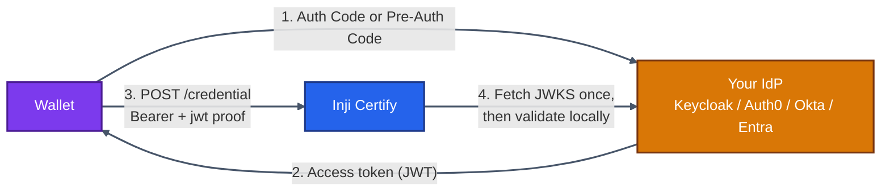
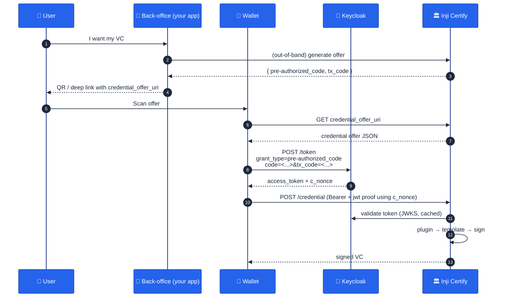
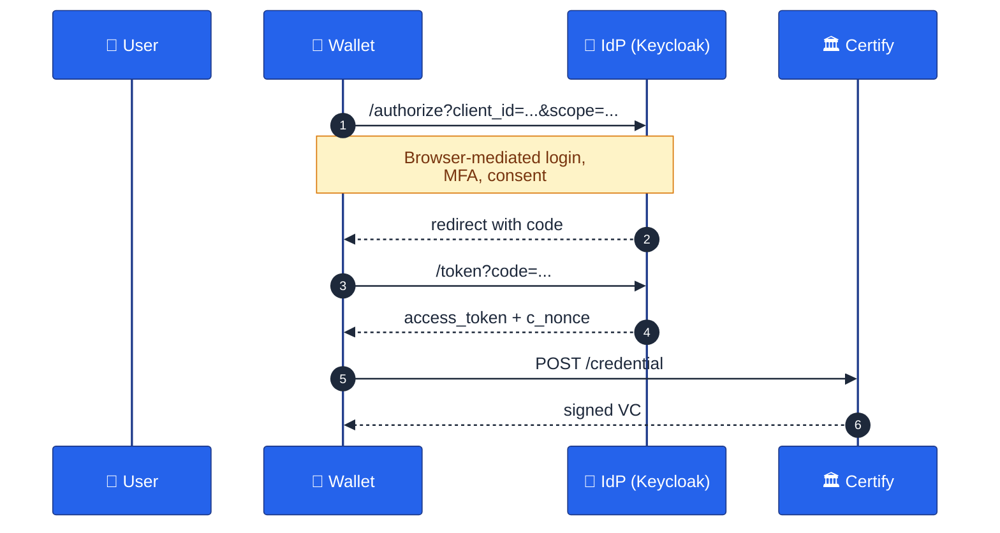

# 06 · Pre-Auth Flow Without eSignet

> **The most important chapter for teams running on existing infrastructure.** Inji Certify does not require eSignet. Any OAuth2 / OIDC compliant Authorization Server — **Keycloak, Auth0, Okta, Microsoft Entra ID, Ping, Authentik, your own** — can authenticate users for VC issuance. This chapter explains exactly how.

---

## 6.1 What "Pre-Auth Flow" Means Here

In OpenID4VCI vocabulary, two issuance flows are defined:

| Flow | Who initiates | When useful |
|------|--------------|-------------|
| **Authorization Code Flow** | User-agent (wallet) goes through the IdP's browser-based login | The classic "redirect to IdP, get a token" pattern |
| **Pre-Authorized Code Flow** | The issuer **pre-issues** a `pre-authorized_code` (often via a credential offer / deep link) and the wallet exchanges it for a token at the IdP without an interactive login | Onboarding flows, kiosks, scenarios where the user has already been authenticated by some other means |

This chapter covers **how to wire either flow against a non-eSignet OIDC provider**, with Keycloak as the worked example. The same property surface applies to any compliant OAuth2 AS.

---

## 6.2 What Certify Cares About (and Doesn't)

Certify is an **OAuth2 resource server**. It only cares about three things:

1. **Where to find the IdP's signing keys** (JWKS URI) so it can validate access tokens.
2. **What `iss` claim to expect** in incoming tokens.
3. **What `aud` claim to expect** in incoming tokens.

Everything else — interactive login, MFA, social federation, password reset — is your IdP's problem, not Certify's. That's the entire point of standards.



---

## 6.3 The Four Properties That Matter

Open `certify-default.properties` (or your profile-specific file). These are the **only** properties you must change to swap IdPs:

```properties
# 1) Where browser-based flows send the user for login/consent
mosip.certify.authorization.url=https://keycloak.example.com/auth/realms/inji

# 2) Expected 'iss' claim — the OIDC Issuer Identifier
mosip.certify.authn.issuer-uri=${mosip.certify.authorization.url}

# 3) Where the JWKS lives (Certify fetches this once at startup and caches)
mosip.certify.authn.jwk-set-uri=${mosip.certify.authorization.url}/protocol/openid-connect/certs

# 4) Expected 'aud' claim — your client's identifier
mosip.certify.identifier=https://injicertify.example.com
mosip.certify.domain.url=https://injicertify.example.com
```

All four are **standard OIDC discovery values**. You can find them at:

```
https://<your-idp-base>/.well-known/openid-configuration
```

| Discovery field | Maps to |
|----------------|---------|
| `authorization_endpoint` | `mosip.certify.authorization.url` (or just use the base) |
| `issuer` | `mosip.certify.authn.issuer-uri` |
| `jwks_uri` | `mosip.certify.authn.jwk-set-uri` |
| Your registered client's `audience` / `client_id` | `mosip.certify.identifier` |

---

## 6.4 Keycloak — End-to-End Worked Example

### 6.4.1 Run Keycloak locally

```bash
docker run -p 8080:8080 \
  -e KEYCLOAK_ADMIN=admin \
  -e KEYCLOAK_ADMIN_PASSWORD=admin \
  quay.io/keycloak/keycloak:26.0 start-dev
```

Open `http://localhost:8080`. Log in with `admin / admin`.

### 6.4.2 Create a Realm

1. Click the dropdown top-left → **Create Realm**.
2. Name: `inji`.
3. Save.


### 6.4.3 Create a Client (Wallet)

Clients → **Create client**:

| Field | Value |
|-------|-------|
| Client type | OpenID Connect |
| Client ID | `inji-wallet` |
| Client authentication | **On** (confidential client) — *or* **Off** for public PKCE-only wallets |
| Standard flow | ✅ enabled (Authorization Code) |
| Direct access grants | ✅ if you need ROPC for dev |
| Service accounts roles | ✅ for client-credential flows (optional) |
| Valid redirect URIs | `http://localhost:3004/*`, `openid4vci://*` |
| Web origins | `+` (echoes redirect origins) |

Save. Note the **client secret** (Credentials tab) if confidential.

### 6.4.4 Define a Scope for Verifiable Credentials

The wallet has to request a *scope* that Certify maps to a credential type.

Client scopes → **Create client scope**:

- Name: `mosip_identity_vc_ldp` (must match what your `credential_config.scope` column has)
- Type: Default
- Include in token scope: On

Then under your client → **Client scopes** → assign `mosip_identity_vc_ldp` as **Default** (so it always appears in access tokens).

### 6.4.5 Add an Audience Mapper

Certify validates `aud`. By default Keycloak access tokens have `aud=account`. You need to add Certify's identifier.

Client scopes → `mosip_identity_vc_ldp` → **Mappers** → Create:

- Mapper type: **Audience**
- Name: `inji-certify-audience`
- Included Client Audience: leave blank
- Included Custom Audience: `https://injicertify.example.com` (must match `mosip.certify.identifier`)
- Add to access token: On

### 6.4.6 (Optional) Add Custom Claims

If your `DataProviderPlugin` needs claims out of the access token (e.g. `sub`, `name`, custom `individual_id`), add corresponding **mappers** so they appear in the JWT.

Typical claims that flow through:

| Claim | Purpose in Certify |
|-------|-------------------|
| `sub` | Subject — passed to plugin as `identityDetails.get("sub")` |
| `scope` | Used to look up `credential_config` row |
| `accessTokenHash` | Bound to the wallet's `jwt` proof (server computes & compares) |

### 6.4.7 Create a Test User

Users → **Create user**:

- Username: `farmer1`
- Email: `farmer1@example.com`
- Set password under Credentials tab.

### 6.4.8 Point Certify at Keycloak

In `certify-csvdp-farmer.properties` (or your profile):

```properties
mosip.certify.authorization.url=http://host.docker.internal:8080/realms/inji
mosip.certify.authn.issuer-uri=${mosip.certify.authorization.url}
mosip.certify.authn.jwk-set-uri=${mosip.certify.authorization.url}/protocol/openid-connect/certs
mosip.certify.authn.allowed-audiences=https://injicertify.example.com
mosip.certify.identifier=https://injicertify.example.com
mosip.certify.domain.url=https://injicertify.example.com
```

> 🍎 On Docker Desktop (Mac/Windows) use `host.docker.internal`. On Linux, replace with the Docker bridge IP or use `extra_hosts: ['host.docker.internal:host-gateway']` in compose.

### 6.4.9 Restart Certify

```bash
docker compose up -d certify
docker compose logs -f certify  # watch for "Fetched JWKS from ..."
```

### 6.4.10 Test from a Wallet (or Postman)

#### Authorization Code Flow

```
GET http://localhost:8080/realms/inji/protocol/openid-connect/auth
  ?client_id=inji-wallet
  &response_type=code
  &scope=openid+mosip_identity_vc_ldp
  &redirect_uri=http://localhost:3004/callback
```

User logs in → Keycloak issues `code` → wallet exchanges for token at `/protocol/openid-connect/token` → wallet calls Certify's `/credential` with `Authorization: Bearer <access_token>` plus a JWT proof.

#### Pre-Authorized Code Flow

Your back-office issues a Credential Offer like:

```json
{
  "credential_issuer": "https://injicertify.example.com",
  "credential_configuration_ids": ["MockVerifiableCredential"],
  "grants": {
    "urn:ietf:params:oauth:grant-type:pre-authorized_code": {
      "pre-authorized_code": "<opaque>",
      "tx_code": { "input_mode": "numeric", "length": 6 }
    }
  }
}
```

Wallet calls Keycloak token endpoint with grant_type `urn:ietf:params:oauth:grant-type:pre-authorized_code`. Keycloak must be configured to accept this grant.

> ⚠️ Vanilla Keycloak does not yet natively support the OpenID4VCI pre-authorized code grant — you may need a custom **TokenExchange / Authenticator SPI** or use an IdP that does (eSignet does). If your wallet only uses the standard *Authorization Code* flow, vanilla Keycloak is enough.

---

## 6.5 Visualizing the Pre-Auth Code Flow



---

## 6.6 Authorization Code Flow Variant



---

## 6.7 Beyond Keycloak — Other Providers

The exact same four properties drive every other IdP. Use their `/.well-known/openid-configuration` to fill in the values.

### Auth0

```properties
mosip.certify.authorization.url=https://<tenant>.auth0.com
mosip.certify.authn.issuer-uri=https://<tenant>.auth0.com/
mosip.certify.authn.jwk-set-uri=https://<tenant>.auth0.com/.well-known/jwks.json
mosip.certify.identifier=https://api.injicertify.example.com
```

In Auth0, register an **API** with identifier `https://api.injicertify.example.com` and a **scope** of `mosip_identity_vc_ldp`.

### Okta

```properties
mosip.certify.authorization.url=https://<dev-...>.okta.com/oauth2/default
mosip.certify.authn.issuer-uri=https://<dev-...>.okta.com/oauth2/default
mosip.certify.authn.jwk-set-uri=https://<dev-...>.okta.com/oauth2/default/v1/keys
mosip.certify.identifier=api://inji-certify
```

### Microsoft Entra ID (Azure AD)

```properties
mosip.certify.authorization.url=https://login.microsoftonline.com/<tenant>/v2.0
mosip.certify.authn.issuer-uri=https://login.microsoftonline.com/<tenant>/v2.0
mosip.certify.authn.jwk-set-uri=https://login.microsoftonline.com/<tenant>/discovery/v2.0/keys
mosip.certify.identifier=api://<app-id>
```

Note: Entra access tokens are not always JWT (they can be opaque for Microsoft Graph). Force JWT by registering an **App Registration with custom scopes** and using `v2.0` endpoints.

### Authentik / FusionAuth / Zitadel / Curity / Ping

Same pattern. Read their discovery doc, fill the four properties, define a client with the required scope, add an audience mapper. Done.

---

## 6.8 Common Configuration Gotchas

| Symptom | Cause | Fix |
|---------|-------|-----|
| `401 invalid_token` | `iss` mismatch | Make sure `mosip.certify.authn.issuer-uri` exactly matches the `iss` claim. Note Keycloak's trailing slash inconsistencies between versions. |
| `401 invalid_token` | `aud` mismatch | Add an audience mapper that injects `mosip.certify.identifier` |
| `403 invalid_scope` | Scope not in token | Make the VC scope a **Default** client scope, not Optional |
| Long startup, `JwkException` | Certify can't reach JWKS | Network: confirm DNS, no proxy, container can reach IdP |
| JWKS cached forever even after key rotation | Old kid not refetched | Restart Certify or set `mosip.certify.authn.jwk-cache-ttl=PT5M` |
| `c_nonce` mismatch | Wallet didn't bind proof to nonce returned with token | Wallet bug; verify wallet receives `c_nonce` from token response and includes it in JWT proof |
| Clock skew errors | iat/exp out of tolerance | Run NTP; `mosip.certify.authn.clock-skew=PT1M` |

---

## 6.9 Disabling Authentication for Local Dev (NOT for prod)

For very early-stage prototyping you can put Certify in "permissive" mode by pointing it at a **mock JWKS** and relaxing audience validation. Strongly discouraged outside `localhost` because the only thing standing between the world and your signing key is the bearer token check.

```properties
mosip.certify.authn.disable-audience-check=true   # internal dev only
mosip.certify.authn.allowed-audiences=*           # internal dev only
```

If you find yourself doing this in production — stop and design a real IdP integration.

---

## 6.10 Quick Reference Cheat Sheet

```properties
# ALL the properties you typically touch when switching IdPs
mosip.certify.plugin-mode=DataProvider                # or VCIssuance
mosip.certify.authorization.url=<idp-base>
mosip.certify.authn.issuer-uri=<idp-iss-claim>
mosip.certify.authn.jwk-set-uri=<idp-jwks-url>
mosip.certify.authn.allowed-audiences=<your-aud>
mosip.certify.identifier=<your-aud>
mosip.certify.domain.url=<public-url-of-certify>
mosip.certify.integration.scan-base-package=<your-plugin-package>
mosip.certify.integration.data-provider-plugin=<bean-name-of-plugin>
mosip.certify.data-provider-plugin.did-url=did:web:<your-host>
mosip.certify.data-provider-plugin.vc-expiry-duration=P730D
```

---

## 6.11 What's Next

You now have an IdP-independent issuer running. The next chapter shows how to plug your own data and logic into it.

➡️ **[07 · Plugins & Modules](./07-Plugins-And-Modules.md)**
