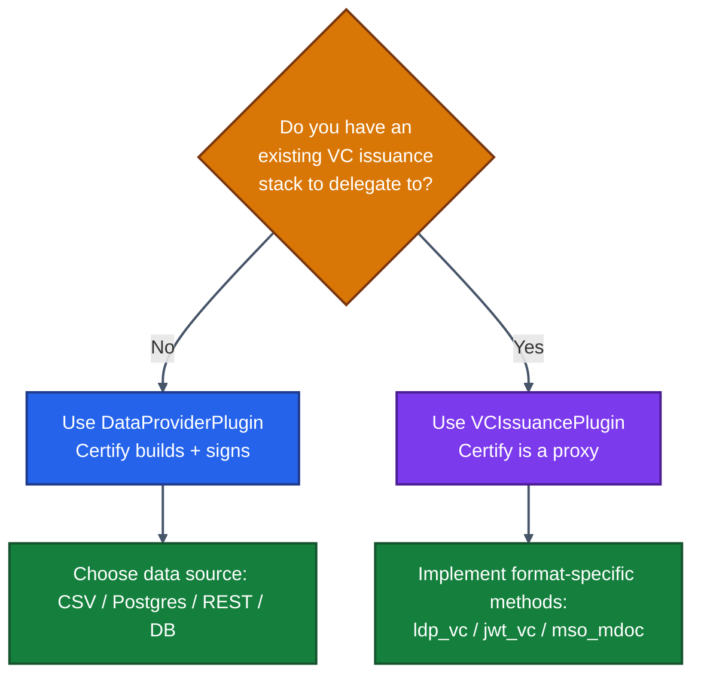
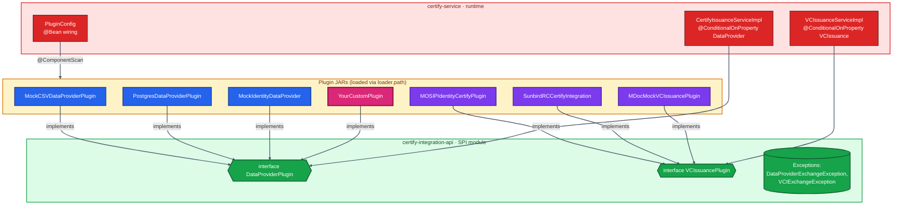

# 07 · Plugins & Modules — The Heart of Customization

> The single most impactful chapter of this manual. Almost every Inji deployment writes a plugin. This chapter explains the *why*, the *what*, and gives you a copy-pasteable *how*.

---

## 7.1 The Two Plugin Modes — Pick One

Inji Certify has exactly **two plugin contracts**, and they correspond to two operating modes:

| Plugin Type | What Certify does | What the plugin does | When to choose |
|-------------|-------------------|---------------------|----------------|
| **`DataProviderPlugin`** | Builds the VC, applies Velocity template, signs with KeyManager, manages status list, ledger | Fetches raw data and returns a `JSONObject` | You **don't already have** a VC issuance system, and you want Certify to do all the heavy lifting |
| **`VCIssuancePlugin`** | Acts as an OpenID4VCI proxy. Authn + delegation only | Returns a **pre-signed VC** from some external system | You **already have** a VC issuance system (MOSIP IDA, Sunbird RC, a partner registry) and just want OpenID4VCI conformance on top |

The mode is set by **a single property**:

```properties
mosip.certify.plugin-mode=DataProvider   # or VCIssuance
```



---

## 7.2 Side-by-Side Comparison

| Aspect | DataProviderPlugin | VCIssuancePlugin |
|--------|--------------------|-----------------|
| Service implementation | `CertifyIssuanceServiceImpl` | `VCIssuanceServiceImpl` |
| Plugin returns | Raw data (`JSONObject`) | Pre-formed signed VC (`VCResult<?>`) |
| Template processing | Yes — Velocity templates | No |
| Signing happens | In Certify, via `KeyManagerService` | In the plugin / external system |
| Status management | Certify manages bitstring status list | Limited — usually delegated to source |
| Format support | Certify-supported formats only | Plugin can produce any format it wants |
| Use cases | New credential types, full control | Federation, legacy adapter, mosipid plugin |

---

## 7.3 Architecture View of the Plugin System



---

## 7.4 Anatomy of `DataProviderPlugin`

### Interface (single method)

```java
package io.mosip.certify.api.spi;

public interface DataProviderPlugin {
    JSONObject fetchData(Map<String, Object> identityDetails)
            throws DataProviderExchangeException;
}
```

### What `identityDetails` contains

When Certify calls your plugin, the map contains claims pulled from the validated access token:

| Key | Type | Meaning |
|-----|------|---------|
| `sub` | `String` | Subject identifier from the IdP (e.g., user ID / PSU-ID) |
| `scope` | `String` | OAuth2 scope used to look up the `credential_config` row |
| `accessTokenHash` | `String` | Hash of the access token, used internally for binding |
| Other custom claims | varies | Any extra claims you mapped in your IdP (e.g., `individual_id`, `email`) |

### Returning data

The `JSONObject` you return is merged into a Velocity template stored in `credential_config.vcTemplate`. Every variable referenced in the template (e.g., `${fullName}`, `${dob}`, `${address.city}`) must be present in the JSONObject (or default to empty).

### Type-mapping cheat sheet

| Template syntax | JSONObject value type | Notes |
|----------------|----------------------|-------|
| `"${name}"` (quoted) | `String` | Template author quotes it explicitly |
| `${age}` (unquoted) | `Integer` / `Long` | Will render as a number literal |
| `${hobbies}` | `List<String>` | Renders as JSON array |
| `${address.city}` | `Map<String,Object>` | Nested access |
| `null` field | omit OR `JSONObject.NULL` | Don't put empty strings unless intended |

---

## 7.5 DataProviderPlugin — Worked Example (CSV)

**Goal**: read identity data from a CSV file keyed by `individual_id` claim, return as a `JSONObject`.

### Project structure

```
my-farmer-plugin/
├── pom.xml
└── src/main/java/com/example/certify/plugin/
    └── FarmerCsvPlugin.java
```

### `pom.xml` (extract)

```xml
<dependencies>
  <dependency>
    <groupId>io.mosip.certify</groupId>
    <artifactId>certify-integration-api</artifactId>
    <version>0.13.1</version>
    <scope>provided</scope>      <!-- IMPORTANT -->
  </dependency>
  <dependency>
    <groupId>org.springframework</groupId>
    <artifactId>spring-context</artifactId>
    <version>6.1.3</version>
    <scope>provided</scope>
  </dependency>
  <dependency>
    <groupId>com.opencsv</groupId>
    <artifactId>opencsv</artifactId>
    <version>5.9</version>
  </dependency>
</dependencies>
```

### `FarmerCsvPlugin.java`

```java
package com.example.certify.plugin;

import io.mosip.certify.api.spi.DataProviderPlugin;
import io.mosip.certify.api.exception.DataProviderExchangeException;
import org.json.JSONObject;
import org.springframework.beans.factory.annotation.Value;
import org.springframework.stereotype.Component;
import java.nio.file.*;
import java.util.*;

@Component("FarmerCsvPlugin")    // matches mosip.certify.integration.data-provider-plugin
public class FarmerCsvPlugin implements DataProviderPlugin {

    @Value("${plugin.farmer.csv.path:/home/mosip/data/farmers.csv}")
    private String csvPath;

    @Override
    public JSONObject fetchData(Map<String, Object> identityDetails)
            throws DataProviderExchangeException {
        try {
            String individualId = (String) identityDetails.get("sub"); // or custom claim
            List<String> rows = Files.readAllLines(Paths.get(csvPath));
            String header = rows.get(0);
            String[] cols = header.split(",");

            for (String row : rows.subList(1, rows.size())) {
                String[] vals = row.split(",");
                if (vals[0].equals(individualId)) {
                    JSONObject out = new JSONObject();
                    for (int i = 0; i < cols.length; i++)
                        out.put(cols[i].trim(), vals[i].trim());
                    return out;
                }
            }
            throw new DataProviderExchangeException("FARMER_NOT_FOUND");
        } catch (Exception e) {
            throw new DataProviderExchangeException("CSV_READ_FAILED", e);
        }
    }
}
```

### Build & deploy

```bash
mvn package
# →  target/my-farmer-plugin-1.0.0.jar

cp target/my-farmer-plugin-1.0.0.jar \
   /path/to/docker-compose-injistack/loader_path/certify/
```

In `docker-compose.yaml`, uncomment the volume mount:

```yaml
volumes:
  - ./loader_path/certify:/home/mosip/additional_jars/
```

In `certify-csvdp-farmer.properties`:

```properties
mosip.certify.plugin-mode=DataProvider
mosip.certify.integration.scan-base-package=com.example.certify.plugin
mosip.certify.integration.data-provider-plugin=FarmerCsvPlugin
plugin.farmer.csv.path=/home/mosip/data/farmers.csv
```

Restart `certify`. Run the Postman flow. You should see your farmer's data inside the issued VC.

---

## 7.6 Anatomy of `VCIssuancePlugin`

### Interface (two methods)

```java
package io.mosip.certify.api.spi;

public interface VCIssuancePlugin {

    /** For 'ldp_vc' format */
    VCResult<JsonLDObject> getVerifiableCredentialWithLinkedDataProof(
            VCRequestDto vcRequestDto,
            String holderId,
            Map<String, Object> identityDetails) throws VCIExchangeException;

    /** For 'jwt_vc_json', 'jwt_vc_json-ld', 'mso_mdoc' */
    VCResult<String> getVerifiableCredential(
            VCRequestDto vcRequestDto,
            String holderId,
            Map<String, Object> identityDetails) throws VCIExchangeException;
}
```

### `VCRequestDto` fields

| Field | Format relevance |
|-------|------------------|
| `format` | `ldp_vc`, `jwt_vc_json`, `vc+sd-jwt`, `mso_mdoc` |
| `type` | List of VC types (e.g. `["VerifiableCredential","DriverLicence"]`) |
| `context` | JSON-LD contexts |
| `credentialSubject` | Subject claim filters from wallet |
| `vct` | SD-JWT type identifier |
| `doctype` | mDL document type, e.g., `org.iso.18013.5.1.mDL` |
| `claims` | mDL claims subset |

---

## 7.7 VCIssuancePlugin — Worked Example (REST adapter to legacy VC service)

```java
package com.example.certify.plugin;

import io.mosip.certify.api.spi.VCIssuancePlugin;
import io.mosip.certify.api.dto.VCRequestDto;
import io.mosip.certify.api.dto.VCResult;
import io.mosip.certify.api.exception.VCIExchangeException;
import foundation.identity.jsonld.JsonLDObject;
import org.springframework.beans.factory.annotation.Value;
import org.springframework.stereotype.Component;
import org.springframework.web.client.RestTemplate;
import java.util.Map;

@Component("LegacyVCProxyPlugin")
public class LegacyVCProxyPlugin implements VCIssuancePlugin {

    @Value("${plugin.legacy.url}")
    private String legacyUrl;

    private final RestTemplate rest = new RestTemplate();

    @Override
    public VCResult<JsonLDObject> getVerifiableCredentialWithLinkedDataProof(
            VCRequestDto req, String holderId, Map<String, Object> claims)
            throws VCIExchangeException {
        try {
            // Build outgoing call to your legacy stack
            Map<String, Object> body = Map.of(
                "subject", claims.get("sub"),
                "type", req.getType(),
                "holderDid", holderId
            );
            // Returns a pre-signed JSON-LD VC
            Map response = rest.postForObject(legacyUrl + "/vc/ldp", body, Map.class);
            JsonLDObject vc = JsonLDObject.fromJsonObject(response);

            VCResult<JsonLDObject> result = new VCResult<>();
            result.setCredential(vc);
            result.setFormat("ldp_vc");
            return result;
        } catch (Exception e) {
            throw new VCIExchangeException("LEGACY_BACKEND_FAILED");
        }
    }

    @Override
    public VCResult<String> getVerifiableCredential(VCRequestDto req, String holderId, Map<String, Object> claims) throws VCIExchangeException {
        // Implement for jwt_vc_json, mso_mdoc, etc., similarly
        throw new VCIExchangeException("UNSUPPORTED_FORMAT");
    }
}
```

In properties:

```properties
mosip.certify.plugin-mode=VCIssuance
mosip.certify.integration.scan-base-package=com.example.certify.plugin
mosip.certify.integration.vci-plugin=LegacyVCProxyPlugin
plugin.legacy.url=https://legacy.internal.example.com
```

---

## 7.8 Plugin Deployment Patterns

### Pattern A — Use the bundled image

`mosipid/inji-certify-with-plugins:<version>` already ships with **all five reference plugins**:

- `mock-certify-plugin` (Mock CSV + Mock VC + Mock mDL)
- `postgres-dataprovider-plugin`
- `mosip-identity-certify-plugin`
- `sunbird-rc-certify-integration-impl`

Just toggle profiles. Zero packaging needed.

### Pattern B — Mount a custom JAR (Docker Compose)

```yaml
services:
  certify:
    image: mosipid/inji-certify:0.13.1
    volumes:
      - ./loader_path/certify:/home/mosip/additional_jars/
    environment:
      - active_profile_env=default,my-profile
```

### Pattern C — Build a custom Docker image

```dockerfile
FROM mosipid/inji-certify:0.13.1
COPY my-plugin-1.0.0.jar /home/mosip/additional_jars/
```

### Pattern D — Kubernetes ConfigMap (for small plugins) or PVC + InitContainer

```yaml
# ConfigMap mount (simplest, for small JARs)
apiVersion: v1
kind: ConfigMap
binaryData:
  my-plugin-1.0.0.jar: <base64-jar>
---
# In deployment:
volumeMounts:
  - name: plugins
    mountPath: /home/mosip/additional_jars
volumes:
  - name: plugins
    configMap:
      name: certify-plugins
```

For larger or many plugins, use a PVC populated by an InitContainer pulling from your artifact registry. See `docs/Custom-Plugin-K8s.md` in the repo.

---

## 7.9 The Five Reference Plugins (What They Are For)

| Plugin | Source repo path | Mode | What it does |
|--------|------------------|------|--------------|
| `MockCSVDataProviderPlugin` | `digital-credential-plugins/mock-certify-plugin` | DataProvider | Reads identity from a CSV file. Great for demos. |
| `MockIdentityDataProvider` | same | DataProvider | Generates synthetic data in memory. For tests. |
| `MockVCIssuancePlugin` | same | VCIssuance | Returns canned VCs. For wallet testing. |
| `MDocMockVCIssuancePlugin` | same | VCIssuance | Returns mock mDL/mDoc credentials |
| `PostgresDataProviderPlugin` | `digital-credential-plugins/postgres-dataprovider-plugin` | DataProvider | Runs configurable SQL per scope. **The most production-ready reference.** |
| `MOSIPIdentityCertifyPlugin` | `digital-credential-plugins/mosip-identity-certify-plugin` | VCIssuance | Adapts MOSIP IDA (auth + e-KYC) → OpenID4VCI |
| `SunbirdRCCertifyIntegration` | `digital-credential-plugins/sunbird-rc-certify-integration-impl` | VCIssuance | Fetches VCs from Sunbird Registry |

> 📚 The **`postgres-dataprovider-plugin` is the gold-standard reference** for production. Read its source line-by-line before writing your own DB plugin.

---

## 7.10 The Postgres Plugin — Worth a Special Mention

This plugin maps each OAuth2 scope to a parameterized SQL query that runs against your existing operational database. No app code changes, no ETL, no replication.

```properties
# Generic data source settings
plugin.postgres.url=jdbc:postgresql://land-reg-db:5432/land
plugin.postgres.username=land_ro
plugin.postgres.password=secret

# Map scope → SQL
plugin.postgres.scope.land_record_vc=SELECT * FROM land_records WHERE owner_id = :sub
plugin.postgres.scope.farmer_id_vc=SELECT * FROM farmers WHERE national_id = :sub
```

This is the **most powerful pattern for legacy integration**. Your land-registry team doesn't even know they're now issuing VCs — Certify is just running a SQL query.

---

## 7.11 The Velocity Template Engine

The template that turns plugin output into a credential lives in the database, in `credential_config.vcTemplate` (base64-encoded).

A typical template for `ldp_vc`:

```velocity
{
  "@context": [
    "https://www.w3.org/ns/credentials/v2",
    "https://example.com/contexts/farmer.json"
  ],
  "type": ["VerifiableCredential", "FarmerCredential"],
  "issuer": "${_issuer}",
  "validFrom": "${validFrom}",
  "validUntil": "${validUntil}",
  "credentialSubject": {
    "id": "${_holderId}",
    "fullName": "${fullName}",
    "dob": "${dob}",
    "farmId": "${farmId}",
    "landArea": ${landArea}
  },
  "credentialStatus": ${_statusList}
}
```

Reserved variables (auto-injected by Certify, not from your plugin):

| Variable | Provided by Certify |
|----------|--------------------|
| `${_issuer}` | DID URL from `credential_config.didUrl` |
| `${_holderId}` | `cnf` from JWT proof or random UUID |
| `${validFrom}`, `${validUntil}` | Now + `vc-expiry-duration` |
| `${_statusList}` | Bitstring status list entry (if status enabled) |
| `${_renderMethodSVGdigest}` | SVG render-method digest (VCDM 2.0) |

---

## 7.12 Validation Checklist Before Going Live

- [ ] Plugin implements correct interface
- [ ] Plugin is `@Component`-annotated
- [ ] Plugin's package is in `mosip.certify.integration.scan-base-package`
- [ ] Bean name matches `mosip.certify.integration.data-provider-plugin` (or `vci-plugin`)
- [ ] All template variables produced
- [ ] Numeric fields are numbers, not strings
- [ ] Exception path uses `DataProviderExchangeException` / `VCIExchangeException`
- [ ] No Spring web / JPA classes leak into plugin (use `provided` scope)
- [ ] JAR compiled to Java 21
- [ ] Loaded via `loader.path`; container restart picks it up
- [ ] Unit + integration tests cover happy and error paths

---

## 7.13 Troubleshooting Plugin Loading

| Symptom | Likely cause |
|---------|--------------|
| `No qualifying bean of type 'DataProviderPlugin'` | Bean name mismatch or `@Component` missing |
| `ClassNotFoundException` | JAR not on `loader.path` — check container volume mount |
| Plugin loads but never called | Wrong `plugin-mode` set (DataProvider vs VCIssuance) |
| `Variable 'X' is undefined` (Velocity) | Plugin JSONObject is missing a key referenced by template |
| `NoSuchMethodError` | Plugin compiled against a different `certify-integration-api` version. Rebuild against the deployed version. |
| Sudden `NullPointerException` in proof generator | Numeric value supplied as string in JSONObject |

---

## 7.14 What's Next

The next chapter zooms out: **how to consume Inji modules independently** so you can mix-and-match instead of swallowing the whole stack.

➡️ **[08 · Modularity Aspects](./08-Modularity-Aspects.md)**
