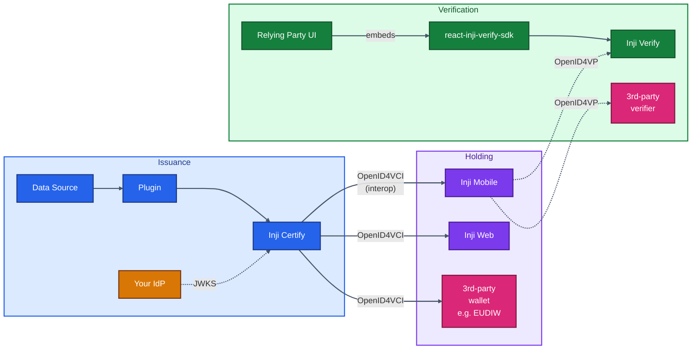
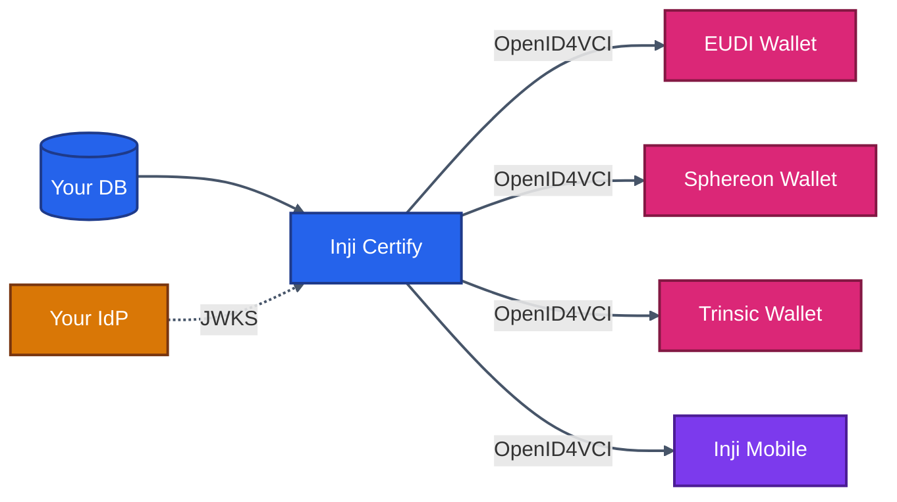
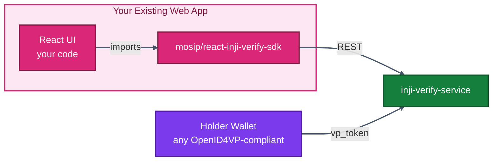
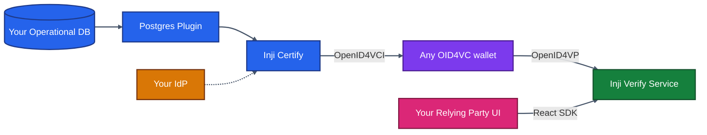
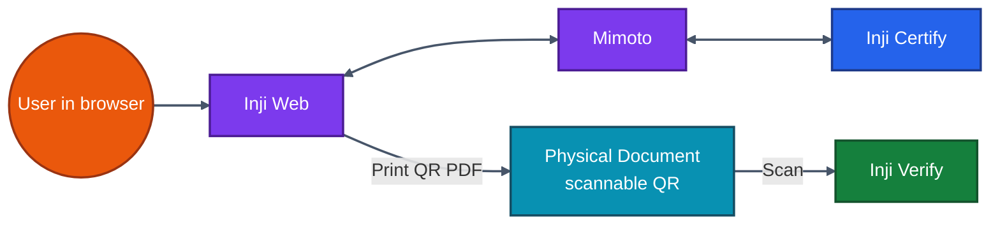
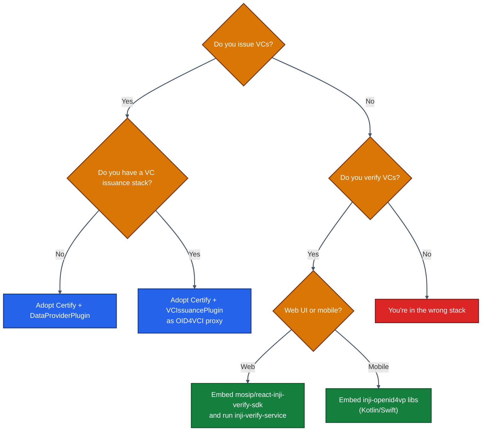

# 08 · Modularity Aspects — Use Only What You Need

> Inji is a **set of independent products that happen to be released together**. This chapter explicitly enumerates which combinations are valid, what each implies, and how to compose them with your existing platform.

---

## 8.1 The Modularity Promise

Every box in the Inji stack is replaceable or omittable, *if* you respect the standard interface between them.



Standards are the interface. As long as a component speaks **OpenID4VCI** (issuance) or **OpenID4VP** (presentation), you can swap any boxes with your own implementation.

---

## 8.2 Eight Realistic Adoption Patterns

| # | What you adopt | What you don't | Use case |
|---|---------------|----------------|----------|
| 1 | Certify only | Wallet + Verify | You issue VCs to *any* wallet (EUDIW, third-party) |
| 2 | Verify only (SDK) | Certify + Wallet | You only need to verify VCs your users already hold |
| 3 | Wallet (Web) only | Certify + Verify | You want a credential holder UX, sourcing VCs from other issuers |
| 4 | Certify + Verify | Wallet | Issuer + verifier service, users bring their own wallets |
| 5 | Certify + Inji Web + Mimoto | Mobile + Verify | Web-only national rollout |
| 6 | Inji Mobile + Inji Verify | Certify | You're integrating with someone else's issuer |
| 7 | Full stack | — | National programmes |
| 8 | Certify + custom SDK on existing wallet | All Inji wallets | You already have a wallet, want OpenID4VCI capability |

---

## 8.3 Pattern 1 — Certify-Only Deployment

You stand up Inji Certify, expose its OpenID4VCI endpoints, and accept any compliant wallet.



**Deploy**: Certify + Postgres + Redis + (your IdP) + (one of the reference plugins or your own).

**Do not deploy**: Mimoto, Inji Web, Inji Mobile, Inji Verify.

**Wins**: minimum surface area; interoperability is automatic if you stick to standards.

**Caveats**: you have no end-user app — users need to bring a wallet. Don't promise an end-user experience.

---

## 8.4 Pattern 2 — Verify-Only Integration

Drop the React SDK into your existing relying-party UI; deploy the Verify service to host the OpenID4VP backend.



Steps:

```bash
npm i @mosip/react-inji-verify-sdk
```

```tsx
import { OpenID4VPVerification } from '@mosip/react-inji-verify-sdk';

<OpenID4VPVerification
  protocol="openid4vp://"
  verifyServiceUrl="https://verify.example.com/v1/verify"
  presentationDefinitionId="my-pd-id"
  onVpProcessed={(result) => console.log(result)}
  onError={(e) => console.error(e)}
  onQrCodeExpired={() => alert('QR expired')}
/>
```

Run `inji-verify-service` (Spring Boot) behind your domain. That's it. You did not deploy an issuer or a wallet.

> **Frontend constraint**: SDK is React 17+ in TypeScript. **Not** compatible with React Native, Angular, Vue, or vanilla SSR Next.js (without customization).

---

## 8.5 Pattern 3 — Wallet-Only

You want only the holder experience: deploy **Mimoto + Inji Web** (and/or Inji Mobile). They will pull VCs from any OpenID4VCI issuer registered in `mimoto-issuers-config.json`.

```json
{
  "issuers": [
    {
      "credential_issuer": "InjiWebDemo",
      "issuer_id": "inji-web-demo",
      "display": [...],
      "client_id": "<oidc-client-id>",
      "redirect_uri": "https://mimoto.example.com/v1/mimoto/credentials/callback",
      "authorization_audience": "https://idp.example.com/oauth/token",
      "token_endpoint": "https://idp.example.com/oauth/token",
      "credential_endpoint": "https://other-issuer.example.com/credential",
      "credential_audience": "https://other-issuer.example.com",
      "wellknown_endpoint": "https://other-issuer.example.com/.well-known/openid-credential-issuer"
    }
  ]
}
```

Mimoto handles the OIDC dance, presents the well-known to Inji Web, and stores P12s for client authentication.

---

## 8.6 Pattern 4 — Certify + Verify (No Inji Wallets)

The pragmatic enterprise pattern: you control issuance + verification, users bring whatever wallet they want.



This is widely used in government pilots: you don't want lock-in on the wallet side, but you want a vetted, audited issuer and verifier.

---

## 8.7 Pattern 5 — Certify + Inji Web + Mimoto (Web-only national rollout)

Skip mobile entirely. Users get VCs into a browser wallet, can print as QR/PDF, can present via Inji Verify. Used in geographies where smartphone penetration is low.



The **PixelPass** library generates compact QR codes that can fit a full VC on a printed page.

---

## 8.8 Pattern 6 — Wallet-Side Integration in Your Own App

You have a mobile app already and want to bolt on VC capability. Use the standalone libraries:

| Library | Platform | Purpose |
|---------|----------|---------|
| `vci-client` | Android (Kotlin) / iOS (Swift) / multiplatform | OpenID4VCI client |
| `inji-openid4vp-android-kotlin` | Android | OpenID4VP wallet side |
| `inji-openid4vp-ios-swift` | iOS | OpenID4VP wallet side |
| `pixelpass` | multi | Compact QR encoding/decoding |
| `tuvali` | Android | BLE-based offline share |
| `secure-keystore` | Android / iOS | Native secure storage |

Example: bring OpenID4VP capability into a Kotlin app:

```kotlin
val openID4VP = OpenID4VP(
    traceabilityId = "txn-12345",
    walletMetadata = WalletMetadata(
        clientIdSchemesSupported = listOf("pre-registered", "did"),
        vpFormatsSupported = mapOf("ldp_vp" to mapOf("proofType" to listOf("Ed25519Signature2020"))),
        // ...
    )
)
val authReq = openID4VP.authenticateVerifier(encodedAuthRequest, trustedVerifiers, shouldValidateClient = true)
val vpToken = openID4VP.constructVerifiablePresentationToken(selectedVCs)
val signedVP = openID4VP.shareVerifiablePresentation(jws)
```

Same library exists in Swift via Swift Package Manager.

---

## 8.9 Decision Matrix



---

## 8.10 Standards Compatibility Matrix

| Standard | Inji Mobile | Inji Web | Inji Certify | Inji Verify | Third-party wallet | Third-party verifier |
|----------|-------------|---------|--------------|------------|--------------------|----------------------|
| OpenID4VCI Draft 13 | ✅ | ✅ | ✅ | n/a | If compliant | n/a |
| OpenID4VP Draft 23 | ✅ | ✅ | n/a | ✅ | If compliant | If compliant |
| W3C VCDM 1.1 (JSON-LD) | ✅ | ✅ | ✅ | ✅ | If compliant | If compliant |
| W3C VCDM 2.0 | ✅ | ✅ | ✅ | ✅ | varies | varies |
| SD-JWT VC | ✅ | ✅ | ✅ | ✅ | varies | varies |
| ISO 18013-5 mDL | partial | partial | mock today | partial | varies | varies |

---

## 8.11 Practical Composition Recipes

### Recipe A: Issue VC from existing Postgres, deliver to EUDIW wallet

1. Deploy Certify (no Mimoto, no Inji Web).
2. Use `PostgresDataProviderPlugin` mapping `scope=eudi_pid` to `SELECT * FROM persons WHERE id = :sub`.
3. Configure Keycloak realm for OAuth2.
4. Publish `/.well-known/openid-credential-issuer`.
5. User scans an offer in their EUDI wallet — done.

### Recipe B: Verify a third-party government VC

1. Deploy `inji-verify-service` only.
2. Embed `QRCodeVerification` component in your portal.
3. Configure trusted issuers list (so signatures from `did:web:gov.example` are accepted).
4. Users present from any wallet; you verify in your UI.

### Recipe C: Hybrid — existing wallet, our verifier

1. Embed `inji-openid4vp` library in your existing mobile wallet.
2. Standing up `inji-verify-service` is optional — you can write your own backend that complies with the OpenAPI spec at `inji-verify-service`.
3. Use `OpenID4VPVerification` SDK component if your web UI is React.

---

## 8.12 Anti-Patterns to Avoid

| Anti-pattern | Why it hurts |
|--------------|--------------|
| Forking the entire Inji repo to change one thing | Plugins exist precisely so you don't have to. Use them. |
| Bypassing `certify-nginx` and hitting `:8090` directly from browsers | CORS will bite you; nginx adds the headers |
| Coupling your verifier UI tightly to internal Inji Verify endpoints | Use the SDK; the wire contract is the OpenAPI spec, not the internal service |
| Sharing one OIDC client across many issuers | Use one client per issuer, with scoped permissions |
| Burying credential templates in code | They're in `credential_config` for a reason — change them via SQL/API, not redeploys |
| Issuing without a status list | Without revocation you have no way to undo a fraudulent or compromised VC |

---

## 8.13 Modularity in Practice — The "Lego Brick" Mindset

Treat Inji like a box of Lego bricks:

| Brick | What it interoperates over |
|-------|----------------------------|
| Inji Certify | OpenID4VCI (incoming) + JWKS (outgoing trust) |
| Inji Wallet | OpenID4VCI ⇄ Issuer, OpenID4VP ⇄ Verifier |
| Inji Verify (service) | OpenID4VP ⇄ Wallets, REST ⇄ RP UI |
| Inji Verify SDK | React component ⇄ Verify service via REST/OpenAPI |
| Mimoto | REST ⇄ Wallets, OAuth2 ⇄ Issuer IdP |

Build your assembly using **only** these contracts. Every internal detail (Spring beans, table layout, plugin interfaces) is open-source but should not be load-bearing in your design.

---

## 8.14 What's Next

The next chapter dives into **how to actually connect external data sources** — the most common customization beyond plugins.

➡️ **[09 · External Data Sources](./09-External-Data-Sources.md)**
