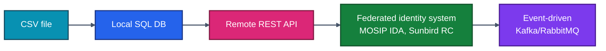
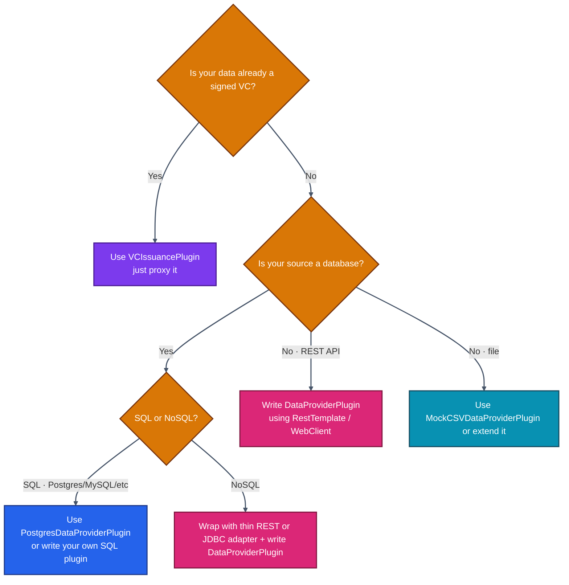
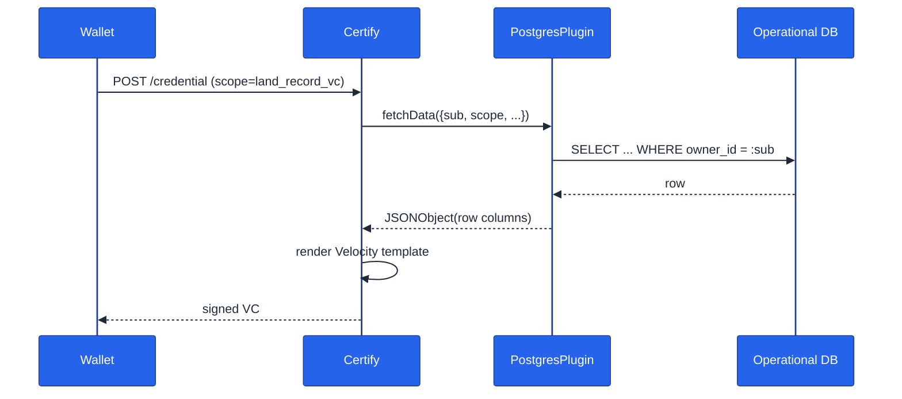
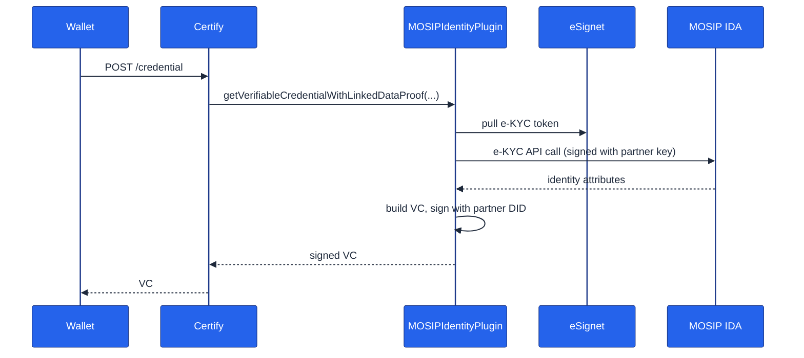
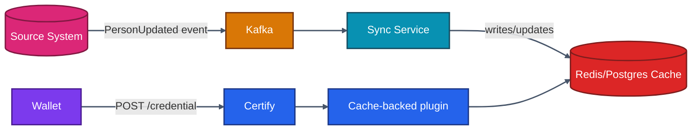
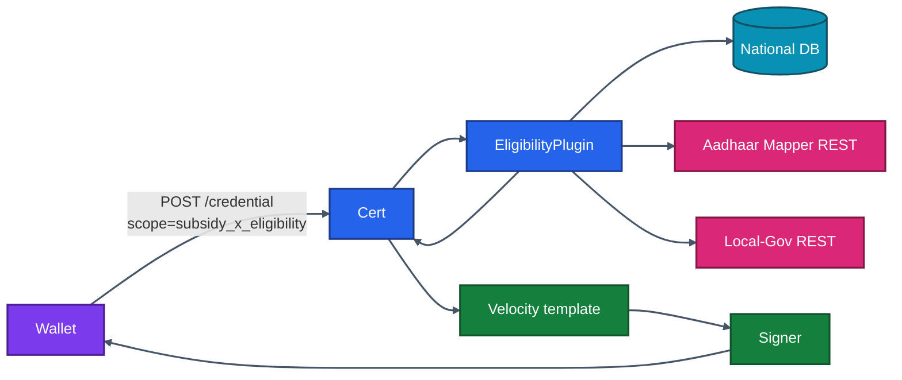

# 09 · External Data Sources

> Every issuance ultimately reads from *something*. This chapter enumerates the recommended ways to connect Inji Certify to your operational data — from a CSV file to a national ID system.

---

## 9.1 The Data-Source Spectrum



Inji can ingest from any of these — the question is **which plugin pattern to use** and **how much state to keep in Certify itself**.

---

## 9.2 Decision Tree: Pick a Connector



---

## 9.3 Source 1 — CSV Files

### When to use
- POCs, demos, internal pilots
- Small static datasets (<10k rows)
- No write-back required

### Plugin
The official `MockCSVDataProviderPlugin` reads a single CSV by path and matches a row by an identity field.

### Configuration

```properties
mosip.certify.plugin-mode=DataProvider
mosip.certify.integration.data-provider-plugin=MockCSVDataProviderPlugin
mosip.certify.mock.csv.path=/home/mosip/config/farmer_identity_data.csv
mosip.certify.mock.csv.identifier-column=id
```

### Limitations
- File is loaded fresh on each request — fine for small files, **don't use for millions of rows**.
- No concurrency control.
- For larger datasets switch to the Postgres plugin.

---

## 9.4 Source 2 — Relational Databases (Postgres / MySQL / Oracle / MSSQL)

### When to use
- Production deployments with existing operational SQL DBs
- You don't want to replicate data

### Plugin
`PostgresDataProviderPlugin` (works against any JDBC source with the right driver added to `loader_path`).

### Per-scope SQL mapping

```properties
plugin.postgres.url=jdbc:postgresql://land-db:5432/landreg
plugin.postgres.username=ro_user
plugin.postgres.password=...

# Each scope maps to a parameterized SQL
plugin.postgres.scope.land_record_vc=\
  SELECT  owner_id, owner_name, plot_number, area_sqm, registry_date \
  FROM    public.land_records \
  WHERE   owner_id = :sub

plugin.postgres.scope.farmer_id_vc=\
  SELECT  individual_id AS id, full_name AS fullName, dob, village, district \
  FROM    farmer_registry \
  WHERE   individual_id = :sub
```

`:sub` and other named parameters are filled from `identityDetails` (i.e., access-token claims).

### Architecture



### Best practices
- Use a **read-only DB user**. Plugin must never have write access.
- Run the **query as `SELECT ... LIMIT 1`** with proper indexing on the `:sub` column. Issuance is in the user request path — keep it <50 ms.
- Use **HikariCP** (already wired by Spring Boot) for connection pooling. Don't open a new connection per request.
- Add **statement timeouts**: `plugin.postgres.statement-timeout=2s`.
- Mask PII in logs. Plugin logs run at INFO; set `logging.level.io.mosip.certify.postgres=WARN` in prod.

---

## 9.5 Source 3 — REST / HTTP APIs

### When to use
- Your identity / record system already exposes an API
- Cross-team boundaries (you cannot access their DB)
- Need to invoke a verification or scoring service before issuing

### Plugin
Roll your own `DataProviderPlugin`.

### Skeleton

```java
@Component("MyRestPlugin")
public class MyRestPlugin implements DataProviderPlugin {

    private final WebClient client;
    @Value("${plugin.rest.base-url}") String baseUrl;
    @Value("${plugin.rest.api-key}") String apiKey;

    public MyRestPlugin(WebClient.Builder builder) {
        this.client = builder.build();
    }

    @Override
    public JSONObject fetchData(Map<String, Object> id) throws DataProviderExchangeException {
        try {
            String sub = (String) id.get("sub");
            Map<String,Object> body = client.get()
                .uri(baseUrl + "/persons/{id}", sub)
                .header("Authorization", "Bearer " + apiKey)
                .retrieve()
                .bodyToMono(Map.class)
                .timeout(Duration.ofSeconds(2))
                .block();
            return new JSONObject(body);
        } catch (Exception e) {
            throw new DataProviderExchangeException("REST_FETCH_FAILED");
        }
    }
}
```

### Best practices
- Set **read timeouts** (1–2 s typical). The wallet call hangs while you wait.
- Retry policy: 1 retry on idempotent reads, with jitter.
- Cache **idempotent** lookups with Spring Cache backed by Redis if the upstream API allows.
- Wrap the call in a **circuit breaker** (Resilience4j). When upstream is down, fail fast.
- Propagate **trace IDs** (W3C Trace-Context) for end-to-end debuggability.

---

## 9.6 Source 4 — MOSIP IDA (Identity Authentication)

If your country has a MOSIP deployment, the `MOSIPIdentityCertifyPlugin` is your friend. It:

1. Authenticates the user against MOSIP IDA (often via eSignet behind the scenes).
2. Performs an e-KYC request.
3. Constructs a VC and signs it (it's a `VCIssuancePlugin`, not a `DataProviderPlugin`).

### Configuration sketch

```properties
mosip.certify.plugin-mode=VCIssuance
mosip.certify.integration.vci-plugin=MOSIPIdentityCertifyPlugin

mosip.certify.mosip.ida-url=https://api.collab.mosip.net/idauthentication/v1
mosip.certify.mosip.partner-id=mpartner-default
mosip.certify.mosip.partner-api-key=<key>
mosip.certify.mosip.partner-private-key-path=/home/mosip/certs/ida.p12
mosip.certify.mosip.misp-license-key=<key>
```

### Flow



---

## 9.7 Source 5 — Sunbird Registry (RC)

Use `SunbirdRCCertifyIntegration` (a `VCIssuancePlugin`). Sunbird's registry already issues VCs, so Certify just proxies them via OpenID4VCI.

```properties
mosip.certify.plugin-mode=VCIssuance
mosip.certify.integration.vci-plugin=SunbirdRCCertifyIntegration
plugin.sunbird.registry-url=https://registry.example.org
plugin.sunbird.schema.education=EducationCertificate
plugin.sunbird.search.api=/api/v1/EducationCertificate/search
```

Sunbird's JSON-LD output is mapped 1:1 to the wallet response.

---

## 9.8 Source 6 — Event-Driven (Kafka / RabbitMQ / NATS)

A pure event-driven issuance pattern is **not** how OpenID4VCI works — Certify is a synchronous HTTP server. But you can use events to **pre-stage data**:



In this model, your plugin reads from a **synchronized cache** while a separate consumer keeps the cache in sync from the event stream. The wallet call stays fast and predictable.

---

## 9.9 Combining Sources

A single plugin can pull from multiple sources. Example: issue a "Eligibility Credential" that requires (a) the person's identity from a national DB, plus (b) their income status from a tax API:

```java
@Override
public JSONObject fetchData(Map<String, Object> id) throws DataProviderExchangeException {
    String sub = (String) id.get("sub");
    Map<String,Object> identity = identityClient.lookup(sub);
    Map<String,Object> income  = taxClient.fetchIncome(sub);

    JSONObject out = new JSONObject(identity);
    out.put("incomeBand", income.get("band"));
    out.put("eligibilityScore", computeScore(income));
    return out;
}
```

Both calls fail-fast on timeout; on partial failures, throw `DataProviderExchangeException("PARTIAL_DATA")` so the caller sees a clean OpenID4VCI error.

---

## 9.10 Data Quality Pitfalls

| Pitfall | Symptom | Mitigation |
|---------|---------|------------|
| Stale data | VC contains last-year's address | Read-through cache TTL; invalidate on event |
| Inconsistent ID schemes | Plugin can't find `sub` in source | Standardize IDs at the IdP using claim mappers; or look up by alternate keys |
| Encoding issues | Names with accents render as `?` | UTF-8 everywhere; check JDBC connection strings (`?characterEncoding=UTF-8`) |
| Missing required fields | Template throws "undefined variable" | Validation step inside plugin before returning |
| PII over-fetching | More data leaves source than needed | Constrain SQL `SELECT` columns explicitly |
| Numeric/string confusion | Velocity outputs strings where templates expect numbers | Type-safe JSONObject building |

---

## 9.11 Security Hardening for Data Connectors

1. **Network isolation**: data sources reachable only from inside the VPC / namespace where Certify runs. Never expose your operational DB to the internet.
2. **Least-privilege DB user**: read-only, only the necessary tables/columns.
3. **mTLS**: between Certify and downstream APIs where feasible. Certify can be configured to load a client cert via JVM args.
4. **Auditing**: every plugin call should produce a log entry with `traceId`, `sub` (hashed), `scope`, latency, and outcome.
5. **Rate limiting**: at NGINX or your gateway, cap per-IP and per-`sub` issuance attempts.
6. **Don't put secrets in properties files in plain text**. Use Spring Cloud Config + Vault, K8s Secrets mounted as env vars, or Sealed Secrets.
7. **Mask logs**: use a logback pattern that redacts `accessToken`, `pre-authorized_code`, `c_nonce`, and any field marked PII.

---

## 9.12 Observability for Data Sources

| Metric | Why |
|--------|-----|
| `inji_certify_plugin_duration_seconds{plugin}` | Track plugin latency p50/p95/p99 |
| `inji_certify_plugin_errors_total{plugin,error_type}` | Spike alert on plugin failures |
| Downstream **upstream** status code histogram | Detect upstream brownouts |
| Connection pool gauges (HikariCP) | Detect pool exhaustion |
| Cache hit ratio | Tune TTLs |

Wire these via `micrometer-registry-prometheus` (already on Certify's classpath).

---

## 9.13 Sample End-to-End Custom Data Source — "EligibilityCredential"

Scenario: issue an "Eligibility for SubsidyX" credential that combines:

- Identity from national-DB (Postgres)
- Bank account verified via Aadhaar Mapper API (REST)
- Family size from local-government API (REST)



Velocity template (excerpt):

```velocity
"credentialSubject": {
    "id": "${_holderId}",
    "fullName": "${fullName}",
    "familySize": ${familySize},
    "bankVerified": ${bankVerified},
    "eligibilityValidUntil": "${validUntil}"
}
```

Plugin:

```java
@Component("EligibilityPlugin")
public class EligibilityPlugin implements DataProviderPlugin {
    @Autowired NationalDbClient db;
    @Autowired AadhaarMapperClient aam;
    @Autowired LocalGovClient lg;

    public JSONObject fetchData(Map<String,Object> id) throws DataProviderExchangeException {
        String sub = (String) id.get("sub");
        try {
            var person = db.lookup(sub).orElseThrow();
            var bank = aam.verifyBank(sub);
            var family = lg.fetchFamily(sub);

            JSONObject out = new JSONObject();
            out.put("fullName", person.fullName());
            out.put("familySize", family.size());
            out.put("bankVerified", bank.verified());
            return out;
        } catch (Exception e) {
            throw new DataProviderExchangeException("ELIGIBILITY_LOOKUP_FAILED", e);
        }
    }
}
```

Properties:

```properties
mosip.certify.plugin-mode=DataProvider
mosip.certify.integration.data-provider-plugin=EligibilityPlugin
plugin.eligibility.nat-db.url=jdbc:postgresql://national-db/cit
plugin.eligibility.aam.url=https://aam.api.example
plugin.eligibility.aam.api-key=<vault-ref>
plugin.eligibility.lg.url=https://lg.api.example
```

---

## 9.14 What's Next

Now that you can wire data in, the next chapter looks at *platform integration patterns* — how Inji fits into a larger architecture (microservices, BFFs, edge proxies, sidecars).

➡️ **[10 · Platform Integration Strategies](./10-Platform-Integration-Strategies.md)**
