# 10 · Platform Integration Strategies

> **How do we drop Inji into an architecture that already exists?**
> This chapter answers that question with a catalogue of integration patterns. Each pattern has a Mermaid diagram, a "use when" rule, the trade-offs, and the wiring touch-points.

---

## 10.1 First Principles

Before choosing a pattern, internalise three facts about the Inji stack:

1. **Inji speaks standards on its edges.** Certify exposes **OpenID4VCI**, Verify exposes **OpenID4VP**, both protected by **OAuth2**. The bus between Inji and the rest of your platform is HTTPS + standard tokens — *not* a proprietary SDK.
2. **Inji is stateless at the API boundary.** Certify keeps short-lived caches (transactions, c_nonces) in Redis but does not own user identity, KYC state, or business workflow. Your platform owns those.
3. **Inji is composable.** You can adopt Certify alone, Verify alone, or the Wallet alone (see [./08-Modularity-Aspects.md](./08-Modularity-Aspects.md)). Pick the smallest footprint that meets the use-case.

These three facts mean the integration question is really *"where do I terminate the OpenID4VCI/VP boundary?"* and *"who owns the user-facing surfaces?"*

---

## 10.2 The Integration Spectrum


| Pattern | Effort | Customisation Ceiling | Operational Burden |
|--------|--------|----------------------|--------------------|
| Hosted sandbox | Hours | Very low | None |
| Verify SDK only | Days | Medium | Low (run a small verify service) |
| Certify as black box | Days | Medium | Medium (one service + DB + Redis) |
| Sidecar | 1–2 weeks | High | Medium-high |
| BFF wrap | 2–4 weeks | Very high | High |
| Deep fork + plugins | Weeks | Unlimited | High |

Pick the pattern that matches what the use-case actually needs, not the most "complete" one. Most successful production integrations sit at **Pattern 3 (Certify as black box) + Pattern 2 (Verify SDK)**.

---

## 10.3 Pattern 1 — Hosted Sandbox Pass-Through (Prototype)

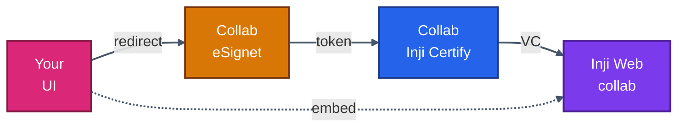

**Use when:** demos, hackathons, internal stakeholder showcases. Not for any real PII.

**Cost:** zero. **Steps:** see [./03-Sandbox-Exploration.md](./03-Sandbox-Exploration.md).

**Why this is still useful even in production planning:** it lets a product team experience the full holder–issuer–verifier loop *before* committing to any plumbing. We strongly recommend running this exercise at kick-off.

---

## 10.4 Pattern 2 — Verify SDK Embedded in an Existing App

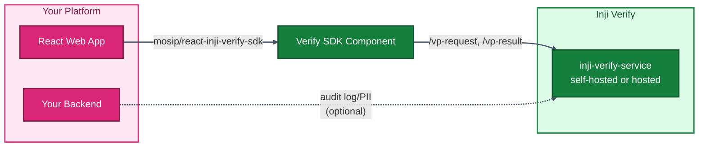

**Use when:** the platform is *only* a relying party. You don't issue, you just want to accept VCs (e.g. "prove you are 18+" or "prove you hold this certificate").

**Touch-points:**

- `npm install @mosip/react-inji-verify-sdk`
- Stand up `inji-verify-service` (one container, Postgres optional, Redis optional)
- Configure presentation definition / DCQL query on the SDK component
- Receive verification result via callback

Full walk-through in [./12-Inji-Verify-Integration.md](./12-Inji-Verify-Integration.md).

**Key benefit:** zero changes to existing auth/identity flows. The SDK is a *widget*.

---

## 10.5 Pattern 3 — Certify as a Black-Box Issuance Service

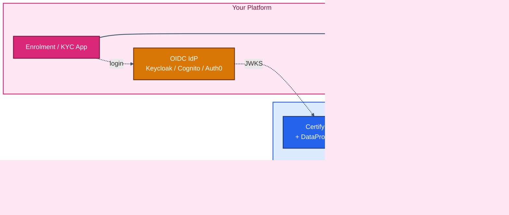

**Use when:** you already have a user database and an identity provider, and want to add VC issuance with minimal blast radius.

**Touch-points:**

| Concern | Where it lives | Notes |
|--------|---------------|-------|
| User authentication | Your IdP | See [./06-Pre-Auth-Flow-Without-eSignet.md](./06-Pre-Auth-Flow-Without-eSignet.md) |
| User data | Your DB / API | Read by a `DataProviderPlugin` (see [./07-Plugins-And-Modules.md](./07-Plugins-And-Modules.md)) |
| VC template | Certify (Velocity) | Versioned in Git, mounted as ConfigMap |
| Signing key | Certify keymanager / HSM | Rotate independently of your platform |
| Wallet | User's own — Inji Mobile, Inji Web, or any OpenID4VCI-compliant wallet | |

**Operational footprint:** one stateless Java service (≈700 MB RAM warm), one Postgres schema, one Redis instance. Add a sidecar plugin JAR if you don't want to bake a custom Docker image.

This pattern is what most adopters end up running. The rest of the chapter assumes you've chosen this and looks at *how* to wire it into a larger landscape.

---

## 10.6 Pattern 4 — Sidecar Co-Deployment

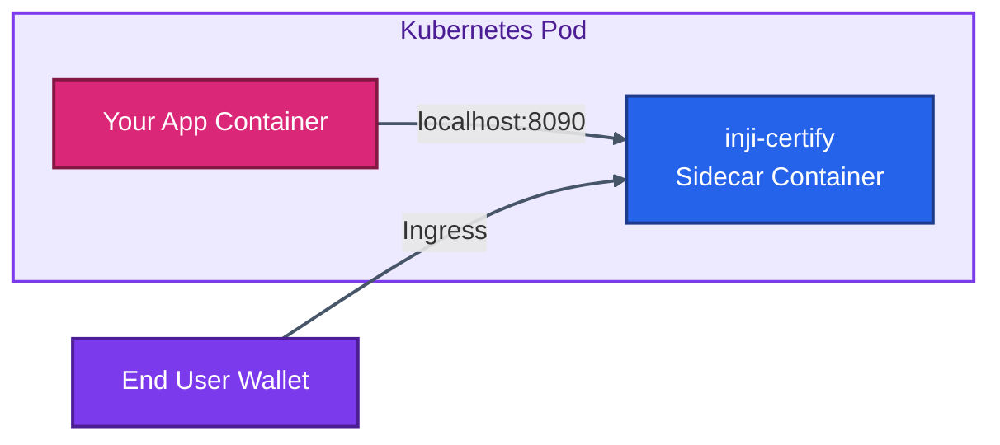

**Use when:** the issuing system and Certify share a strong locality requirement (e.g. air-gapped network, latency SLO < 50 ms to DB, regulatory data-residency).

**Why a sidecar over a separate Service:** the data provider plugin can talk to `localhost`, removing network hops and surface area. The price you pay is co-scaling — if the app scales, Certify scales with it.

**Caveat:** sidecar makes sense for *low-throughput, high-isolation* contexts. For high-throughput issuance, deploy Certify as its own horizontally scaled workload (Pattern 3).

---

## 10.7 Pattern 5 — Backend-for-Frontend (BFF) Wrap

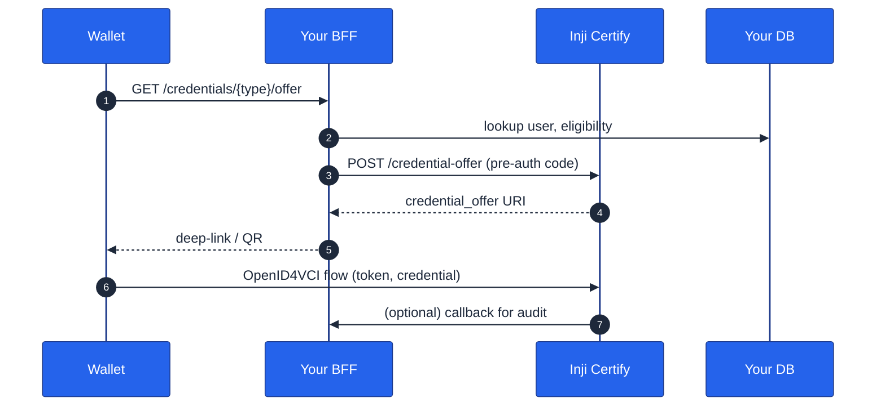

**Use when:**
- You need to **decorate or restrict** the OpenID4VCI surface (rate-limit per user, add captcha, custom error messages).
- You want to **hide Certify** behind your existing API gateway and never expose it directly.
- The wallet you support is **your own** (so you can call non-standard endpoints).

**Concrete examples:**
- Mimoto itself is a BFF in front of Certify for the Inji wallets. See [./13-Inji-Wallet-Integration.md](./13-Inji-Wallet-Integration.md).
- An education-board portal that issues "transcript credentials" to students might wrap Certify so that the offer URL embeds the student's portal session id.

**Risk:** if you intercept too aggressively, you break standards compliance. Keep the **token + credential endpoint** spec-conformant and pre-shape only the *offer creation* and *result delivery* edges.

---

## 10.8 Pattern 6 — Deep Fork + Custom Plugins

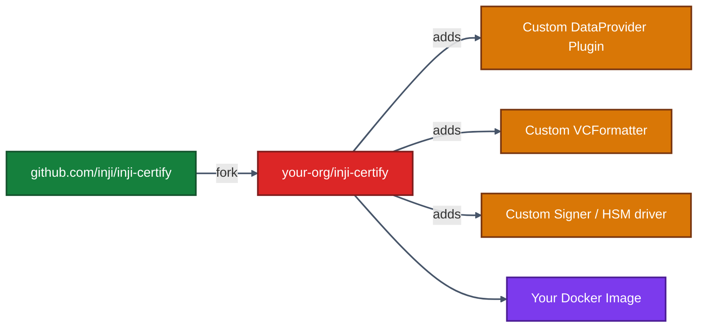

**Use when:**
- You need a VC format not yet supported (custom CBOR profile, ZK-credential, BBS+).
- You need a signing path through a non-PKCS#11 HSM that the upstream keymanager doesn't yet wrap.
- You need to remove modules for a compliance footprint (e.g. strip out all non-mDL code paths).

**Cost:** ongoing rebase / merge effort against upstream releases. Budget time for this.

**Mitigation:** keep changes inside the **plugin module** as much as possible (see [./07-Plugins-And-Modules.md](./07-Plugins-And-Modules.md)). Anything you can do as a plugin should *not* be a fork.

---

## 10.9 Choosing Between Patterns — A Decision Matrix

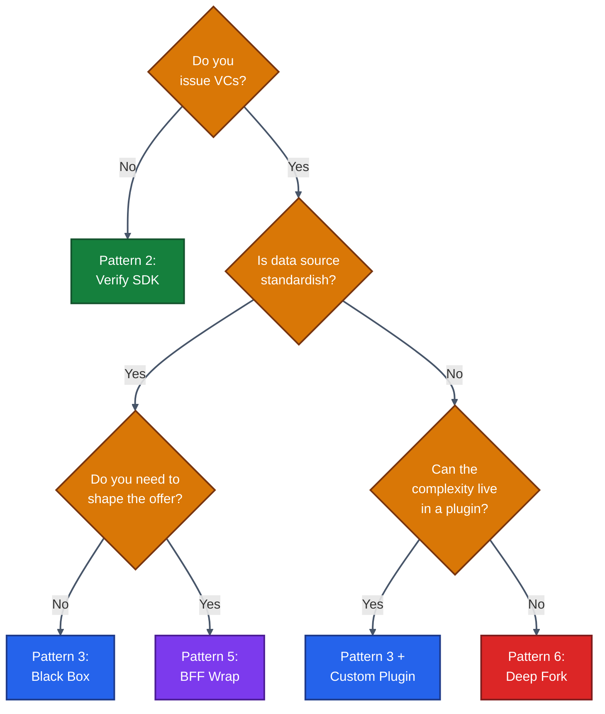

---

## 10.10 Identity Boundary — Where Your IdP Meets Certify

Whichever pattern you pick, the **identity boundary** is the same: an OAuth2 access token issued by an OIDC provider you control, validated by Certify against your JWKS endpoint.

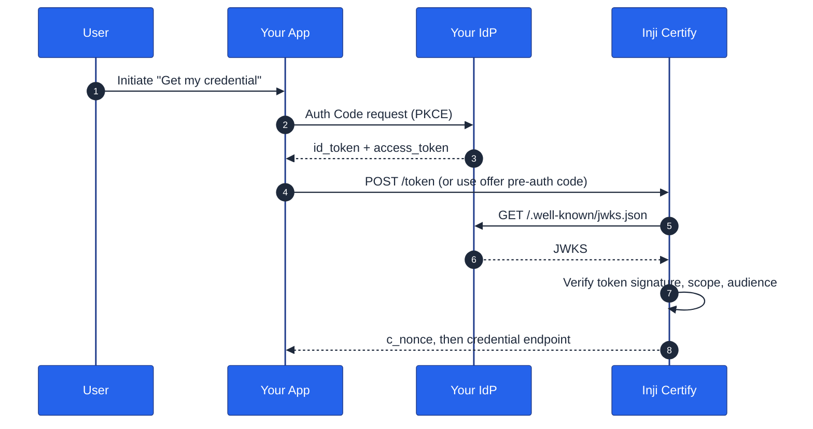

Properties to set (all detailed in [./06-Pre-Auth-Flow-Without-eSignet.md](./06-Pre-Auth-Flow-Without-eSignet.md)):

```properties
mosip.certify.authorization.url=https://idp.example.com
mosip.certify.authn.issuer-uri=https://idp.example.com/realms/inji
mosip.certify.authn.jwk-set-uri=https://idp.example.com/realms/inji/protocol/openid-connect/certs
mosip.certify.identifier=https://certify.example.com
mosip.certify.domain.url=https://certify.example.com
```

---

## 10.11 Data Boundary — Where Your Data Meets Certify

The data boundary is owned by the **`DataProviderPlugin`** you write. The plugin is the *only* code that talks to your databases or APIs.

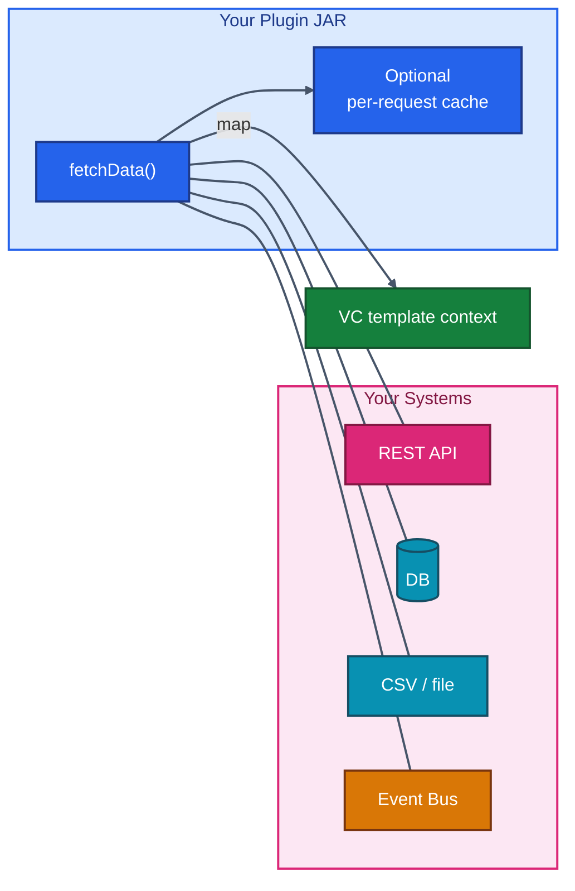

Patterns for each kind of source are catalogued in [./09-External-Data-Sources.md](./09-External-Data-Sources.md).

**Rule of thumb:** the plugin should be *narrow* — fetch claims, map them, return. Do not put business logic in the plugin; keep that upstream where it can be unit-tested independently.

---

## 10.12 Network Boundary — Gateway, mTLS, and Token Audience

Whether Certify is behind your existing API gateway, an Ingress, or directly exposed, three rules hold:

1. **Terminate TLS at one well-known place.** Certify itself can run with HTTP inside the cluster; let the gateway / Ingress handle TLS and cipher suites.
2. **Set token audience explicitly.** The `mosip.certify.identifier` property must equal the `aud` claim your IdP puts in the access token. Mismatched audiences are the #1 cause of "401 invalid_token" in production.
3. **Use mTLS for plugin → backend traffic** if your data plane is sensitive. Most JDBC drivers and HTTP clients support it; the plugin holds the keystore reference.

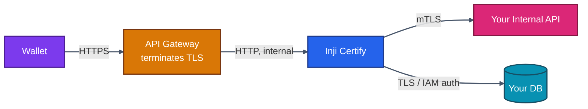

---

## 10.13 Multi-Tenancy

Certify is **single-tenant per deployment** today. For multi-tenant scenarios you have three options:

| Strategy | How | Trade-off |
|---------|-----|-----------|
| **Deployment per tenant** | One namespace + DB + keys per tenant | Cleanest isolation, highest cost |
| **Issuer per tenant inside one deployment** | Configure multiple `issuerMetadata` entries and route by path; plugin reads tenant header | Lowest cost, needs careful tenant scoping in plugin |
| **Shared deployment, tenant in claims** | One issuer, encode tenant inside the credential subject | Only fits if downstream consumers treat tenants uniformly |

For programmes serving many small relying parties, deployment-per-tenant (Strategy 1) is the safest default. Use a GitOps pattern (Argo CD / Flux) to keep the explosion manageable.

---

## 10.14 Observability and Audit

Inji emits standard Spring Boot / Actuator endpoints. Wire them into your observability stack:

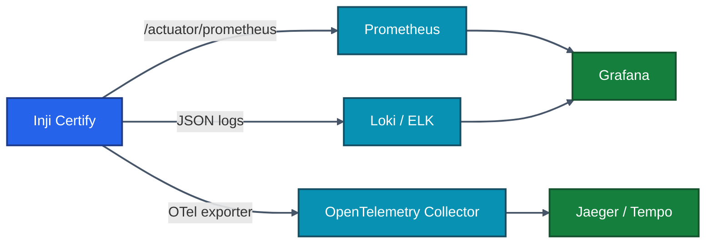

Minimum metrics to alert on:
- `http_server_requests_seconds{uri="/credential",status="5xx"}` — issuance failure rate
- Token endpoint 4xx burst — possible attack or misconfigured client
- Plugin invocation latency p95 — your data source is slow
- Redis connection failures — nonces become unusable, transactions fail

For audit logging, prefer to emit a domain event (e.g. `credential.issued`) from a plugin extension point or BFF wrapper. Do not parse application logs for audit — it's fragile and misses async paths.

See operational details in [./15-Deployment-Guide.md](./15-Deployment-Guide.md).

---

## 10.15 Anti-Patterns to Avoid

| Anti-pattern | Why it hurts |
|-------------|--------------|
| Treating Certify like a CRUD service | It's an OAuth2 resource server; calls are protocol-driven. Trying to "POST a VC directly" misses the entire offer flow. |
| Sharing the Certify DB with your app | The schema is internal and changes between versions. Read from a plugin instead. |
| Putting business logic in Velocity templates | Templates are formatters, not validators. Filter eligibility in the plugin. |
| Using a single signing key forever | Rotate. Use `kid`s. Publish DIDs so verifiers can resolve old keys. |
| Forking just to add a config property | 95 % of "I need to change Certify" reduces to a plugin or a property override. |

---

## 10.16 What's Next

The next chapter goes deep on the **shape** of the credential itself — JSON-LD vs SD-JWT vs mDoc, Velocity template authoring, and signing algorithm trade-offs.

➡️ **[11 · VC Formats & Implementations](./11-VC-Formats-and-Implementations.md)**
