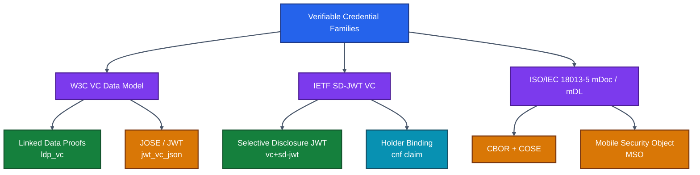
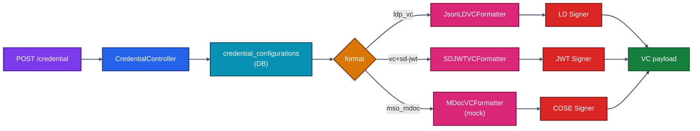
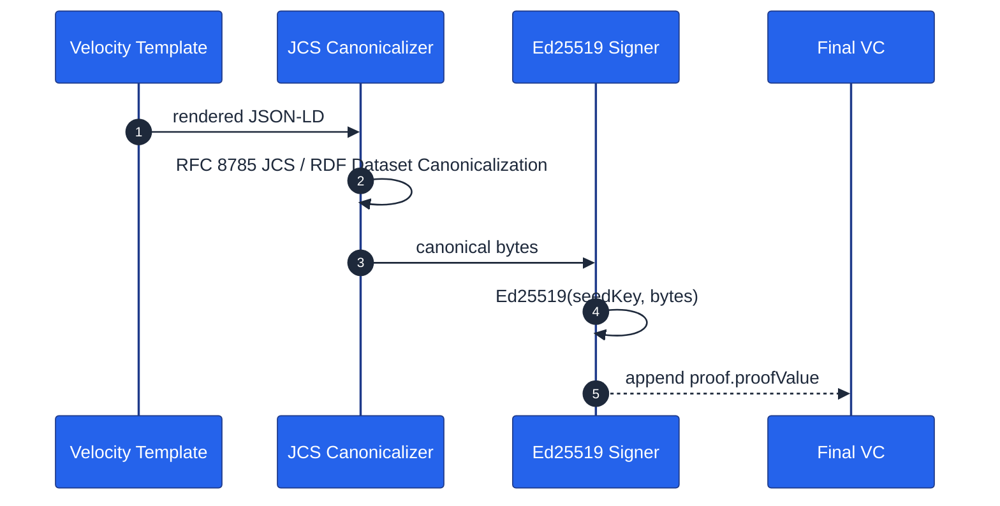
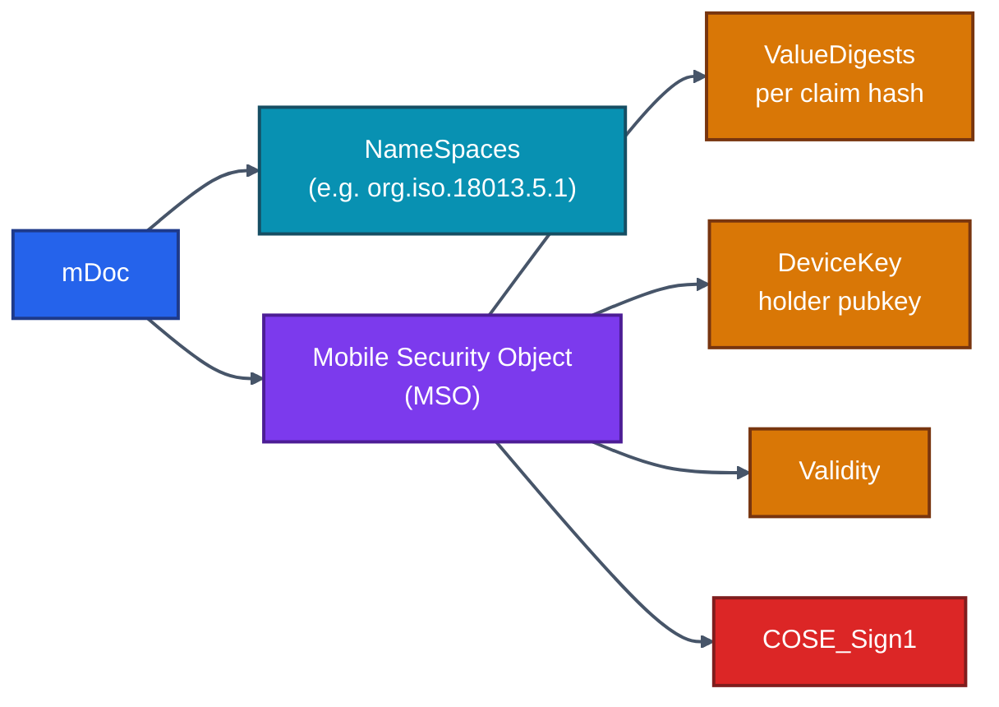
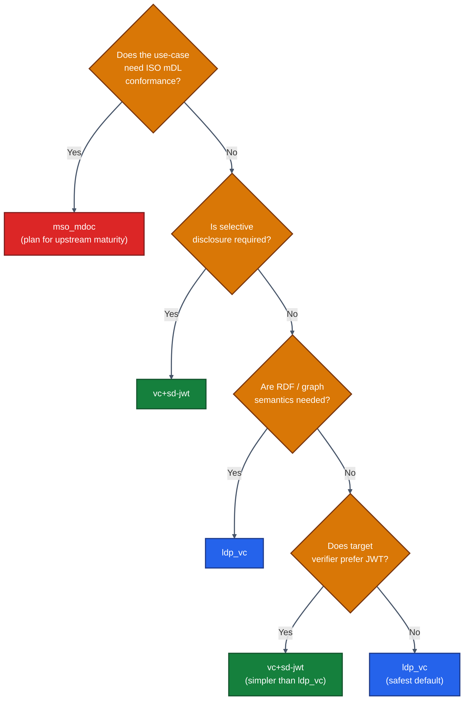
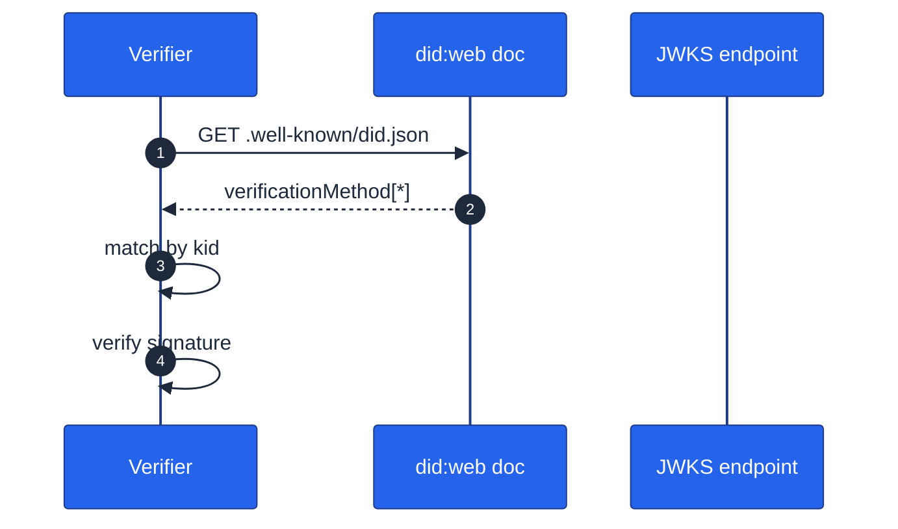
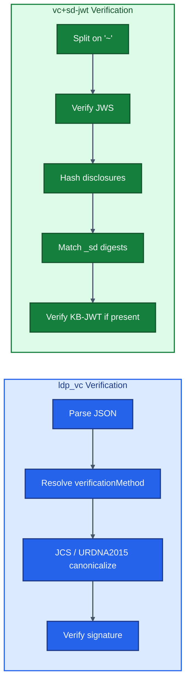
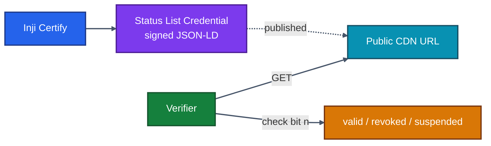
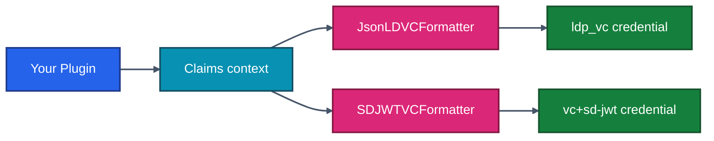

# 11 · VC Formats & Implementations

> **One issuer, many credential shapes.** Inji Certify natively supports three major Verifiable Credential families: **JSON-LD VCs (`ldp_vc`)**, **SD-JWT VCs (`vc+sd-jwt`)**, and **ISO mDoc / mDL (`mso_mdoc`)**. This chapter explains each format, when to pick it, and how to author and sign it inside Inji.

---

## 11.1 The Format Landscape — at a Glance



| Format string | Family | Inji status today | Best for |
|---------------|--------|------------------|---------|
| `ldp_vc` | W3C VCDM + LD Proofs | **First-class** | Open-data ecosystems, multiple proof types, expressiveness |
| `vc+sd-jwt` | IETF SD-JWT VC | **First-class** | Selective disclosure, smaller payloads, wallet privacy |
| `mso_mdoc` | ISO 18013-5 | **Mock today**, production work in progress | Border control, driver licences, NFC/BLE engagement |
| `jwt_vc_json` | W3C in JWT form | Possible via plugin; not first-class in stock build | Legacy JWT-only verifiers |

---

## 11.2 How Certify Chooses a Format

The credential request from the wallet carries a `format` field (or, in newer drafts, a `credential_configuration_id` that maps to a `format`). Certify's `CredentialController` looks the configuration up and dispatches to a **VCFormatter** implementation.



The dispatch is purely data-driven — *adding a new format means adding a new formatter bean and a configuration row, not branching the controller*.

---

## 11.3 Format 1 — JSON-LD (`ldp_vc`)

### What it looks like on the wire

```json
{
  "@context": [
    "https://www.w3.org/ns/credentials/v2",
    "https://example.org/contexts/transcript-v1.jsonld"
  ],
  "type": ["VerifiableCredential", "UniversityDegreeCredential"],
  "issuer": "did:web:certify.example.com",
  "validFrom": "2026-05-26T07:00:00Z",
  "credentialSubject": {
    "id": "did:jwk:...",
    "degree": {
      "type": "BachelorDegree",
      "name": "B.Sc. Computer Science"
    },
    "alumniOf": "Example University"
  },
  "proof": {
    "type": "DataIntegrityProof",
    "cryptosuite": "eddsa-jcs-2022",
    "created": "2026-05-26T07:00:00Z",
    "proofPurpose": "assertionMethod",
    "verificationMethod": "did:web:certify.example.com#key-1",
    "proofValue": "z3Fp...base58btc..."
  }
}
```

### Strengths

- **Most expressive** — graph data, vocabularies, nested claims.
- **Many proof types** supported (`Ed25519Signature2020`, `eddsa-jcs-2022`, `ecdsa-2019`, BBS+ with extension).
- **Easy human inspection** — JSON, not CBOR.

### Trade-offs

- **Verbose.** The whole credential ships every time, with all claims visible.
- **`@context` is load-bearing.** Wrong or unreachable contexts make verification fail. Always pin contexts to a URL you control.
- **No native selective disclosure.** Use SD-JWT if the wallet user must minimise disclosure.

### Authoring in Inji — Velocity template

Certify uses **Apache Velocity** templates to render the `credentialSubject`. Templates are stored in the `credential_template` table (column `template`), keyed by `(credential_type, context)`. A minimal template:

```velocity
{
  "@context": [
    "https://www.w3.org/ns/credentials/v2",
    "https://schemas.example.org/transcript/v1.jsonld"
  ],
  "type": ["VerifiableCredential", "UniversityDegreeCredential"],
  "issuer": "$issuer",
  "validFrom": "$validFrom",
  "credentialSubject": {
    "id": "$subjectDid",
    "name": "$_esc.json($fullName)",
    "alumniOf": "$_esc.json($institution)",
    "degree": {
      "type": "$degreeType",
      "name": "$_esc.json($degreeName)"
    }
  }
}
```

`$_esc.json(...)` is critical — it prevents Velocity from emitting unescaped quotes that would break JSON. Always wrap every plugin-provided string value with it.

The context map (`fullName`, `degreeName`, etc.) is what your `DataProviderPlugin.fetchData(...)` returns; see [./07-Plugins-And-Modules.md](./07-Plugins-And-Modules.md).

### Signing pipeline



Signing properties (in `application-default.properties`):

```properties
mosip.certify.key-values.didDocument.id=did:web:certify.example.com
mosip.certify.key-values.signature.type=Ed25519Signature2020
mosip.certify.key-values.signature.crypto-suite=Ed25519Signature2020
mosip.certify.key-values.proof.verification-method=did:web:certify.example.com#key-1
mosip.kernel.keymanager.keystore.app.id=CERTIFY
mosip.kernel.keymanager.keystore.ref.id=ED25519_SIGN
```

The actual keystore is the MOSIP `kernel-keymanager`, which can target either local PKCS#12 (dev) or a real HSM via PKCS#11 (prod). See [./15-Deployment-Guide.md](./15-Deployment-Guide.md).

---

## 11.4 Format 2 — SD-JWT VC (`vc+sd-jwt`)

### What it looks like

An SD-JWT VC is a **compact JWT with appended disclosures**:

```
<JWT-body>~<disclosure-1>~<disclosure-2>~...~<KeyBindingJWT-optional>
```

Where:
- `<JWT-body>` is the issuer-signed JWT whose payload contains a `_sd` array of hashed claim digests.
- Each `<disclosure-N>` is a base64url-encoded `[salt, claim, value]` triple the wallet *chooses* to reveal.
- The trailing `KeyBindingJWT` proves the holder still controls the key.

### Why SD-JWT is the privacy default

Because the holder can drop any disclosure they don't want to share. The verifier sees only the hashes for undisclosed claims — they *exist*, but their content is invisible.


### Authoring in Inji

In Certify, an SD-JWT credential configuration looks like this:

```yaml
credential_configurations:
  - id: HealthInsuranceCredential
    format: vc+sd-jwt
    vct: HealthInsuranceCredential
    cryptographic_binding_methods_supported: [jwk]
    credential_signing_alg_values_supported: [ES256]
    claims:
      given_name:
        sd: true
      family_name:
        sd: true
      policy_id:
        sd: false
      policy_holder:
        date_of_birth:
          sd: true
```

`sd: true` means the claim is **selectively disclosable** — it goes into the `_sd` digests array; `sd: false` means it stays in plaintext on the JWT body. Inji's `SDJWTVCFormatter` walks the plugin's returned claim map, produces salted disclosures for `sd: true` claims, and assembles the final string.

### Signing

SD-JWT uses **JWS** under the hood:

```properties
mosip.certify.sdjwt.signing-algorithm=ES256
mosip.certify.sdjwt.issuer=https://certify.example.com
mosip.certify.sdjwt.kid=es256-2026
```

Algorithm support: `ES256`, `ES384`, `EdDSA`, `RS256`, `PS256`. Use **ES256** or **EdDSA** for new deployments — RSA is fine but produces bigger tokens.

### Selective disclosure in practice

A wallet presenting `given_name` and `policy_id` but hiding `family_name` and `date_of_birth` ships only those disclosures. Verifiers re-hash and compare against the `_sd` array. If digests don't match → reject. If a disclosure is missing → that claim simply isn't proven.

This is **the** reason SD-JWT VC is the W3C/IETF/EUDIW direction for general-purpose credentials.

---

## 11.5 Format 3 — mDoc / mDL (`mso_mdoc`)

### Why this exists

The ISO/IEC 18013-5 standard predates the W3C VC stack and ships in real ID-1 driver licences across many jurisdictions. The data model is **CBOR + COSE**, not JSON.



### Current Inji status

Today, Certify ships a **mock mDoc formatter** (`MDocMockVCIssuancePlugin`) that returns deterministically constructed CBOR for testing wallet-side rendering. Production-grade mDoc issuance — with proper `IssuerAuth` COSE signing, device-key binding, and ISO-compliant CBOR — is on the roadmap. Track upstream at [github.com/inji/inji-certify](https://github.com/inji/inji-certify) issues / milestones.

### When to wait vs when to build

- **Wait** if your use-case is general-purpose identity attributes and your wallet ecosystem is OpenID4VCI-native (Inji Mobile, EUDI wallets, etc.).
- **Build** (deep-fork or extension plugin) only if you have a hard ISO mDL conformance requirement and a defined release date.

---

## 11.6 Choosing a Format — Decision Matrix



**Heuristic for new programmes:**
- Start with **`vc+sd-jwt`** — it covers privacy + interoperability + smaller payloads.
- Add **`ldp_vc`** if you have a downstream that explicitly needs linked-data semantics.
- Add **`mso_mdoc`** only when an mDL ecosystem is in scope.

You can issue **multiple formats from the same Certify instance** — just declare multiple `credential_configurations` rows.

---

## 11.7 Velocity Templates — Deeper Authoring Guide

Templates are stored per-credential-type. Useful patterns:

### Conditional emission

```velocity
#if($address && $address.line1)
  "address": {
    "line1": "$_esc.json($address.line1)",
    "city":  "$_esc.json($address.city)",
    "postalCode": "$_esc.json($address.postalCode)"
  }#if($address.country),"country": "$_esc.json($address.country)"#end
#end
```

### Iterating a list of claims

```velocity
"courses": [
#foreach($c in $courses)
  {
    "code": "$_esc.json($c.code)",
    "name": "$_esc.json($c.name)",
    "grade": "$_esc.json($c.grade)"
  }#if($foreach.hasNext),#end
#end
]
```

### Date formatting

Velocity has no native ISO 8601 helper. Format dates *in the plugin* using `DateTimeFormatter.ISO_INSTANT` and pass strings to the template. This keeps templates dumb and predictable.

### Template safety checklist

| Check | Why |
|------|-----|
| Wrap every string with `$_esc.json(...)` | Prevents quote injection |
| Never `#set` business logic inside template | Logic belongs in the plugin |
| Pin `@context` URLs to versions you control | Avoids breakage when external context drifts |
| Validate the rendered JSON in unit tests | Use a JSON Schema for each VC type |
| Keep templates < 200 lines | If it's bigger, split into sub-templates |

---

## 11.8 Signing Algorithms — Trade-Offs

| Algorithm | Family | Key size | Signature size | Speed | Recommended for |
|----------|--------|---------|----------------|-------|----------------|
| **EdDSA (Ed25519)** | EC | 32 B | 64 B | Very fast | New deployments, JSON-LD, SD-JWT |
| **ES256** | EC P-256 | 32 B | 64 B | Fast | SD-JWT VC default, FIPS environments |
| **ES256K** | EC secp256k1 | 32 B | 64 B | Fast | Blockchain-adjacent ecosystems |
| **RS256** | RSA 2048+ | 256 B+ | 256 B+ | Slow | Legacy verifiers, JWKS interop |
| **PS256** | RSA-PSS | 256 B+ | 256 B+ | Slow | Same as RS256 with modern padding |

**Production default:** Ed25519 for `ldp_vc`, ES256 for `vc+sd-jwt`, both backed by an HSM.

```properties
# Ed25519 keystore reference
mosip.kernel.keymanager.keystore.ref.id=ED25519_SIGN
# ES256 keystore reference
mosip.kernel.keymanager.es256.ref.id=ES256_SIGN
```

---

## 11.9 Key Identifiers and DIDs

Inji publishes the issuer's signing key at three places:

| Place | URL pattern | Used by |
|------|------------|---------|
| OpenID4VCI issuer metadata | `/.well-known/openid-credential-issuer` | Wallets discovering the issuer |
| JWKS endpoint | `/oauth/jwks.json` | SD-JWT verifiers checking the JWS |
| DID document | configured DID method (e.g. `did:web:certify.example.com/.well-known/did.json`) | LD-Proof verifiers resolving `verificationMethod` |

Always publish a **`kid`** with every key, and never reuse a `kid` across rotations. Verifiers cache by `kid`, so a stable `kid` for a rotated key will *break* historical verifications.



---

## 11.10 Verification — Mirror Image of Issuance

Knowing how a verifier reads each format helps you debug issuance:



Inji Verify implements both pipelines; see [./12-Inji-Verify-Integration.md](./12-Inji-Verify-Integration.md). When something fails, ask: *which step of the diagram broke?* Almost every issuance bug is a canonicalisation, encoding, or `kid` issue caught at one of these gates.

---

## 11.11 Status & Revocation

VCs are usually long-lived, so revocation matters. Inji supports the **W3C Bitstring Status List** model:



Implementation steps:
1. Enable `mosip.certify.statuslist.enabled=true`.
2. Each issued credential gets a `credentialStatus` block pointing to a status-list URL and an index.
3. Operations team (or a back-office workflow) flips bits via Certify's revocation endpoint.
4. Status list credential is re-signed and re-published on a fixed cadence (every revocation, batched).

See [./14-API-Reference.md](./14-API-Reference.md) for the status-list endpoints.

---

## 11.12 Multi-Format Issuance from One Plugin

A common requirement: issue **the same logical credential** as both `ldp_vc` and `vc+sd-jwt`. With Inji, you don't need two plugins — the same `DataProviderPlugin` returns claims, and Certify routes to the right formatter based on the wallet's request format.



You declare **two `credential_configurations` rows**, both pointing at the same claims source, differing only in `format`, `vct`, `cryptographic_binding_methods_supported`, and the template id.

---

## 11.13 Practical Pitfalls

| Symptom | Likely cause | Fix |
|--------|-------------|-----|
| Verifier says "context not loaded" | `@context` URL unreachable or 404 | Host the JSON-LD context on a stable URL you control; pin a version |
| SD-JWT decode works but signature fails | `kid` mismatch between issuer JWKS and JWS header | Ensure `mosip.certify.sdjwt.kid` matches a key actually in JWKS |
| LD-proof signature fails on otherwise-valid VC | Canonicalisation drift — extra whitespace / different `@context` order | Use Inji's built-in canonicalizer; never hand-edit the rendered VC |
| mDoc decode hangs in wallet | Using mock plugin, but wallet expects real `IssuerAuth` | Use the mock only in mock wallets; production needs upstream mDoc maturity |
| Wallet rejects credential as "expired" | `validFrom`/`validUntil` rendered with wrong timezone | Always use ISO 8601 with `Z` |

---

## 11.14 What's Next

Now you can shape what comes out. The next chapter shows how a **verifier** unpacks it — and how to embed verification into a web UI with the React SDK.

➡️ **[12 · Inji Verify Integration](./12-Inji-Verify-Integration.md)**
