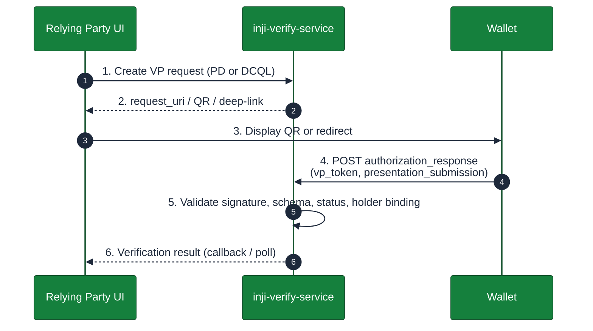
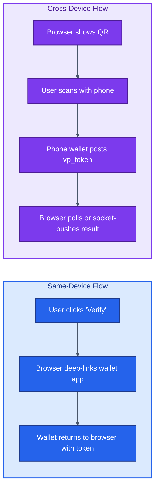
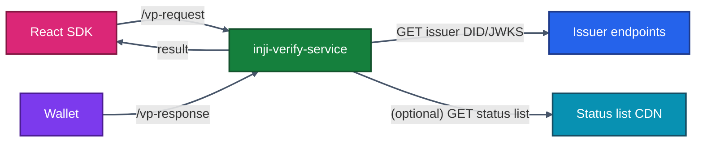
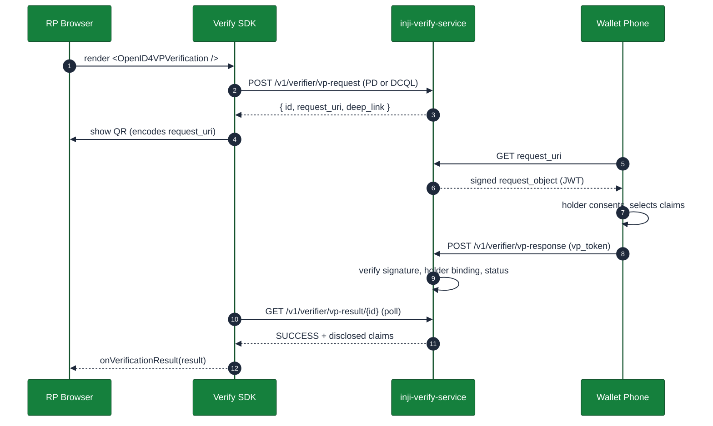
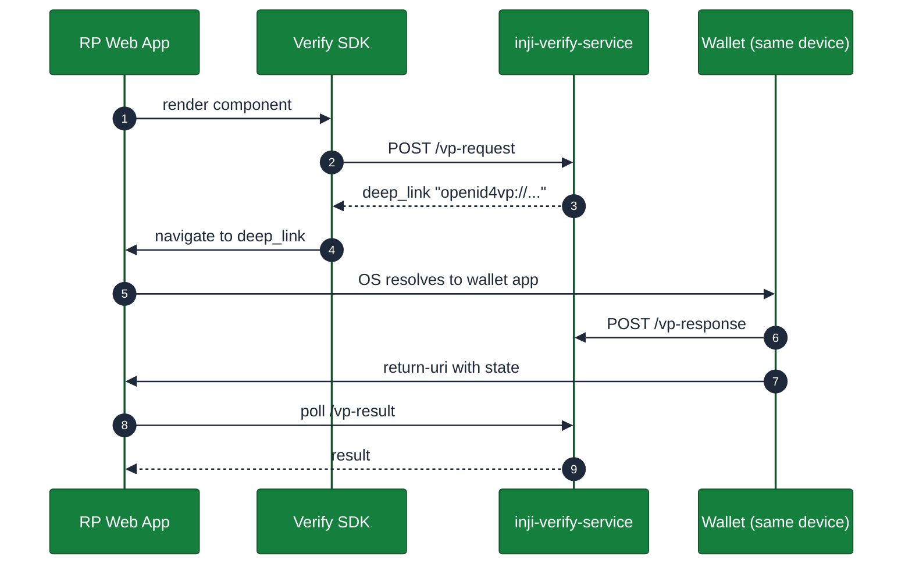

# 12 · Inji Verify Integration

> **Inji Verify ships in two layers — a backend service (`inji-verify-service`) that runs the OpenID4VP verification flow, and a React SDK (`@mosip/react-inji-verify-sdk`) that drops verification UI into any web app in a few lines.** This chapter walks through both, with embedding examples for the common flows.

---

## 12.1 What "Verify" Means in OpenID4VP Terms

OpenID4VP (OpenID for Verifiable Presentations) is the protocol by which a wallet *presents* one or more VCs to a verifier. The "verification" is really three steps:



The SDK handles step 3 (rendering) and step 6 (result delivery). Steps 1, 2, 4, and 5 happen on the service.

---

## 12.2 Two Flow Shapes — Same-Device vs Cross-Device



**Same-device:** holder and verifier are on one device. The wallet app handles the deep-link `openid4vp://` URI.
**Cross-device:** holder phone reads a QR shown by the desktop browser; the desktop is notified out-of-band.

The SDK supports both, with the same React component and a prop that picks the mode.

---

## 12.3 The React SDK — `@mosip/react-inji-verify-sdk`

| Fact | Value |
|------|-------|
| NPM package | `@mosip/react-inji-verify-sdk` |
| Peer-deps | React 18.2.0, React-DOM 18.2.0 |
| Language | TypeScript 4.9.5 |
| Repo | [github.com/inji/inji-verify](https://github.com/inji/inji-verify) |
| License | MPL-2.0 |
| Primary components | `<OpenID4VPVerification />`, `<QRCodeVerification />` |

Install:

```bash
npm install @mosip/react-inji-verify-sdk
```

---

## 12.4 Minimal Embedding Example

```tsx
import { OpenID4VPVerification } from "@mosip/react-inji-verify-sdk";

export default function AgeVerificationPage() {
  return (
    <OpenID4VPVerification
      verifyServiceUrl="https://verify.example.com"
      presentationDefinition={{
        id: "age-over-18",
        input_descriptors: [
          {
            id: "age",
            constraints: {
              fields: [
                {
                  path: ["$.credentialSubject.age_over_18"],
                  filter: { type: "boolean", const: true }
                }
              ]
            }
          }
        ]
      }}
      onVerificationResult={(result) => {
        if (result.status === "SUCCESS") {
          alert("Age verified ✔");
        } else {
          console.warn("Verification failed", result);
        }
      }}
      onError={(err) => console.error(err)}
    />
  );
}
```

What this gives you, out of the box:

- A "Scan to verify" QR code, with cross-device polling.
- A "Use wallet on this device" button that produces the `openid4vp://` deep-link.
- Auto-refresh of expired request tokens.
- Spinner + result UI you can replace via slots.

---

## 12.5 Component Props — `OpenID4VPVerification`

| Prop | Type | Purpose |
|------|------|---------|
| `verifyServiceUrl` | string | Base URL of your `inji-verify-service`. |
| `presentationDefinition` | object | DIF Presentation Exchange v2 definition describing what claims you require. |
| `query` (alternative) | object | DCQL query (newer alternative to PE). |
| `onVerificationResult` | (result) => void | Called when verification finishes. |
| `onError` | (err) => void | Called on network / decode / signature errors. |
| `mode` | `"same-device"`\|`"cross-device"`\|`"auto"` | Force a flow, or let the SDK pick. |
| `theme` | object | Override colours, fonts, border radius. |
| `customStyles` | CSSProperties | Per-element CSS override hooks. |
| `pollIntervalMs` | number | Cross-device polling cadence (default 2000). |
| `timeoutMs` | number | Total wait before failing (default 120 000). |

For QR-only embedding (no flow management), use `<QRCodeVerification ... />` with the same props.

---

## 12.6 Backend — `inji-verify-service`

The service is a Spring Boot application that:

- Persists VP requests (Postgres).
- Serves `/v1/verifier/vp-request` (create), `/v1/verifier/vp-request/{id}` (fetch), `/v1/verifier/vp-response` (wallet POST), `/v1/verifier/vp-result/{id}` (poll).
- Validates JWS / LD proofs against the issuer's published key material.
- Checks status lists when present on the VC.
- Optionally enforces a **trust list** of allowed issuers.



### Minimal `application.properties`

```properties
server.port=8095
spring.datasource.url=jdbc:postgresql://verify-db:5432/verify
spring.datasource.username=verify
spring.datasource.password=${VERIFY_DB_PASSWORD}

mosip.injiverify.trusted-issuers=did:web:certify.example.com,did:web:partner.example.org
mosip.injiverify.status-check.enabled=true
mosip.injiverify.vp-request.ttl-seconds=300
```

Run as a Docker container (image: `mosipid/inji-verify`).

---

## 12.7 Presentation Definition vs DCQL

Two equivalent ways to express "what claims do I need":

| Aspect | Presentation Exchange (PE) v2 | DCQL (newer) |
|-------|-------------------------------|-------------|
| Format | JSON with `input_descriptors` | JSON with `credentials` |
| Standardisation | DIF | OpenID Foundation |
| Selective disclosure mapping | Field path + filter | Direct claim references |
| Inji SDK prop | `presentationDefinition` | `query` |
| When to use | Maximum wallet compatibility today | Forward-looking, simpler |

### DCQL example — driver's licence age check

```json
{
  "credentials": [
    {
      "id": "mdl_age",
      "format": "vc+sd-jwt",
      "meta": { "vct_values": ["org.iso.18013.5.1.mDL"] },
      "claims": [
        { "path": ["age_over_18"] },
        { "path": ["family_name"] }
      ]
    }
  ]
}
```

The wallet returns *only* `age_over_18` and `family_name`. Other claims stay private — this is the privacy story for SD-JWT and mDL combined.

---

## 12.8 Cross-Device Flow — End-to-End Sequence



The `request_uri` indirection lets the wallet fetch the signed request from the verifier server, which **protects integrity** even on long QR strings.

---

## 12.9 Same-Device Flow



**Edge cases to handle:**
- No wallet installed → SDK falls back to QR (mode `auto` does this).
- Browser blocks deep-link → show a "tap here if not redirected" affordance.
- iOS Safari needs a user-gesture for the deep-link click; do not auto-navigate without a tap.

---

## 12.10 Validating the Result

The result delivered to `onVerificationResult` is shaped like:

```json
{
  "status": "SUCCESS",
  "id": "vpreq_01HXYZ...",
  "credentials": [
    {
      "format": "vc+sd-jwt",
      "issuer": "did:web:certify.example.com",
      "claims": {
        "age_over_18": true,
        "family_name": "Lewis"
      },
      "valid_from": "2026-05-01T00:00:00Z",
      "valid_until": "2031-05-01T00:00:00Z",
      "status_check": "VALID"
    }
  ],
  "verified_at": "2026-05-26T07:15:00Z"
}
```

Application-side checks you **still own**:

| Check | Why |
|------|-----|
| Issuer is in your **business trust list** | Service trust list is a hard filter; business may add finer rules per page |
| `valid_until` not within 24 h | Avoid borderline credentials for high-risk transactions |
| Claim values match the user's session context | Defends against replay across users |
| Result `id` was actually requested by this session | Prevents result-injection from another tab |

---

## 12.11 Custom UI — Replacing the SDK Renderer

If the supplied component does not fit your design system, you can call the **service endpoints directly** and render anything. The SDK exposes hooks:

```tsx
import { useOpenID4VPSession } from "@mosip/react-inji-verify-sdk";

function MyVerifyPanel() {
  const { state, request, qrPng, deepLink, error } = useOpenID4VPSession({
    verifyServiceUrl: "https://verify.example.com",
    presentationDefinition: { /* ... */ }
  });

  if (state === "WAITING") {
    return ;
  }
  if (state === "DONE") {
    return <YourClaimsRenderer claims={request.result.credentials[0].claims} />;
  }
  return <YourLoader />;
}
```

That gives you full control over visuals while the SDK manages the protocol state machine.

---

## 12.12 Trust List Management


Patterns for trust list source:

| Source | Pros | Cons |
|------|-----|-----|
| `application.properties` static list | Simplest | Restart to change |
| K8s ConfigMap mounted as JSON | GitOps-friendly | Restart still needed unless hot-reload enabled |
| External REST API (federation) | Multi-org dynamic | Adds a runtime dependency |
| EBSI/EUDI-style registry | Standards-based | More setup |

For most adopters, **ConfigMap + reload-on-SIGHUP** is a sweet spot.

---

## 12.13 Verifying Multiple Credentials at Once

PE/DCQL natively supports asking for **N** credentials in one request. Example: a hiring portal needs "degree credential AND employment credential".

```json
{
  "credentials": [
    { "id": "degree", "format": "vc+sd-jwt", "meta": { "vct_values": ["DegreeCredential"] }, "claims": [{ "path": ["degree.name"] }] },
    { "id": "employment", "format": "vc+sd-jwt", "meta": { "vct_values": ["EmploymentCredential"] }, "claims": [{ "path": ["employer"] }, { "path": ["title"] }] }
  ]
}
```

The wallet bundles both into one `vp_token`. The result object's `credentials` array carries both.

---

## 12.14 Common Pitfalls

| Symptom | Likely cause | Resolution |
|--------|-------------|----------|
| QR shows but no result, even after scan | Phone hit a private `request_uri` not reachable from the open internet | Expose `inji-verify-service` on a public URL or test with two devices on same VPN |
| `verification failed: status_list_unreachable` | Issuer's status list 404s | Issuer must publish status list; for testing disable `mosip.injiverify.status-check.enabled` |
| `unknown_issuer` | DID document or JWKS not resolvable | Validate issuer's `did:web` is correctly hosted at `/.well-known/did.json` |
| Holder-binding check fails | Wallet did not include KB-JWT for SD-JWT VC | Update wallet to a build that signs KB-JWT |
| Result polled forever | Cross-device session expired (`ttl-seconds`) | Increase TTL or implement WebSocket push |

---

## 12.15 Operational Checklist

- [ ] Verify service behind HTTPS with HSTS.
- [ ] Postgres backups (request audit + result history).
- [ ] Trust list is version-controlled and reviewed on each change.
- [ ] Result poll endpoint rate-limited per session id.
- [ ] PII in disclosed claims is **not** logged at INFO; mask in log appenders.
- [ ] CSP on the embedding page allows the SDK's image/QR rendering paths.

---

## 12.16 What's Next

You now know how to *consume* credentials. The next chapter explores how to *hold* them — Inji Mobile, Inji Web, and the Mimoto BFF that powers both.

➡️ **[13 · Inji Wallet Integration](./13-Inji-Wallet-Integration.md)**
