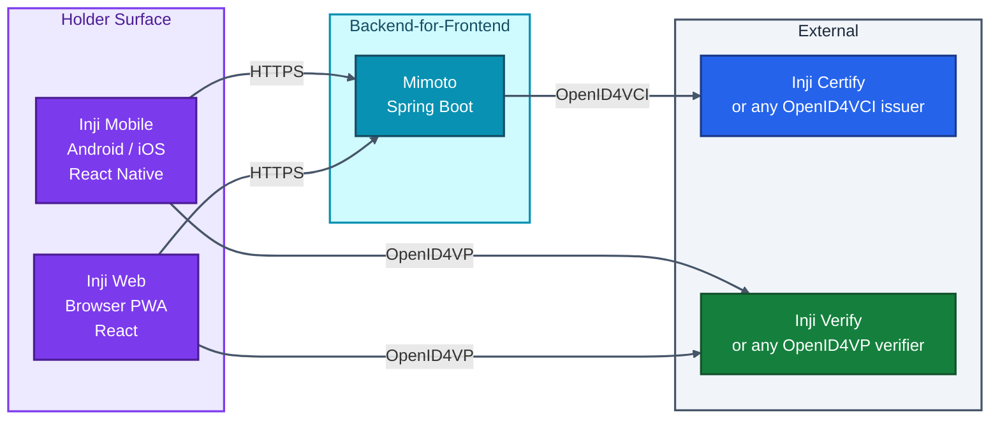
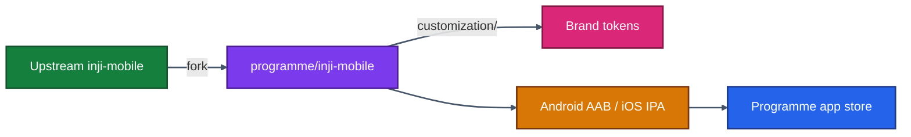
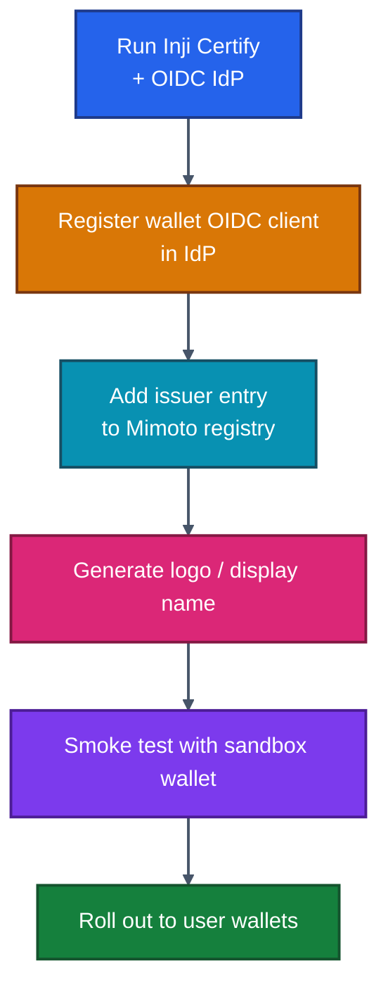
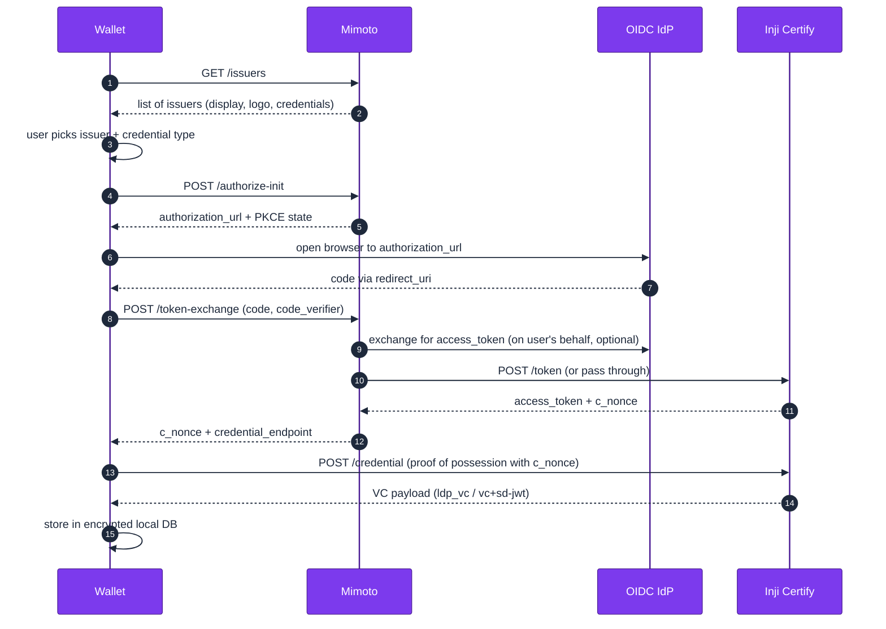
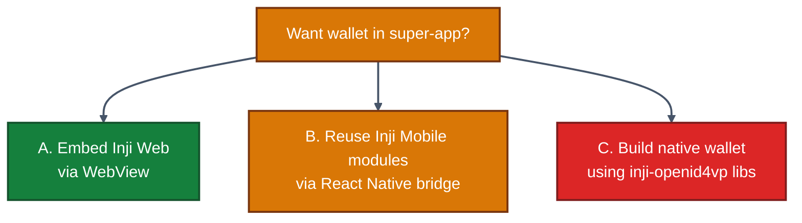
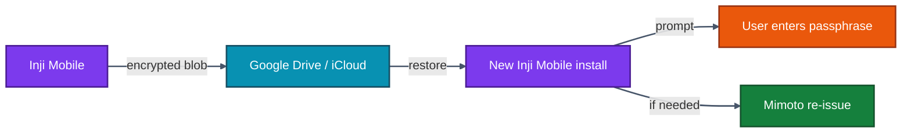
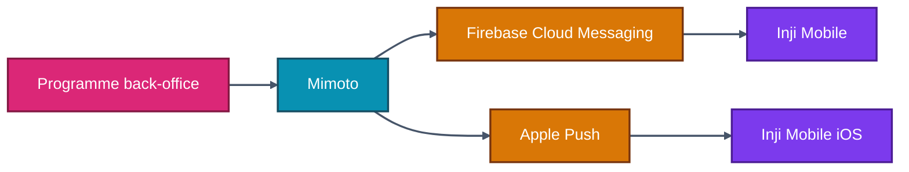

# 13 · Inji Wallet Integration

> **Inji ships two reference wallets — Inji Mobile (Android/iOS) and Inji Web (browser) — both backed by a shared backend-for-frontend called Mimoto.** This chapter is for teams who want to *use* an Inji wallet, *embed* it into another app, or *onboard their issuer* so that Inji wallets can discover and store its credentials.

---

## 13.1 The Wallet Trinity



**Important nuance:** Mimoto is the **issuance** broker that issuer programmes onboard. **Presentation** (OpenID4VP) happens *directly* between the wallet and the verifier — Mimoto is not in that path. This keeps verification reachable even when the issuer's BFF is down.

---

## 13.2 Inji Mobile

| Fact | Value |
|------|-------|
| Repo | [github.com/inji/inji-mobile](https://github.com/inji/inji-mobile) |
| Stack | React Native + native modules (Android Keystore, iOS Secure Enclave) |
| Crypto | Per-credential keys; selective disclosure for SD-JWT VCs |
| Storage | Encrypted Realm DB locally; never round-trips full VCs to Mimoto |
| Distribution | Open APKs + Apple TestFlight; programmes typically rebrand & re-sign |

### Capabilities

- Onboard from a programme-supplied "issuer list" (served by Mimoto).
- Authenticate via OIDC against the issuer's IdP (eSignet, Keycloak, etc.).
- Receive credentials in any of `ldp_vc`, `vc+sd-jwt`, `mso_mdoc` (mock).
- Present credentials via QR (camera-scan) or deep-link (`openid4vp://`).
- Backup / restore via Google Drive or iCloud (encrypted).

### Branding

Inji Mobile is built to be **rebranded**. The repo contains a `customization/` directory with theme tokens, logos, splash images, and app-name overrides. A typical programme:



---

## 13.3 Inji Web

| Fact | Value |
|------|-------|
| Repo | [github.com/inji/inji-web](https://github.com/inji/inji-web) |
| Stack | React 18 + Vite, PWA-capable |
| Crypto | Browser keys via WebCrypto; per-credential keypair |
| Storage | IndexedDB locally, optionally synced via Mimoto when user logs in |
| Distribution | Hosted on `injiweb.example.com` per programme |

Inji Web is what runs at [injiweb.collab.mosip.net](https://injiweb.collab.mosip.net). It is the easiest way to demo issuance and presentation in a browser without users installing anything.

Embedding strategies:

1. **Whole-app embed** — `iframe` the deployment and let it own the page.
2. **Subroute embed** — host Inji Web at `https://yourapp.example.com/wallet/*` via a path reverse-proxy.
3. **Fork-and-style** — clone the repo, change theme, ship as your own.

---

## 13.4 Mimoto — The Backend-for-Frontend

| Fact | Value |
|------|-------|
| Repo | [github.com/inji/mimoto](https://github.com/inji/mimoto) |
| Stack | Spring Boot 3.x, Java 21 |
| Storage | Postgres (user profile, issuer registry) |
| Port (default) | 8099 |

Mimoto's responsibilities:

- Maintain the **issuer registry** wallets see ("which issuers does this programme support?").
- Bridge OIDC redirects from the wallet to the issuer's IdP.
- Cache issuer metadata (`/.well-known/openid-credential-issuer`).
- Provide push notifications when a credential is ready.
- Optionally proxy the **token + credential endpoints** so the wallet never needs direct internet access to the issuer.

### Issuer registration JSON

```json
{
  "issuer_id": "example-university",
  "display_name": "Example University",
  "logo_uri": "https://mimoto.example.com/issuers/example-university/logo.png",
  "credential_issuer_url": "https://certify.example.com",
  "authorization_url": "https://idp.example.com/realms/inji",
  "client_id": "inji-mobile-client",
  "redirect_uri": "io.mosip.residentapp://oauth/redirect",
  "credentials": [
    { "type": "UniversityDegreeCredential", "format": "vc+sd-jwt" },
    { "type": "TranscriptCredential", "format": "ldp_vc" }
  ]
}
```

Drop this in `mimoto-issuers-config.json`, mount as ConfigMap, restart Mimoto. The wallet picks it up next time it lists issuers.

---

## 13.5 Onboarding a New Issuer (Step by Step)



Concrete checklist:

| Step | Owner | Validation |
|------|-------|-----------|
| Certify reachable on a public URL with valid TLS | Issuer ops | `curl https://certify.example.com/.well-known/openid-credential-issuer` |
| OIDC client created with redirect URI matching wallet | IdP admin | Test code flow with curl/Postman |
| Issuer JSON merged into Mimoto config | Programme | Restart / hot-reload Mimoto |
| Logo and metadata uploaded | Comms | Visible in Inji Web sandbox |
| End-to-end test from Inji Mobile sandbox build | QA | VC appears in wallet |

---

## 13.6 OIDC Client Configuration for Wallets

Wallets are public OAuth2 clients — they cannot keep a client secret safe. So:

```properties
# IdP-side client config
client_type=public
grant_types=authorization_code
response_types=code
require_pkce=true
require_proof_key=true
redirect_uris=io.mosip.residentapp://oauth/redirect,https://injiweb.example.com/oauth/callback
scopes=openid,credential
```

Notes:

- **Public** client, **PKCE required** — never a client secret.
- Two redirect URIs: a deep-link for Inji Mobile and a web callback for Inji Web.
- Scope `credential` is what Certify will check before issuing.

---

## 13.7 Wallet Onboarding to Issuance — Sequence



Two important details:

- **Pre-auth flow** (issuer-initiated, no user redirect) is an alternative — Mimoto vends an offer URL, the wallet picks it up. Useful for "issued credential ready, tap link" flows.
- **Proof of possession** (the cryptographic challenge in `POST /credential`) is what binds the credential to a wallet-local key. The wallet must keep that key safe — Android Keystore / iOS Secure Enclave.

---

## 13.8 Custom Wallets — When You Don't Use Inji Mobile/Web

Inji's wallets are reference implementations. You can build your own wallet from scratch and still:

- Receive credentials from Inji Certify (standards-conformant).
- Present credentials to Inji Verify (OpenID4VP).
- Use Mimoto's issuer registry (it's just JSON over HTTPS).

Libraries you'll find useful:

| Library | Repo | Purpose |
|--------|------|---------|
| `inji-openid4vp` (Kotlin & Swift) | [github.com/inji/inji-openid4vp](https://github.com/inji/inji-openid4vp) | OpenID4VP request handling |
| `vc-verifier-credentials` | [github.com/mosip/vc-verifier-credentials](https://github.com/mosip/vc-verifier-credentials) | VC verification primitives |
| `pixel-pass` | [github.com/mosip/pixelpass](https://github.com/mosip/pixelpass) | QR + base45 + zlib for offline VCs |

These are MPL-licensed, language-native, and can be embedded directly without forking Inji Mobile.

---

## 13.9 Embedding the Wallet Experience in Your App

A non-trivial percentage of programmes want a **single app** (their existing super-app) instead of a separate wallet. Three options:



| Option | Effort | UX fit | Crypto control |
|-------|-------|--------|----------------|
| A. WebView Inji Web | Days | Lower (web inside native) | Browser keystore — weaker |
| B. RN module reuse | Weeks | High | Native keystore |
| C. Custom native | Months | Maximum | Maximum |

Choose A for MVP, B for medium-term, C only when business-critical UX or hardware-key requirements force it.

---

## 13.10 Backup, Restore, and Recovery

A lost phone should **not** mean a lost credential. Inji's approach:



- **Local encrypted backup** to user-owned cloud storage, gated by a passphrase only the user knows.
- **Re-issuance fallback** — if backup is unavailable, the user re-authenticates to the issuer and gets a fresh credential. Old credential should be revoked (status list flip).

Programme decisions you must make:

| Decision | Options | Default |
|---------|---------|--------|
| Backup default | On / opt-in / off | Opt-in with reminder |
| Passphrase recovery | None / questions / contact line | None (security first) |
| Re-issuance window | Unlimited / per-credential limit | Per-credential limit |

---

## 13.11 Push Notifications and Status Updates

Mimoto can push messages to wallets:



Use cases:
- "Your credential is ready, tap to receive."
- "Your credential has been revoked — please re-enrol."
- "New version of credential available — refresh."

Implementation: register an FCM/APNS topic per user, store the push token in Mimoto on first launch, fire messages from the back-office.

---

## 13.12 Security Considerations for Wallet Integrators

| Concern | Recommendation |
|--------|--------------|
| Root / jailbreak detection | Use Play Integrity / DeviceCheck before issuing high-assurance credentials |
| Biometric gate before disclosure | OS-level biometric prompt on every present, configurable per credential |
| Holder-bound keys | Always generate keys in TEE/SE, never export |
| Logging | Never log raw VC payloads or disclosures |
| Network | Pin certificates for Mimoto + issuer endpoints |
| Backup encryption | AES-256-GCM with a user-supplied passphrase |
| Cross-app deep-links | Validate scheme + host before processing `openid4vp://` |
| Disclosed claim minimisation | Default to "least permissive" claim set when presenting |

---

## 13.13 Operational Footprint

For a programme running their own Mimoto + onboarding their own issuer:

| Component | Resource (warm) | HA |
|----------|----------------|----|
| Mimoto | 1 GB RAM, 1 vCPU | 2+ replicas behind a Service |
| Mimoto Postgres | 2 GB RAM, 20 GB SSD | Streaming replica |
| FCM / APNS account | n/a | Cloud-managed |
| Inji Web hosting | Static; any CDN | n/a |
| Inji Mobile distribution | Play Console + App Store | n/a |

See [./15-Deployment-Guide.md](./15-Deployment-Guide.md) for k8s manifests and Helm chart references.

---

## 13.14 Common Integration Pitfalls

| Symptom | Cause | Fix |
|--------|------|----|
| Wallet says "issuer not found" | Mimoto config not loaded / typo in issuer JSON | Validate JSON schema; restart Mimoto |
| OIDC login loops back to wallet without auth | `redirect_uri` mismatch | Make IdP redirect URI exactly equal to wallet deep link |
| Credential issued but not visible in wallet | Wallet didn't decode response format | Verify `format` returned matches what wallet announced supporting |
| Present flow shows wallet but no credential to share | No matching credential — schema or claim path mismatch with PE/DCQL | Test PE/DCQL against the VC's actual claim paths |
| Backup restore wipes new credentials | Restore happened *after* user already issued new ones | Prompt for restore at first launch only |

---

## 13.15 What's Next

You now know the issuer side, the holder side, and the verifier side. Time to flip to the developer reference: every API endpoint Certify exposes, with examples.

➡️ **[14 · API Reference](./14-API-Reference.md)**
