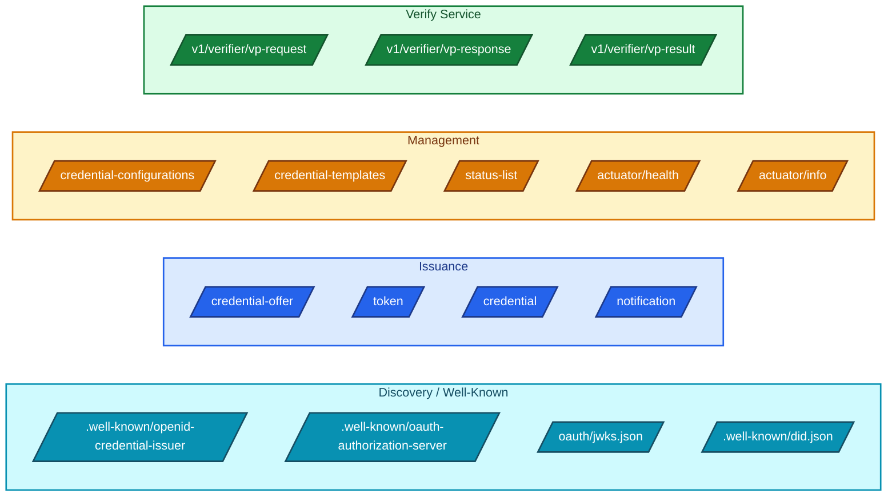
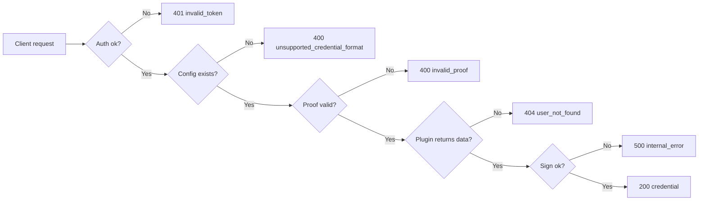

# 14 · API Reference

> **The endpoints you'll integrate against, with request/response shapes, headers, and error patterns.** This chapter is a developer-facing catalogue, not a full OpenAPI spec — for the machine-readable contract, fetch `/v3/api-docs` from a running Certify or Verify instance.

> **Assumption:** examples use `https://certify.example.com` as Certify base URL and `https://verify.example.com` as Verify base URL. Replace with your own.

> 📚 **Official API portal:** the canonical, interactive, "try-it-now" reference for every MOSIP/Inji API surface is hosted at **[mosip.stoplight.io](https://mosip.stoplight.io/)**. Treat that portal as the source of truth when contracts in this chapter and the published spec disagree.

---

## 14.1 The Endpoint Map



---

## 14.2 Discovery — OpenID4VCI Metadata

### GET `/.well-known/openid-credential-issuer`

**Purpose:** wallets call this first to discover what the issuer offers.

**Response (abridged):**

```json
{
  "credential_issuer": "https://certify.example.com",
  "authorization_servers": ["https://idp.example.com/realms/inji"],
  "credential_endpoint": "https://certify.example.com/credential",
  "notification_endpoint": "https://certify.example.com/notification",
  "credential_configurations_supported": {
    "UniversityDegreeCredential_sdjwt": {
      "format": "vc+sd-jwt",
      "vct": "UniversityDegreeCredential",
      "cryptographic_binding_methods_supported": ["jwk"],
      "credential_signing_alg_values_supported": ["ES256"],
      "proof_types_supported": {
        "jwt": { "proof_signing_alg_values_supported": ["ES256", "EdDSA"] }
      },
      "display": [
        { "name": "University Degree", "locale": "en", "background_color": "#0F62FE" }
      ]
    }
  }
}
```

**Cache hint:** wallets cache this. Use HTTP `Cache-Control: max-age=300` and bump when adding new configurations.

---

## 14.3 Discovery — Authorization Server Metadata

### GET `/.well-known/oauth-authorization-server`

Returned by the **IdP**, not Certify. Certify itself does **not** host an authorization server — it points to one via `authorization_servers` in the issuer metadata.

Minimal expected fields a wallet relies on:

```json
{
  "issuer": "https://idp.example.com/realms/inji",
  "authorization_endpoint": "https://idp.example.com/realms/inji/protocol/openid-connect/auth",
  "token_endpoint": "https://idp.example.com/realms/inji/protocol/openid-connect/token",
  "jwks_uri": "https://idp.example.com/realms/inji/protocol/openid-connect/certs",
  "response_types_supported": ["code"],
  "grant_types_supported": ["authorization_code", "urn:ietf:params:oauth:grant-type:pre-authorized_code"],
  "code_challenge_methods_supported": ["S256"]
}
```

---

## 14.4 Discovery — JWKS

### GET `/oauth/jwks.json`

Certify's own public keys (for SD-JWT verification). Returns standard JWKS:

```json
{
  "keys": [
    {
      "kty": "EC",
      "crv": "P-256",
      "kid": "es256-2026",
      "x": "F83OJ3...",
      "y": "X45hRG...",
      "alg": "ES256",
      "use": "sig"
    }
  ]
}
```

Verifiers cache by `kid`. Always include `kid` on every key, never reuse a `kid` across rotations.

---

## 14.5 Discovery — DID Document

### GET `/.well-known/did.json` (or your DID method's URL)

Inji typically uses `did:web`. The document points to the same keys as JWKS but in DID-document form:

```json
{
  "@context": ["https://www.w3.org/ns/did/v1"],
  "id": "did:web:certify.example.com",
  "verificationMethod": [
    {
      "id": "did:web:certify.example.com#key-1",
      "type": "Ed25519VerificationKey2020",
      "controller": "did:web:certify.example.com",
      "publicKeyMultibase": "z6MkrJV..."
    }
  ],
  "assertionMethod": ["did:web:certify.example.com#key-1"]
}
```

---

## 14.6 Issuance — Credential Offer

### POST `/credential-offer`

Used in **issuer-initiated** flow (pre-authorized code). Programme back-office calls this when a credential becomes ready for a user.

**Request:**

```http
POST /credential-offer HTTP/1.1
Host: certify.example.com
Authorization: Bearer <programme-back-office-token>
Content-Type: application/json

{
  "credential_configuration_ids": ["UniversityDegreeCredential_sdjwt"],
  "subject_id": "user-internal-1234",
  "user_pin_required": false
}
```

**Response:**

```json
{
  "credential_offer_uri": "https://certify.example.com/offer/01HXYZ...",
  "pre_authorized_code": "tx_eyJhbGciOi...",
  "expires_in": 600
}
```

The wallet retrieves the offer object from `credential_offer_uri`, then proceeds to the token endpoint with the pre-auth code.

---

## 14.7 Issuance — Token Endpoint

The token endpoint is hosted **by the IdP, not by Certify** for the auth-code grant. For the **pre-authorized code** grant Certify itself may handle it depending on deployment topology.

**Auth-code request (to IdP):**

```http
POST /realms/inji/protocol/openid-connect/token HTTP/1.1
Content-Type: application/x-www-form-urlencoded

grant_type=authorization_code
&code=...
&client_id=inji-mobile-client
&redirect_uri=io.mosip.residentapp://oauth/redirect
&code_verifier=...
```

**Pre-auth-code request (to Certify or IdP, depending on config):**

```http
POST /token HTTP/1.1
Content-Type: application/x-www-form-urlencoded

grant_type=urn:ietf:params:oauth:grant-type:pre-authorized_code
&pre-authorized_code=tx_eyJhbGciOi...
&client_id=inji-mobile-client
```

**Response:**

```json
{
  "access_token": "eyJhbGciOiJSUzI1...",
  "token_type": "Bearer",
  "expires_in": 300,
  "c_nonce": "P9TBJK...",
  "c_nonce_expires_in": 300
}
```

The `c_nonce` is consumed by the next call.

---

## 14.8 Issuance — Credential Endpoint

### POST `/credential`

Where the wallet actually receives the VC.

**Request:**

```http
POST /credential HTTP/1.1
Host: certify.example.com
Authorization: Bearer eyJhbGciOiJSUzI1...
Content-Type: application/json

{
  "format": "vc+sd-jwt",
  "credential_definition": {
    "vct": "UniversityDegreeCredential"
  },
  "proof": {
    "proof_type": "jwt",
    "jwt": "eyJ0eXAiOiJvcGVuaWQ0..."
  }
}
```

The `proof.jwt` is **wallet-signed**, contains the `c_nonce` from the token response, and proves the wallet holds the private key it claims.

**Successful response:**

```json
{
  "credential": "eyJhbGc...header.body.sig~disclosure1~disclosure2~",
  "c_nonce": "Q1RDLK...",
  "c_nonce_expires_in": 300
}
```

For `ldp_vc`:

```json
{
  "credential": {
    "@context": ["https://www.w3.org/ns/credentials/v2", ...],
    "type": ["VerifiableCredential", "UniversityDegreeCredential"],
    "issuer": "did:web:certify.example.com",
    "credentialSubject": { ... },
    "proof": { ... }
  }
}
```

### Error responses

| HTTP | `error` | Meaning | Fix |
|------|--------|--------|-----|
| 401 | `invalid_token` | Access token bad / audience mismatch | Check `mosip.certify.identifier` |
| 400 | `invalid_proof` | `c_nonce` expired or proof JWT malformed | Wallet must re-derive proof with fresh nonce |
| 400 | `unsupported_credential_format` | Requested `format` not in configuration | Add credential configuration |
| 400 | `invalid_credential_request` | Request body missing fields | Inspect against OpenID4VCI spec |
| 500 | (no spec field) | Plugin or signer threw | Check Certify logs around `DataProviderPlugin` calls |

---

## 14.9 Issuance — Notification Endpoint

### POST `/notification`

After the wallet stores the credential, it sends a status notification — useful for issuer audit and revocation linkage.

**Request:**

```http
POST /notification HTTP/1.1
Authorization: Bearer eyJhbGciOiJSUzI1...
Content-Type: application/json

{
  "notification_id": "n_01HXYZ...",
  "event": "credential_accepted",
  "event_description": "Stored in wallet"
}
```

**Events:**
- `credential_accepted`
- `credential_failure`
- `credential_deleted` (wallet-side delete; programme decides whether to revoke)

---

## 14.10 Management — Credential Configurations

### GET `/credential-configurations`

Lists registered configurations. Useful in CI/CD pipelines for drift detection.

### POST `/credential-configurations`

Creates a new configuration. Body shape mirrors what appears under `credential_configurations_supported` in issuer metadata.

```json
{
  "id": "TranscriptCredential_ldp",
  "format": "ldp_vc",
  "context": ["https://www.w3.org/ns/credentials/v2", "https://schemas.example.org/transcript/v1.jsonld"],
  "type": ["VerifiableCredential", "TranscriptCredential"],
  "cryptographic_binding_methods_supported": ["did:key", "did:jwk"],
  "credential_signing_alg_values_supported": ["Ed25519Signature2020"],
  "template_id": "transcript-v1"
}
```

### PUT `/credential-configurations/{id}` and DELETE `/credential-configurations/{id}`

Update or remove. **Deletions cascade** to template references; verify before deleting in production.

> Most operators treat these as GitOps-managed. Wire them into Argo CD or Flux with a custom controller; do not let humans curl PUT in prod.

---

## 14.11 Management — Credential Templates

### GET `/credential-templates`
### POST `/credential-templates`
### PUT `/credential-templates/{id}`
### DELETE `/credential-templates/{id}`

Template body is the Velocity content (see [./11-VC-Formats-and-Implementations.md](./11-VC-Formats-and-Implementations.md)):

```json
{
  "id": "transcript-v1",
  "credential_type": "TranscriptCredential",
  "context": "https://schemas.example.org/transcript/v1.jsonld",
  "template": "{\n  \"@context\": [...],\n  \"type\": [...],\n  \"credentialSubject\": { ... }\n}"
}
```

Use multi-line strings carefully — JSON escapes every newline. Easier to PUT from a file via `curl --data-binary @template.json`.

---

## 14.12 Management — Status List

### GET `/status-list/{id}`

Returns the **public** status list credential (signed JSON-LD per W3C Bitstring Status List spec). Verifiers cache this for the TTL declared in `Cache-Control`.

### POST `/status-list/{id}/revoke`

Body:

```json
{
  "credential_index": 4321,
  "reason": "user_request"
}
```

Flips bit 4321 to "revoked". Status list is re-signed and the cached public copy invalidated.

> Authenticate this endpoint to programme back-office only — anyone with this token can revoke credentials.

---

## 14.13 Management — System Info

### GET `/actuator/info`

```json
{
  "build": { "name": "inji-certify", "version": "0.14.0" },
  "git": { "branch": "main", "commit": { "id": "a8f3d29" } }
}
```

### GET `/actuator/health`

Wire to liveness/readiness probes. Avoid `/actuator/health` in unauthenticated form revealing dependency status; use `health.show-details=when_authorized`.

### GET `/actuator/prometheus`

For your metrics scrape. Protect with internal-only network.

---

## 14.14 Verify Service — VP Request

### POST `/v1/verifier/vp-request`

**Request:**

```json
{
  "presentation_definition": { /* DIF PE v2 */ },
  "ttl_seconds": 300,
  "callback_url": "https://yourapp.example.com/verify/callback"
}
```

or, equivalently with DCQL:

```json
{
  "query": { /* DCQL */ },
  "ttl_seconds": 300
}
```

**Response:**

```json
{
  "id": "vpreq_01HXYZ...",
  "request_uri": "https://verify.example.com/v1/verifier/vp-request/vpreq_01HXYZ.../object",
  "deep_link": "openid4vp://?client_id=...&request_uri=...",
  "qr_png_base64": "iVBORw0KGgoAAAANSUhEUg..."
}
```

---

## 14.15 Verify Service — VP Response

### POST `/v1/verifier/vp-response`

Called by the **wallet**, not by your code. Body shape per OpenID4VP:

```http
POST /v1/verifier/vp-response HTTP/1.1
Content-Type: application/x-www-form-urlencoded

state=...
&vp_token=...
&presentation_submission=...
```

Service validates, stores the result under the original request `id`.

---

## 14.16 Verify Service — VP Result

### GET `/v1/verifier/vp-result/{id}`

Your RP backend polls this (or the SDK does on the frontend). Possible states:

```json
{ "status": "PENDING" }
```

```json
{
  "status": "SUCCESS",
  "credentials": [
    {
      "format": "vc+sd-jwt",
      "issuer": "did:web:certify.example.com",
      "claims": { "age_over_18": true },
      "status_check": "VALID"
    }
  ],
  "verified_at": "2026-05-26T07:00:00Z"
}
```

```json
{
  "status": "FAILED",
  "error": "signature_invalid",
  "error_description": "vc+sd-jwt JWS signature did not verify"
}
```

---

## 14.17 Authentication for Management Endpoints

The management endpoints (configurations, templates, status-list revocation) are protected by OAuth2 just like the issuance endpoints. Use a **back-office service account** with a dedicated scope, e.g. `certify.admin`.

```properties
mosip.certify.admin.scope=certify.admin
mosip.certify.admin.required-roles=programme-admin
```

Do **not** use the same client used by wallets to call admin endpoints.

---

## 14.18 Rate-Limiting and Quotas

Inji does not ship rate-limit logic; rely on your gateway (NGINX, Kong, Envoy, Cloudflare). Suggested rules:

| Endpoint | Limit | Rationale |
|---------|------|---------|
| `/credential` | 10/min per user | Prevent runaway re-issuance |
| `/credential-offer` | 30/min per back-office client | Match expected back-office throughput |
| `/v1/verifier/vp-request` | 60/min per RP | RPs may legitimately verify many sessions |
| `/v1/verifier/vp-result/{id}` | 1/sec per session | Polling shouldn't overheat |
| Discovery endpoints | 1000/min per IP | Public, cache-friendly |

---

## 14.19 Error Model Cheat-Sheet



---

## 14.20 cURL Smoke-Test Sequence

```bash
# 1. Discovery
curl -s https://certify.example.com/.well-known/openid-credential-issuer | jq

# 2. Create an offer (programme back-office)
curl -s -X POST https://certify.example.com/credential-offer \
  -H "Authorization: Bearer $ADMIN_TOKEN" \
  -H "Content-Type: application/json" \
  -d '{"credential_configuration_ids":["UniversityDegreeCredential_sdjwt"],"subject_id":"u-1"}'

# 3. (as wallet) exchange pre-auth code
curl -s -X POST https://idp.example.com/realms/inji/protocol/openid-connect/token \
  -d "grant_type=urn:ietf:params:oauth:grant-type:pre-authorized_code" \
  -d "pre-authorized_code=$CODE" \
  -d "client_id=inji-mobile-client"

# 4. Get the credential
curl -s -X POST https://certify.example.com/credential \
  -H "Authorization: Bearer $ACCESS" \
  -H "Content-Type: application/json" \
  -d '{"format":"vc+sd-jwt","credential_definition":{"vct":"UniversityDegreeCredential"},"proof":{"proof_type":"jwt","jwt":"'$PROOF'"}}'
```

Treat this as your CI smoke test. Run it on every deploy.

---

## 14.21 What's Next

You have the protocol surface. Now let's deploy it for real — Docker Compose, Helm, secrets, HSM.

➡️ **[15 · Deployment Guide](./15-Deployment-Guide.md)**
