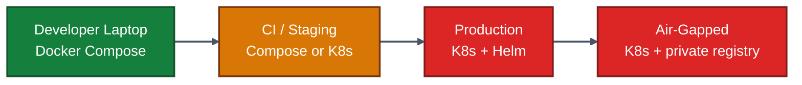
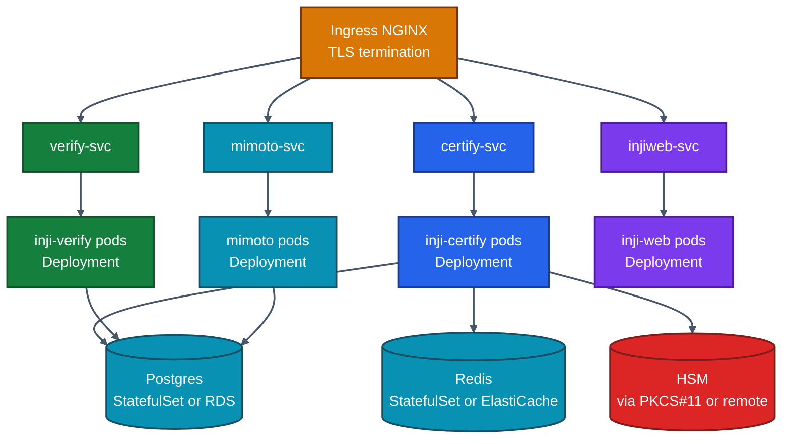
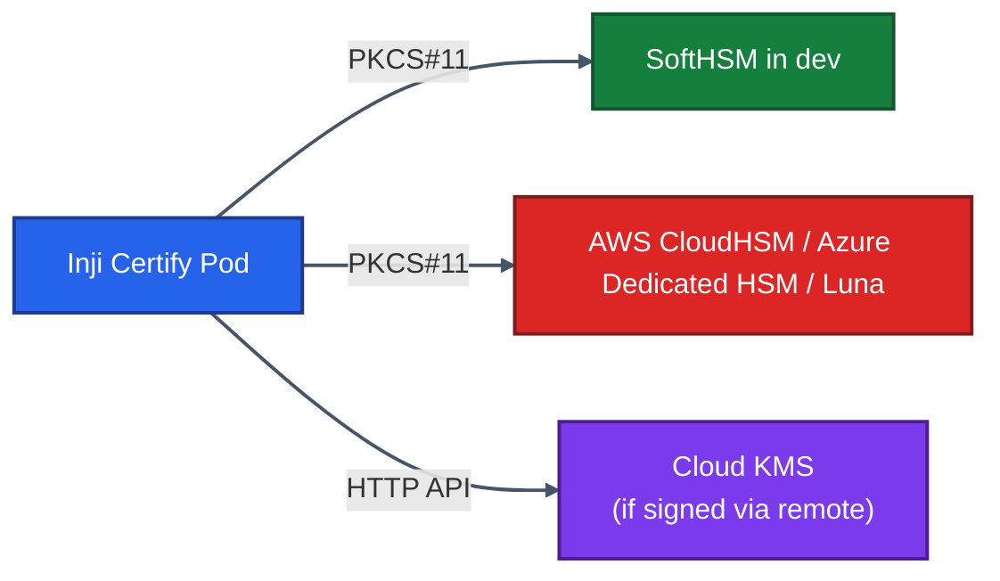
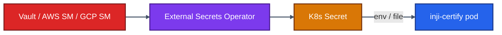
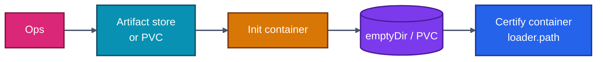
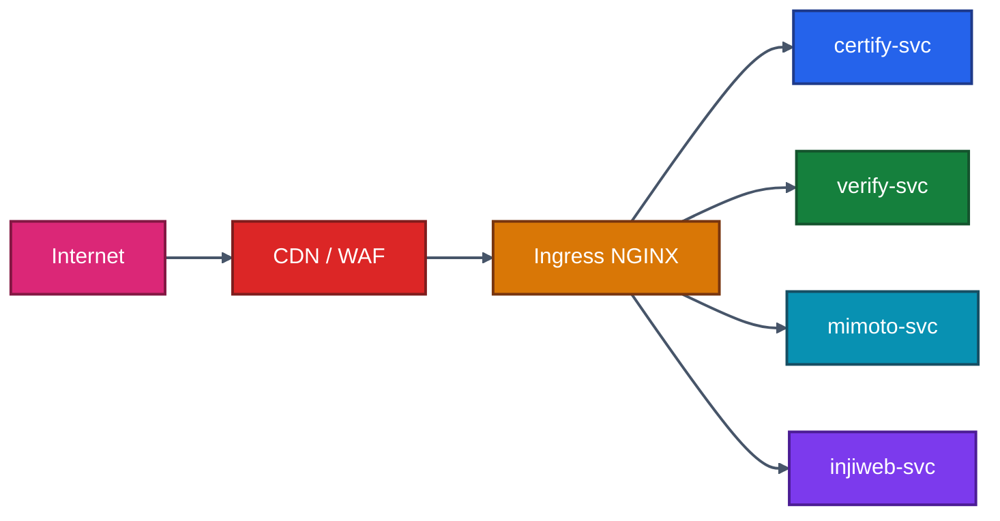
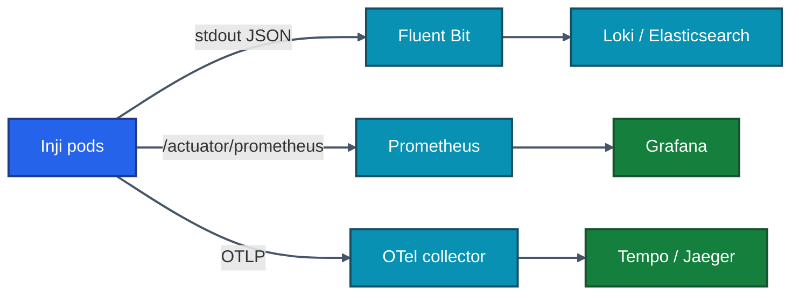
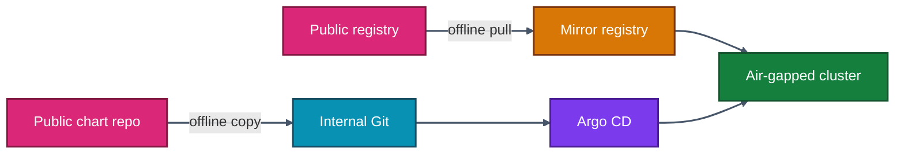

# 15 · Deployment Guide

> **From a workstation prototype to a production-grade rollout.** This chapter walks through three deployment shapes — Docker Compose for development, Kubernetes/Helm for production, and an air-gapped variant for high-assurance environments. It also covers custom-plugin packaging, HSM integration, secrets, and hardening.

---

## 15.1 Deployment Shapes — Pick the Right One



| Shape | Use | Footprint |
|------|-----|----------|
| Docker Compose | Local dev, demos | One host, 4 GB RAM minimum |
| K8s + Helm | Staging + production | Cluster, HA Postgres + Redis |
| Air-gapped K8s | Government / regulated | Private registry, offline charts |

---

## 15.2 Docker Compose — Refresher

The canonical reference is the `inji-certify/docker-compose/docker-compose-injistack/` stack (covered in detail in [./04-Sample-Setup-Guide.md](./04-Sample-Setup-Guide.md)). Ports and services recap:

| Service | Image | Port | Purpose |
|--------|-------|-----|---------|
| `postgres` | postgres:15 | 5433 | Certify + Mimoto DB |
| `redis` | redis:7 | 6379 | Token / transaction cache |
| `inji-certify` | mosipid/inji-certify-with-plugins:0.13.1 | 8090 | Issuer |
| `nginx` | nginx:1.27 | 8091 | Reverse proxy |
| `mimoto` | mosipid/mimoto | 8099 | BFF |
| `inji-web` | mosipid/inji-web | 3004 | Web wallet |
| `inji-verify` | mosipid/inji-verify | 8095 | Verifier service |

Bring it all up:

```bash
cd inji-certify/docker-compose/docker-compose-injistack
docker compose up -d
docker compose logs -f inji-certify
```

This is for **developers**. Do not deploy Compose to production.

---

## 15.3 Kubernetes — Reference Topology



**Sizing per replica (warm steady-state, single-tenant programme):**

| Service | CPU req/lim | Mem req/lim | Replicas |
|--------|-----------|-----------|---------|
| inji-certify | 250m / 1000m | 768Mi / 1.5Gi | 2 (HPA up to 6) |
| inji-verify | 250m / 1000m | 512Mi / 1Gi | 2 (HPA up to 4) |
| mimoto | 200m / 800m | 512Mi / 1Gi | 2 |
| inji-web | 50m / 200m | 128Mi / 256Mi | 2 |

---

## 15.4 Helm Chart Layout

MOSIP publishes Helm charts under [github.com/mosip/inji-helm](https://github.com/mosip/inji-helm) (canonical), and each upstream repo has a `helm/` directory. Recommended layout for an **umbrella chart** in your own GitOps repo:

```
charts/inji-stack/
├── Chart.yaml                # version, dependencies
├── values.yaml               # programme-wide defaults
├── values-staging.yaml       # env overrides
├── values-prod.yaml
├── charts/                   # subcharts (vendored or fetched)
│   ├── inji-certify/
│   ├── inji-verify/
│   ├── mimoto/
│   └── inji-web/
└── templates/
    └── shared-configmaps.yaml
```

Sample `values.yaml` for Certify:

```yaml
injiCertify:
  image:
    repository: mosipid/inji-certify-with-plugins
    tag: "0.14.0"
  replicaCount: 2
  service:
    type: ClusterIP
    port: 8090
  ingress:
    enabled: true
    hosts: ["certify.example.com"]
    tls:
      - secretName: certify-tls
        hosts: ["certify.example.com"]
  resources:
    requests: { cpu: 250m, memory: 768Mi }
    limits:   { cpu: 1000m, memory: 1500Mi }
  env:
    SPRING_PROFILES_ACTIVE: prod
    MOSIP_CERTIFY_AUTHN_ISSUER_URI: https://idp.example.com/realms/inji
    MOSIP_CERTIFY_AUTHN_JWK_SET_URI: https://idp.example.com/realms/inji/protocol/openid-connect/certs
    MOSIP_CERTIFY_IDENTIFIER: https://certify.example.com
  secrets:
    DB_PASSWORD:
      valueFrom:
        secretKeyRef:
          name: certify-db
          key: password
```

---

## 15.5 Database — Postgres in Production

Schema is created automatically on first boot via Flyway. For a managed Postgres (RDS / Cloud SQL):

| Setting | Value |
|--------|------|
| Postgres version | 15 or 16 |
| Instance class | minimum 2 vCPU / 4 GB |
| Storage | 50 GB gp3 to start |
| Backups | PITR enabled, 7-day retention minimum |
| SSL | `sslmode=require` from app |
| Connection pool | PgBouncer in transaction mode, 20 conn/pod |

Two databases recommended (separate schemas at minimum):

- `inji_certify` — issuance state, configurations, status lists.
- `inji_verify` — VP request/result history (often shorter retention; see GDPR).
- `mimoto` — issuer registry, user push tokens.

---

## 15.6 Redis — Cache Layout

Certify uses Redis for:

| Key prefix | Purpose | TTL |
|-----------|--------|-----|
| `c_nonce:*` | Replay nonces | ~5 min |
| `transaction:*` | Pre-auth transactions | ~10 min |
| `jwks:*` | Cached IdP JWKS | ~10 min |
| `issuer-meta:*` | Cached well-known docs | ~5 min |

Use a small (1 GB) managed Redis with TLS. Redis is **not the source of truth** — losing the cache means short-lived sessions die, nothing more.

---

## 15.7 HSM and Signing Keys



Inji uses the `kernel-keymanager` library, which speaks:

- Local PKCS#12 keystore (dev only).
- PKCS#11 (production HSMs: Luna, nCipher, CloudHSM, SoftHSM).
- (Coming) HTTP-based remote signers.

**Properties:**

```properties
mosip.kernel.keymanager.keystore.type=PKCS11
mosip.kernel.keymanager.keystore.path=/etc/utimaco/p11.cfg
mosip.kernel.keymanager.keystore.password=${HSM_PIN}
mosip.kernel.keymanager.keystore.app.id=CERTIFY
mosip.kernel.keymanager.keystore.ref.id=ED25519_SIGN
```

The PIN is mounted as a Kubernetes Secret (never in `values.yaml`). For some HSMs you'll mount a vendor library as a sidecar.

### Key-rotation cadence

| Key | Rotation period | Process |
|-----|----------------|---------|
| Signing key | 12 months | Generate new, publish in JWKS with new `kid`, switch active `kid`, keep old in JWKS for verification of historical credentials |
| TLS cert | 90 days | Use cert-manager |
| DB password | 90 days | Use external secrets operator + rolling restart |

---

## 15.8 Secrets Management



Never put secrets in:
- `values.yaml`
- `application-default.properties` checked into Git
- Container images

Always:
- Reference via Kubernetes Secret (mounted env or file).
- Use ExternalSecrets / SealedSecrets for GitOps friendliness.
- Rotate via the external secret backend, not by editing the Secret directly.

---

## 15.9 Custom Plugin Deployment

You wrote a plugin (see [./07-Plugins-And-Modules.md](./07-Plugins-And-Modules.md)). Three ways to deploy it:

### Option A — Bake into a custom image

```dockerfile
FROM mosipid/inji-certify:0.14.0
COPY ./build/libs/my-plugin-1.0.0.jar /home/mosip/additional_jars/
```

Build, push to your registry, deploy via Helm `image.repository`. Simplest model.

### Option B — Sidecar volume mount

```yaml
volumes:
  - name: plugins
    emptyDir: {}
initContainers:
  - name: fetch-plugin
    image: alpine:3
    command: ["sh","-c","wget -O /plugins/my-plugin.jar https://artifacts.example.com/my-plugin-1.0.0.jar"]
    volumeMounts:
      - { name: plugins, mountPath: /plugins }
containers:
  - name: inji-certify
    image: mosipid/inji-certify:0.14.0
    env:
      - { name: LOADER_PATH, value: /plugins }
    volumeMounts:
      - { name: plugins, mountPath: /plugins }
```

Plugin is fetched fresh at pod start. Good for fast iteration; depends on artifact-store availability.

### Option C — Persistent volume

PV with `ReadOnlyMany`, plugin uploaded by ops, referenced via `LOADER_PATH`. Less common, used in air-gapped sites with manual update windows.



---

## 15.10 Environment Profiles

Certify reads `spring.profiles.active`. Recommended profiles:

| Profile | Purpose | Notable settings |
|--------|--------|----------------|
| `default` | Local dev | Mock plugin, H2 fallback (do not use) |
| `compose` | Docker Compose stack | Postgres + Redis on hostnames |
| `staging` | Staging cluster | Real IdP, plugin = mock |
| `prod` | Production | Real plugin, HSM, status list enabled |

Override anything via env variables: `MOSIP_CERTIFY_DOMAIN_URL=https://certify.example.com` etc.

---

## 15.11 Network and Ingress



Ingress recommendations:

- **TLS 1.2 minimum**, prefer TLS 1.3.
- **HSTS** with at least 180 days.
- **CSP** for Inji Web allowing only your own origins + Verify base URL.
- **Rate limiting** per path (see [./14-API-Reference.md](./14-API-Reference.md) §14.18).
- **CORS** on `/credential-offer` if called from a programme web admin; not on `/credential` (wallet apps don't use CORS).

---

## 15.12 Observability Wiring



Minimum Grafana dashboards to import (or build):

- **Issuance overview**: requests per minute, success rate, p95 latency, plugin latency.
- **Verification overview**: VP requests per minute, success rate by RP.
- **Token endpoint health**: 4xx burst, refresh failures.
- **HSM utilisation**: signing latency, signing rate.
- **Postgres health**: replication lag, slow queries.

Alerts to enable on day one:

- 5xx rate on `/credential` > 1 %.
- Plugin latency p95 > 2 s.
- DB connections > 80 % of pool.
- Redis evictions > 0.

---

## 15.13 Backup, Restore, Disaster Recovery

| Asset | Backup | RTO | RPO |
|-------|-------|-----|-----|
| Postgres | PITR + daily snapshot | 1 h | 5 min |
| HSM keys | HSM-vendor backup (hardware token) | Hours | None (replicated) |
| Plugin JAR | Artifact registry with versioning | Minutes | None |
| Helm values | Git | Minutes | None |
| Secrets | Vault snapshot | 1 h | 5 min |

DR test cadence: at least quarterly. Failing to test = no DR.

---

## 15.14 Air-Gapped Deployment



Steps:

1. **Mirror images** to your private registry (`docker pull`, `docker tag`, `docker push`).
2. **Vendor charts** into your internal Git (no live `helm repo add`).
3. **Trust list & DID context** files mounted from ConfigMaps populated by ops, no internet fetch at runtime.
4. **JWKS** for the IdP is also a static ConfigMap unless you also host the IdP inside the cluster.
5. **No `did:web` if hostnames are internal-only** — use `did:key` or `did:jwk` instead, which don't require DNS resolution.

---

## 15.15 CI/CD Pipeline Pattern

```mermaid
flowchart LR
    PR[Pull Request] --> BUILD[Build<br/>Maven]
    BUILD --> TEST[Unit + Integration tests]
    TEST --> IMG[Build & sign image]
    IMG --> SCAN[Trivy / Grype scan]
    SCAN --> STAGE[Deploy to staging<br/>Argo CD sync]
    STAGE --> SMOKE[Smoke tests<br/>cURL sequence §14.20]
    SMOKE --> PROM[Promote tag]
    PROM --> PROD[Production sync]

    classDef prClass fill:#DB2777,stroke:#831843,stroke-width:2px,color:#FFFFFF
    classDef buildClass fill:#2563EB,stroke:#1E3A8A,stroke-width:2px,color:#FFFFFF
    classDef testClass fill:#0891B2,stroke:#164E63,stroke-width:2px,color:#FFFFFF
    classDef scanClass fill:#D97706,stroke:#78350F,stroke-width:2px,color:#FFFFFF
    classDef stageClass fill:#7C3AED,stroke:#4C1D95,stroke-width:2px,color:#FFFFFF
    classDef prodClass fill:#15803D,stroke:#14532D,stroke-width:2px,color:#FFFFFF

    class PR prClass
    class BUILD,IMG buildClass
    class TEST,SMOKE testClass
    class SCAN scanClass
    class STAGE stageClass
    class PROM,PROD prodClass

    linkStyle default stroke:#475569,stroke-width:2px
```



Required gates:

- Image scanned, no Critical CVEs.
- Smoke tests green on staging.
- Helm chart lint passes (`helm lint`, `kubeconform`).
- Manual approval for production sync (4-eyes).

---

## 15.16 Hardening Checklist

- [ ] Pods run as non-root (`runAsUser: 1000`).
- [ ] Read-only root filesystem (`readOnlyRootFilesystem: true`).
- [ ] Drop all capabilities; add none.
- [ ] NetworkPolicy isolating Certify → only IdP, DB, Redis, HSM egress allowed.
- [ ] PSP / PSA `restricted` profile.
- [ ] Secrets never as env in production — prefer mounted files.
- [ ] HPA + PDB configured (don't drain all replicas at once).
- [ ] mTLS between Certify and plugin's data sources where possible.
- [ ] Audit logs forwarded to a separate, append-only sink.
- [ ] Disaster-recovery runbook documented and rehearsed.
- [ ] Keys rotated on the documented cadence with calendar reminders.
- [ ] DID document signed and pinned to a known commit.

---

## 15.17 Common Deployment Issues

| Symptom | Cause | Resolution |
|--------|------|----------|
| Pod CrashLoopBackOff with "no JWKS" | IdP unreachable from pod | NetworkPolicy egress rule missing |
| First request times out, subsequent succeed | JWKS warmup; cache only fills on first hit | Set `mosip.certify.jwks.preload=true` |
| `401 invalid_token` only in production | Audience mismatch — staging used `localhost`, prod uses real URL | Align `mosip.certify.identifier` with deployment URL |
| Custom plugin not picked up | `LOADER_PATH` wrong, or plugin class not annotated | Check pod logs for "loaded plugin: ..." line |
| Status list 404 in production | Status-list public URL not exposed by Ingress | Add public route for `/status-list/*` |
| HSM PIN errors | Secret not mounted or wrong key in Secret | `kubectl describe pod` to verify env source |

---

## 15.18 What's Next

Now that it's running, what breaks and how do you keep it running? The next chapter is the **operator's manual**.

➡️ **[16 · Troubleshooting & Best Practices](./16-Troubleshooting-and-Best-Practices.md)**
