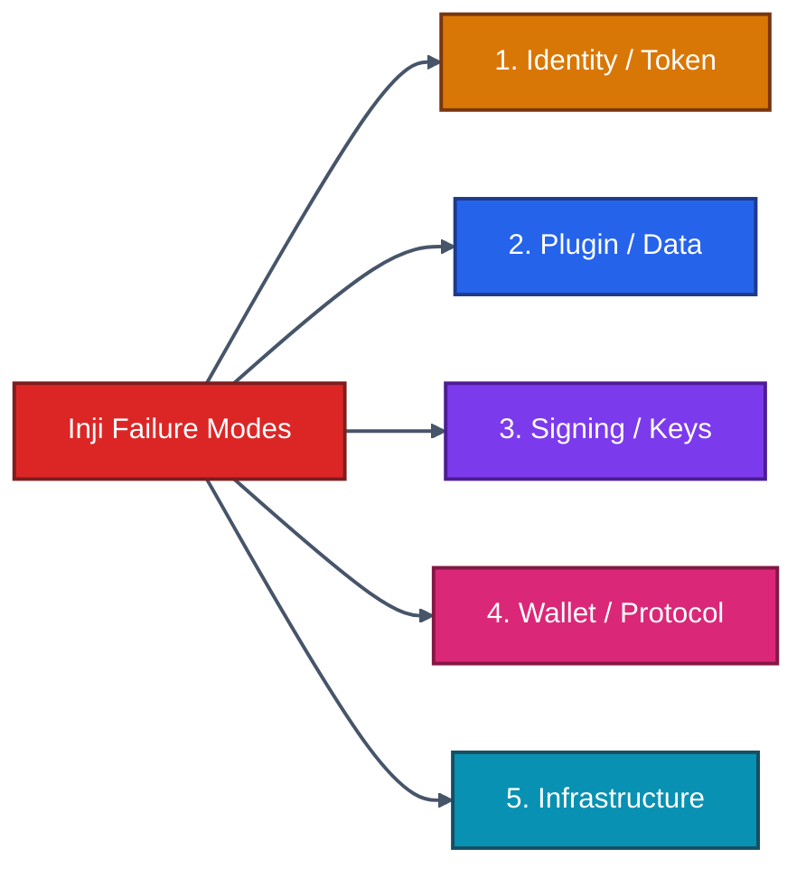
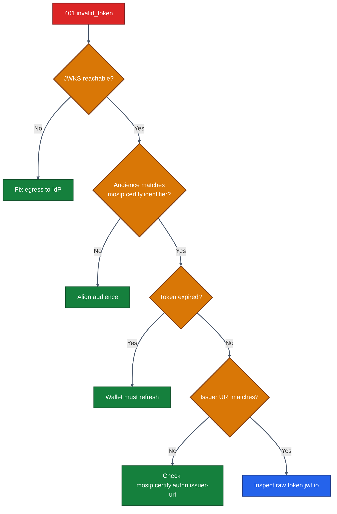
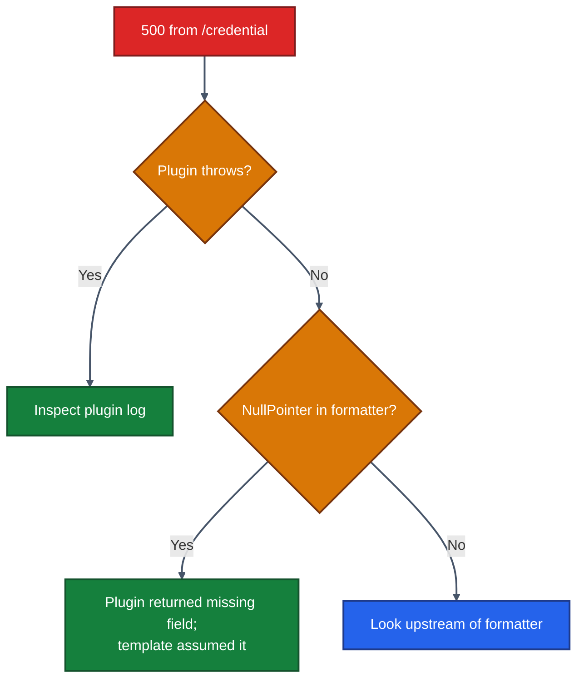
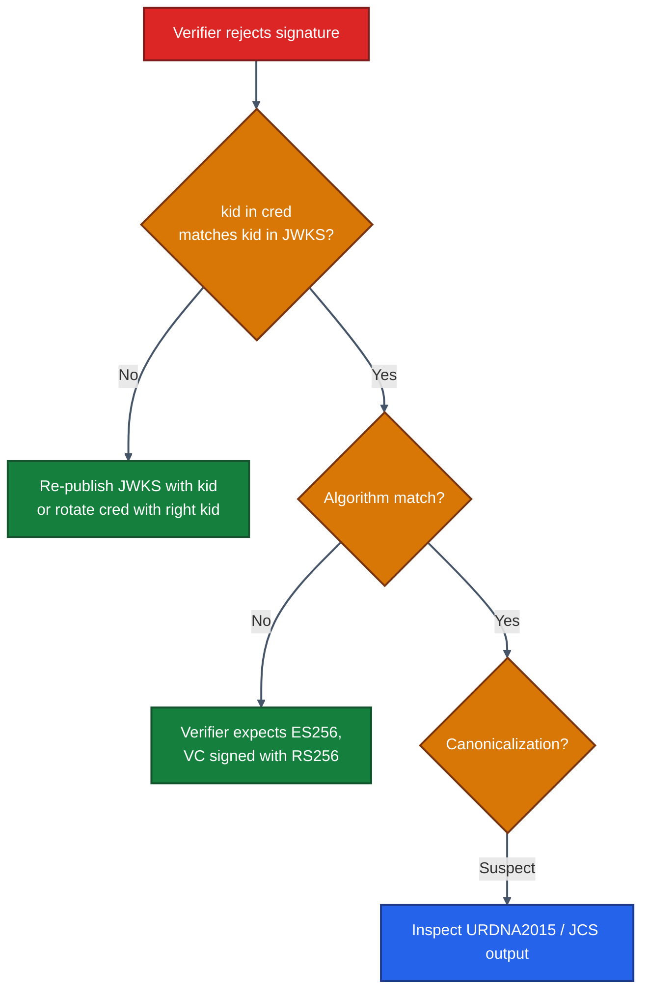
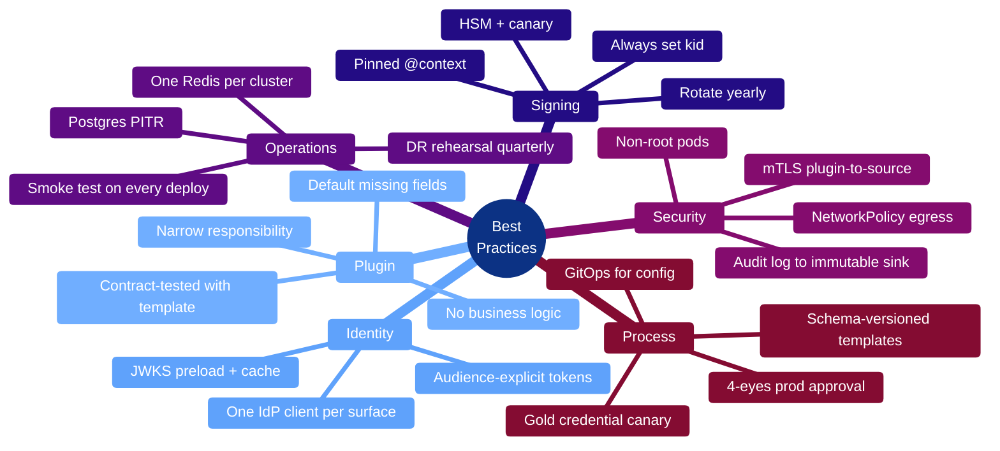

# 16 · Troubleshooting & Best Practices

> **Field manual for keeping an Inji deployment honest.** This chapter consolidates the recurring failure modes we see, with diagnosis flows, log signatures, and best-practice patterns that prevent them in the first place.

---

## 16.1 The Five Failure Categories



Most production incidents fall into exactly one of these. Identifying the category first cuts diagnosis time in half.

---

## 16.2 Category 1 — Identity & Token Issues

### Symptom: `401 invalid_token` on `/credential`



**Log signatures to grep:**

```
ERROR ... InvalidTokenException: aud mismatch: expected=https://certify.example.com, got=https://api.example.com
WARN  ... JwksClient could not retrieve keys from https://idp.example.com/.../certs
```

**Properties to verify:**

```properties
mosip.certify.authn.issuer-uri=...
mosip.certify.authn.jwk-set-uri=...
mosip.certify.identifier=...
```

**Best-practice prevention:**
- Set `mosip.certify.jwks.preload=true` so JWKS is fetched at startup, not on first request.
- Add a startup probe that hits `/.well-known/openid-credential-issuer` and the IdP's `/.well-known/openid-configuration`.
- Document the audience expected by Certify in every IdP client configuration record.

---

### Symptom: pre-auth code returns `invalid_grant`

Usually:
1. Code already used (one-shot).
2. TTL expired (default 10 min).
3. Code generated by a different Certify instance than the one redeemed it (sticky-session issue when replicas don't share Redis).

**Best practice:** all replicas must point to **one** Redis. Do not run Redis per pod.

---

## 16.3 Category 2 — Plugin & Data Issues

### Symptom: `500 internal_error` with stack trace from plugin



**Log signatures:**

```
ERROR ... DataProviderPlugin.fetchData failed: subject=u-1234
ERROR ... NullPointerException at velocity.transcript-v1:21
```

**Best practices:**
- The plugin should **never** throw `RuntimeException`. Wrap data-source errors in a domain exception that maps to a 4xx if user-fault (not found, ineligible) and 5xx if infra (DB down).
- Every claim used in a Velocity template should be **defensively defaulted** in the plugin (`null → ""` or omit the claim).
- Add a contract test that exercises every template with realistic plugin output. Catch missing fields in CI.

---

### Symptom: stale data in issued credentials

Caused by a per-process cache in the plugin holding values past their freshness window. Either:
- Shorten the TTL.
- Invalidate on the upstream signal (Kafka event, webhook).
- Remove the cache and rely on the data source's own caching layer.

**Best practice:** don't put a cache in a plugin unless you've measured a real latency problem. Caches are a debugging hazard.

---

## 16.4 Category 3 — Signing & Key Issues

### Symptom: verifier says "signature invalid" but issuance succeeded



**Best practices:**
- Always include `kid` in every signature.
- Never reuse a `kid` across rotations.
- For LD-Proofs, use the in-tree canonicalizer; never round-trip the JSON through a formatter.
- Pin every JSON-LD `@context` to a URL **you control** with version-stable content.

---

### Symptom: HSM signing latency spike

Causes:
1. HSM token saturated — single-threaded slot.
2. Connection pool starved.
3. Wrong key handle, vendor library retrying.

**Best practices:**
- Pre-create a pool of signing sessions at startup.
- Run an HSM-latency canary every minute and alert on >250 ms p95.
- Plan for HSM failover: a secondary HSM should be pre-provisioned with replicated keys; signed credentials must still verify against the same public key regardless of which HSM signed.

---

## 16.5 Category 4 — Wallet & Protocol Issues

### Symptom: wallet receives `invalid_proof`

The wallet's proof JWT didn't match the latest `c_nonce`. Common reasons:

| Cause | Fix |
|------|-----|
| Wallet uses stale `c_nonce` from a previous attempt | Wallet logic must always read the most recent `c_nonce` field from token / credential response |
| Clock skew between wallet and server | Ensure both sync NTP; allow ±30 s tolerance |
| Wallet signs with wrong `aud` claim | `aud` must equal `credential_issuer` from metadata |

**Best practice:** publish `iat`/`exp` requirements in your developer docs. A wallet integrating with your issuer should know the allowed skew.

---

### Symptom: wallet shows credential as "could not be verified" after import

The wallet ran its own local check and a step failed. Diagnose:

1. Inspect the rendered VC manually — `jq` for JSON-LD, decode the JWT body for SD-JWT.
2. Run the credential through Inji Verify in test mode with verbose logging.
3. Verify the issuer's DID document and JWKS resolve correctly with `curl`.

**Best practice:** maintain a **gold credential** — a known-good VC, refreshed on every release, that you can verify end-to-end as a smoke test.

---

### Symptom: `presentation_definition_unsatisfied` from wallet

The wallet has no credential matching the PE/DCQL filter. Possible mismatches:

| What you asked for | What wallet has | Fix |
|------|------|----|
| `path: $.credentialSubject.age_over_18` | Cred uses `age >= 18` numeric field | Use a path that exists |
| `type: BachelorDegreeCredential` | Cred is `DegreeCredential` | Loosen type or re-issue |
| `format: vc+sd-jwt` | Cred is `ldp_vc` | Mismatch — pick one |

**Best practice:** version your PE/DCQL like API contracts. If you change a claim path, treat it as a breaking change.

---

## 16.6 Category 5 — Infrastructure Issues

### Symptom: random `502 Bad Gateway`

Usually NGINX/Ingress losing connection to a pod that's restarting.

**Best practices:**
- Tune Ingress `proxy_read_timeout` to 60 s (issuance can take a few seconds in cold-start).
- Configure `terminationGracePeriodSeconds: 60` on Certify pods so they drain inflight requests.
- Set `readinessProbe` to gate traffic until JWKS preload completes.

---

### Symptom: Postgres CPU pegged at 100 %

Usually:
1. A plugin doing N+1 queries per credential.
2. Status-list re-signing on every revocation rather than batching.
3. Audit table growing unbounded — missing index or partition.

**Best practices:**
- Profile plugin SQL with `pg_stat_statements`.
- Batch status-list refreshes (e.g. every 5 min, signed once).
- Partition long-lived tables by month or by issuer.

---

### Symptom: Redis evictions

Probably a memory-policy mismatch. Set `maxmemory-policy=allkeys-lru` for a Certify cache, never `noeviction` (would cause writes to fail).

---

## 16.7 Diagnostic Toolkit

### Quick log queries (assuming Loki / Grafana)

```logql
# Failed credential issuances in last 15 min
{app="inji-certify"} |= "credential" |= "ERROR" | json | line_format "{{.thread}} {{.message}}"

# Token validation failures
{app="inji-certify"} |= "InvalidTokenException"

# Plugin latency outliers
{app="inji-certify"} |= "DataProviderPlugin" | json | line_format "{{.latency_ms}} {{.subject_id}}"
```

### Health endpoints

```bash
curl https://certify.example.com/actuator/health      # liveness
curl https://certify.example.com/actuator/info        # version / git
curl https://certify.example.com/actuator/prometheus  # metrics
```

### Quick smoke test

Use the cURL sequence in [./14-API-Reference.md](./14-API-Reference.md) §14.20 — run it manually when something feels off; it pins down the broken step in under a minute.

### Wallet-side debug

- `adb logcat | grep inji` on Android.
- Safari Web Inspector for Inji Web.
- iOS Console.app filtered to the app bundle id.

---

## 16.8 Best Practices, Summarised



---

## 16.9 Runbooks — Three That Pay Off Immediately

### RB-01 — "Issuance rate dropped"

1. Check `/actuator/health` on each replica.
2. Inspect Grafana issuance dashboard — is it the whole fleet or one pod?
3. Tail logs: `ERROR` and `WARN` count by class.
4. Compare with IdP-side metrics — is the IdP failing token issuance upstream?
5. If plugin-related, check the data source health.
6. Roll back the most recent deploy if symptom started < 1 h after deploy.

### RB-02 — "Verifier rejects all credentials suddenly"

1. Confirm new key was added to JWKS *before* being used for signing.
2. `curl /oauth/jwks.json` and verify `kid` matches credentials in the field.
3. Check status-list reachability — verifier may be marking everything "status unknown".
4. Confirm the DID document at `.well-known/did.json` is still well-formed and signed (if signed).

### RB-03 — "Wallet onboarding fails for new users"

1. Check Mimoto issuer registry for typos in URLs.
2. Confirm IdP redirect URIs include the wallet's exact deep-link.
3. Verify scope `credential` is granted to the wallet client.
4. Test from a known-good sandbox wallet build to isolate wallet vs server.

---

## 16.10 Postmortem Template

After every Sev-1 incident, write a postmortem capturing:

1. **Timeline** (UTC, minute-by-minute, what happened and who acted).
2. **Impact** (who was affected, how many issuances/verifications failed, what data was leaked or destroyed).
3. **Root cause** (the *real* cause, not the symptom).
4. **Trigger** (what set it off).
5. **Detection lag** (how long until alert fired vs how long until human acted).
6. **Mitigation** (what stopped the bleeding).
7. **Action items** (with owners and due dates):
   - Tests to add.
   - Alerts to refine.
   - Code to change.
   - Documentation to write.

Blameless, focused on the **system**, not the individual.

---

## 16.11 Reducing Toil — Long-Term Patterns

| Pattern | Pay-off |
|--------|---------|
| GitOps everything | Eliminates "who changed the config" mysteries |
| Synthetic canary every minute | Detects most regressions before users |
| Schema versioning on templates | Lets you roll back template changes safely |
| Plugin in its own repo, semver-published | Decouples plugin lifecycle from Certify upgrades |
| Pre-prod parity with prod | Bugs caught before users see them |
| Read-only Sundays (no deploys) | Reduces incident rate week-over-week |

---

## 16.12 When to Open an Upstream Issue

Open one at [github.com/inji/inji-certify](https://github.com/inji/inji-certify/issues) when:

- A documented behaviour deviates from spec (OpenID4VCI / W3C VCDM / SD-JWT VC).
- A plugin SPI is missing and forces an unreasonable workaround.
- A bug reproduces in a clean docker compose stack.

Don't open one when:

- It's your own plugin's bug.
- It's a documentation request — better as a PR to the docs.
- It's only reproducible with proprietary config.

---

## 16.13 What's Next

You now have the playbook. The final chapter is the **glossary** — definitions of every standard and acronym, plus a reading list to go deeper.

➡️ **[17 · Glossary & References](./17-Glossary-and-References.md)**
