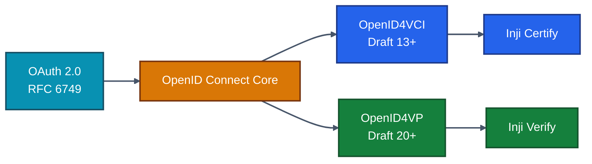
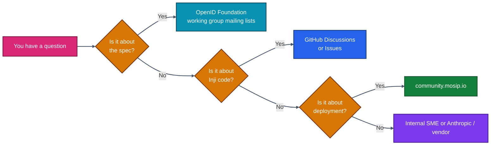

# 17 · Glossary & References

> **The vocabulary of Verifiable Credentials, the standards that define them, and a curated reading list for going deeper.** Use this chapter as a permanent reference, and link to it from anywhere ambiguity creeps in.

---

## 17.1 Glossary (Alphabetical)

### A

**Access Token** — Short-lived OAuth2 token granting the wallet permission to call Certify's `/credential` endpoint. Bears the user's identity claims and audience binding.

**Assertion Method** — In a DID document, a verification method whose key can be used to sign credentials *as the controller*. Inji's issuer DID lists its signing key under `assertionMethod`.

**Audience (`aud`)** — A JWT claim identifying who the token is intended for. Certify checks `aud == mosip.certify.identifier`. The #1 source of `401 invalid_token`.

**Authorization Code Grant** — Standard OAuth2 flow where the wallet receives a code from the IdP and exchanges it for an access token. Default for user-initiated issuance.

### B

**Bitstring Status List** — W3C draft that encodes credential revocation state as a compressed bit array, published as a signed JSON-LD credential. Single 16-KB list can cover ~131 072 credentials.

**Backend-for-Frontend (BFF)** — Architectural pattern where a server tailored to one client front-end mediates between it and downstream services. Mimoto is a BFF for Inji wallets.

### C

**Canonicalization** — Producing a byte-deterministic form of a document so two parties can sign the *same* bytes. JSON-LD uses URDNA2015 / JCS; matters for `ldp_vc`.

**`c_nonce`** — A server-issued nonce the wallet must echo (signed) when calling `/credential`, preventing replay of credential requests.

**`credential_configuration`** — Inji's first-class definition of "we can issue this type, in this format, under these signing rules." Discovered via OpenID4VCI metadata.

**Credential Offer** — An issuer-initiated invitation containing what's offered and how to claim it. Delivered as URL, QR, or push.

### D

**DCQL** — *Digital Credentials Query Language*. A newer OpenID4VP query format alternative to DIF Presentation Exchange. Simpler to author, growing wallet support.

**DID (Decentralized Identifier)** — A globally unique URI whose method dictates how to resolve a key/document. Inji typically uses `did:web` for issuers.

**DID Document** — JSON-LD document at a DID's resolution URL, describing keys and services. `did:web:example.com` resolves at `https://example.com/.well-known/did.json`.

**Disclosure (SD-JWT)** — A `[salt, claim, value]` triple, base64url-encoded, appended to an SD-JWT. The holder picks which disclosures to ship.

### E

**EdDSA / Ed25519** — Edwards-curve signature scheme. Compact (64-byte signatures), fast, no `kid`-related ambiguity. Default for `ldp_vc` in Inji.

**eSignet** — MOSIP's reference OIDC authorization server, optionally fronted by national identity systems. Optional in Inji — any OIDC provider works.

### F

**Format (in OpenID4VCI)** — String identifying the wire form: `ldp_vc`, `vc+sd-jwt`, `mso_mdoc`, `jwt_vc_json`. Determines the formatter and signer in Certify.

### H

**Holder Binding** — Cryptographic link tying a credential to a key the holder controls. Verifiers check it during presentation; without it, credentials are bearer tokens.

**HSM (Hardware Security Module)** — Tamper-resistant key store. Inji integrates via PKCS#11 (Luna, CloudHSM, nCipher, SoftHSM for dev).

### I

**Identifier (`mosip.certify.identifier`)** — Certify's own resource-server URI; the value expected as `aud` in incoming access tokens.

**Inji** — MOSIP's open-source stack for Verifiable Credentials. Comprises Certify (issuer), Verify (verifier), Mobile + Web (wallets), Mimoto (BFF).

**Inji Certify** — The OpenID4VCI issuer service. The chapter for most of this doc.

**Inji Verify** — The OpenID4VP verifier service plus React SDK.

**Issuer Metadata** — The document at `/.well-known/openid-credential-issuer` describing what an issuer offers.

### J

**JCS (JSON Canonicalization Scheme)** — RFC 8785 deterministic JSON serialization. Used by `eddsa-jcs-2022` cryptosuite.

**JWKS (JSON Web Key Set)** — A document containing public keys, served from a well-known URL. Used by Certify to verify access tokens and by verifiers to check SD-JWT issuer signatures.

**JWS (JSON Web Signature)** — Compact serialized form: `header.payload.signature`. The bedrock for SD-JWT and `jwt_vc_json`.

### K

**`kid` (Key ID)** — A short string identifying which key signed something. Always set it. Never reuse it across rotations.

**KB-JWT (Key Binding JWT)** — Trailing JWT on an SD-JWT presentation, signed with the holder's key, proving they control it now.

### L

**LD-Proof (Linked Data Proof)** — Signature attached as a `proof` object to a JSON-LD document. The signature method is named (e.g. `eddsa-jcs-2022`) and points to a `verificationMethod`.

**`ldp_vc`** — OpenID4VCI format string for a W3C VC with LD-Proof.

### M

**mDoc / mDL** — Mobile Document / Mobile Driving Licence, ISO/IEC 18013-5. CBOR + COSE, not JSON. Inji has mock support today; production maturity is on the roadmap.

**Mimoto** — Inji's BFF for wallets. Speaks REST to wallets, OpenID4VCI to issuers.

**MOSIP** — Modular Open Source Identity Platform. The umbrella programme; Inji is one product family within it.

**`mso_mdoc`** — OpenID4VCI format string for mDoc/mDL.

### N

**`notification` endpoint** — OpenID4VCI endpoint that wallets call after storing (or failing to store) a credential. Used for audit and lifecycle linkage.

### O

**OAuth2** — Token-issuance protocol underpinning OpenID4VCI. Inji speaks the OAuth2 *resource server* role.

**OIDC (OpenID Connect)** — Identity layer over OAuth2 adding ID-Tokens. Inji uses OIDC for user authentication when issuing.

**OpenID4VCI** — OpenID for Verifiable Credential Issuance. The wire protocol for issuing VCs to wallets.

**OpenID4VP** — OpenID for Verifiable Presentations. The wire protocol for wallets presenting credentials to verifiers.

### P

**PE (Presentation Exchange)** — DIF spec for expressing what credentials a verifier needs. v2 is current; supported by Inji's verify service alongside DCQL.

**PKCE (Proof Key for Code Exchange)** — OAuth2 extension making the authorization-code grant safe for public clients (wallets). Always required for wallet OIDC clients.

**Pre-Authorized Code Grant** — OAuth2 extension where the issuer hands the wallet a code directly (no user redirect). Powers "tap link to claim credential" flows.

**Plugin (`DataProviderPlugin` / `VCIssuancePlugin`)** — Inji Certify's extension point. `DataProvider` lets Certify build & sign; `VCIssuance` lets Certify proxy a pre-built VC. See [./07-Plugins-And-Modules.md](./07-Plugins-And-Modules.md).

**`proof` (in `/credential` request)** — The wallet-signed JWT proving possession of the key bound into the credential.

### R

**Relying Party (RP)** — The verifier — the app that needs the holder to prove something. Drives the OpenID4VP flow.

**Revocation** — Declaring a previously valid VC no longer trustworthy. Inji uses Bitstring Status List by default.

### S

**SD-JWT VC** — IETF draft format combining JWS with selective disclosure via salted hashed claims. Compact, privacy-respecting, increasingly the W3C/IETF default.

**Selective Disclosure** — Revealing only some claims of a credential, never the full content. Native in SD-JWT and mDoc.

**Status List** — See *Bitstring Status List*.

### T

**Trust List** — A verifier-side list of issuers it accepts. Hard requirement for production; protects against forged but technically valid credentials from rogue issuers.

### V

**VC (Verifiable Credential)** — A digitally signed claim about a subject, in a format that allows independent verification of the claim and the issuer.

**VCDM (Verifiable Credentials Data Model)** — W3C standard defining what a VC is, its required and optional fields, and how proofs attach.

**Velocity Template** — Apache Velocity is the templating engine Inji Certify uses to render the `credentialSubject` from plugin-provided data. See [./11-VC-Formats-and-Implementations.md](./11-VC-Formats-and-Implementations.md).

**Verifier** — The party that checks a presentation. Inji Verify is the reference implementation.

**Verification Method** — A specific key inside a DID document, addressable as `did:method:id#fragment`, used for signing or assertion.

**VP (Verifiable Presentation)** — A signed bundle of one or more VCs prepared by the holder for a specific verifier interaction.

**`vp_token`** — In OpenID4VP, the actual presentation payload posted by the wallet to the verifier.

### W

**WebAuthn-style key** — A device-bound asymmetric key. Inji wallets generate per-credential keys in TEE/SE, similar in spirit to WebAuthn.

---

## 17.2 Standards & Specifications

### OpenID for Verifiable Credentials family

| Spec | Authority | Status | Why it matters |
|------|-----------|--------|---------------|
| OAuth 2.0 (RFC 6749) | IETF | Standard | Token-bearing transport |
| OpenID Connect Core 1.0 | OIDF | Standard | User authentication |
| OpenID4VCI | OIDF | Implementer's Draft 13+ | Issuance protocol |
| OpenID4VP | OIDF | Implementer's Draft 20+ | Presentation protocol |

Find them at [openid.net/specs](https://openid.net/specs/).

### Credential data models

| Spec | Authority | Status | Format |
|------|-----------|--------|--------|
| W3C Verifiable Credentials Data Model v2 | W3C | Recommendation | JSON-LD |
| IETF SD-JWT (general) | IETF | Internet-Draft | JWS with disclosures |
| IETF SD-JWT VC | IETF | Internet-Draft | VC profile of SD-JWT |
| ISO/IEC 18013-5 mDL | ISO | International Standard | CBOR + COSE |

### Cryptography

| Spec | Authority | What |
|------|-----------|------|
| RFC 8032 | IETF | Ed25519 / EdDSA |
| RFC 7515 / 7517 / 7518 / 7519 | IETF | JWS / JWK / JWA / JWT |
| RFC 8785 | IETF | JSON Canonicalization Scheme |
| W3C Data Integrity 1.0 | W3C | LD-Proof framework |

### Decentralized Identifiers

| Spec | Authority | What |
|------|-----------|------|
| W3C DID Core 1.0 | W3C | Decentralized Identifier model |
| `did:web` method | W3C | DNS-based resolution |
| `did:key` method | W3C | Single-key DIDs |
| `did:jwk` method | community | DID derived from a JWK |

---

## 17.3 Inji Source Repositories — Quick Index

| Repo | Purpose | License |
|------|--------|---------|
| [github.com/inji/inji-certify](https://github.com/inji/inji-certify) | Issuer service | MPL-2.0 |
| [github.com/inji/digital-credential-plugins](https://github.com/inji/digital-credential-plugins) | Reference plugins (CSV, Postgres, IDA, Sunbird) | MPL-2.0 |
| [github.com/inji/inji-verify](https://github.com/inji/inji-verify) | Verify service + React SDK | MPL-2.0 |
| [github.com/inji/inji-web](https://github.com/inji/inji-web) | Browser wallet | MPL-2.0 |
| [github.com/inji/inji-mobile](https://github.com/inji/inji-mobile) | Mobile wallet (React Native) | MPL-2.0 |
| [github.com/inji/mimoto](https://github.com/inji/mimoto) | BFF for wallets | MPL-2.0 |
| [github.com/inji/inji-openid4vp](https://github.com/inji/inji-openid4vp) | Kotlin & Swift OpenID4VP libs | MPL-2.0 |
| [github.com/mosip/vc-verifier-credentials](https://github.com/mosip/vc-verifier-credentials) | Reusable verification primitives | MPL-2.0 |
| [github.com/mosip/pixelpass](https://github.com/mosip/pixelpass) | Offline QR encoding | MPL-2.0 |
| [github.com/mosip/kernel-keymanager](https://github.com/mosip/kernel-keymanager) | Key management library | MPL-2.0 |
| [github.com/mosip/inji-helm](https://github.com/mosip/inji-helm) | Reference Helm charts | MPL-2.0 |

---

## 17.4 Documentation Portals

| Site | What it offers |
|------|---------------|
| **[mosip.stoplight.io](https://mosip.stoplight.io/)** | **Canonical interactive API portal** — every MOSIP/Inji endpoint with request/response examples and a "try-it-now" console. Treat as source of truth when the wire contract is in question. |
| [docs.inji.io](https://docs.inji.io) | Official product docs (overview, build, deploy) |
| [docs.mosip.io](https://docs.mosip.io) | MOSIP platform context |
| [deepwiki.com/inji/inji-certify](https://deepwiki.com/inji/inji-certify) | Code-level deep-wiki (architecture, plugin model) |
| [community.mosip.io](https://community.mosip.io) | Public discussion forum |

---

## 17.5 Reading List by Role

### For Architects (depth-first)

1. *W3C VCDM v2* — start with the data model.
2. *OpenID4VCI Draft* — the issuance protocol on the wire.
3. *OpenID4VP Draft* — the verification protocol.
4. *SD-JWT VC Draft* — the format you'll use most.
5. Inji repos `README.md` files — pragmatic shape of each component.
6. EU Digital Identity Wallet ARF — for cross-border patterns.

### For Backend Engineers (build-first)

1. [./04-Sample-Setup-Guide.md](./04-Sample-Setup-Guide.md) — get it running.
2. [./07-Plugins-And-Modules.md](./07-Plugins-And-Modules.md) — own a plugin.
3. [./14-API-Reference.md](./14-API-Reference.md) — the API surface.
4. Spring Boot 3.x docs — the framework Certify rides on.
5. Nimbus JOSE+JWT docs — the JWT library used internally.

### For Frontend Engineers

1. [./12-Inji-Verify-Integration.md](./12-Inji-Verify-Integration.md) — embed verification.
2. React 18 docs — peer dep of the SDK.
3. *OpenID4VP* — what the SDK abstracts.
4. *DIF Presentation Exchange v2* — query authoring.

### For SREs / DevOps

1. [./15-Deployment-Guide.md](./15-Deployment-Guide.md) — concrete K8s patterns.
2. [./16-Troubleshooting-and-Best-Practices.md](./16-Troubleshooting-and-Best-Practices.md) — operate it.
3. Helm chart README at [mosip/inji-helm](https://github.com/mosip/inji-helm).
4. Prometheus + Grafana docs for the observability layer.

### For Compliance & Privacy

1. EU GDPR Articles 5, 25, 32 — privacy-by-design.
2. eIDAS 2.0 + EUDI Wallet — regulatory direction.
3. ISO/IEC 18013-5 — when mDL is in scope.
4. NIST SP 800-63-3 — assurance levels alignment.

---

## 17.6 Where to Get Help

When opening a GitHub issue:

- Include Inji version (`/actuator/info`).
- Include the `application.properties` excerpt (redact secrets).
- Include the **exact** request/response (redact PII).
- Reproduce in a clean compose stack if possible.

---

## 17.7 Versioning Notes

This documentation set was assembled against:

| Component | Version |
|-----------|---------|
| Inji Certify | 0.14.x |
| Inji Verify | 0.10.x |
| Inji Web | 0.11.x |
| Inji Mobile | 0.13.x |
| Mimoto | 0.13.x |
| OpenID4VCI | Draft 13 |
| OpenID4VP | Draft 20 |
| W3C VCDM | v2 |
| SD-JWT VC | IETF Draft 03 |

Re-check the upstream version pages before adopting any specific behaviour, since protocols are still moving.

---

## 17.8 Final Words

The Inji stack is **standards-first, composable, opinionated where it counts, configurable everywhere else**. The most successful adopters we've watched:

- Started with the sandbox, then ran Docker Compose locally before touching K8s.
- Wrote *one* plugin first, kept it narrow, and iterated.
- Picked **one** VC format and grew into multi-format only when downstream demanded it.
- Treated their IdP as a first-class boundary, not an afterthought.
- Onboarded their wallet via Mimoto rather than forking right away.
- Built a smoke-test runbook on day one and kept it green.

This document set will keep working as a reference as you go from prototype to production. Treat it as living — when something is unclear or wrong, fix it in place.

➡️ **[← Back to Table of Contents](./README.md)**
