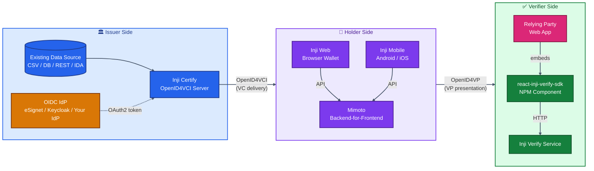

# MOSIP Inji Stack — Comprehensive Developer Documentation

> **A complete developer reference for building, integrating, customizing, and deploying Verifiable Credential (VC) workloads on the MOSIP Inji stack.**

This documentation set is a deep, opinionated developer guide built on top of the official Inji documentation (https://docs.inji.io) and the source repositories under https://github.com/inji/. It is organized so a development team can go from **zero knowledge** to **production-ready integration** without leaving the document set.

---

## 📚 Table of Contents

| # | Document | Purpose |
|---|----------|---------|
| 01 | [Introduction & Overview](./01-Introduction-and-Overview.md) | What Inji is, the Triangle of Trust, where each module fits |
| 02 | [Architecture & Components](./02-Architecture-and-Components.md) | System architecture, layered design, technology stack, Mermaid diagrams |
| 03 | [Sandbox Exploration](./03-Sandbox-Exploration.md) | Exploring the Collab sandbox at collab.mosip.net, what to try, what to look for |
| 04 | [Sample Setup Guide](./04-Sample-Setup-Guide.md) | End-to-end Docker Compose ("InjiStack") setup, every directory and file explained |
| 05 | [Codebase Exploration](./05-Codebase-Exploration.md) | Maven multi-module layout of `inji-certify`, how the source is organized, where to make changes |
| 06 | [Pre-Auth Flow Without eSignet](./06-Pre-Auth-Flow-Without-eSignet.md) | Replacing eSignet with **Keycloak or any OIDC provider**, full property reference, client configuration |
| 07 | [Plugins & Modules](./07-Plugins-And-Modules.md) | `DataProviderPlugin` vs `VCIssuancePlugin`, writing your own, deployment patterns |
| 08 | [Modularity Aspects](./08-Modularity-Aspects.md) | How to consume Inji modules independently — Certify only, Verify SDK only, Wallet SDK only |
| 09 | [External Data Sources](./09-External-Data-Sources.md) | Connecting CSV, Postgres, REST APIs, MOSIP IDA, Sunbird RC, and your own systems |
| 10 | [Platform Integration Strategies](./10-Platform-Integration-Strategies.md) | Patterns for plugging Inji into an existing platform: BFF, sidecar, proxy, embedded SDK |
| 11 | [VC Formats & Implementations](./11-VC-Formats-and-Implementations.md) | JSON-LD (ldp_vc), SD-JWT (vc+sd-jwt), mDoc/mDL, Velocity templates, signing algorithms |
| 12 | [Inji Verify Integration](./12-Inji-Verify-Integration.md) | React SDK, OpenID4VP same-device / cross-device flows, custom verifier UI |
| 13 | [Inji Wallet Integration](./13-Inji-Wallet-Integration.md) | Inji Mobile, Inji Web, Mimoto BFF, OIDC client onboarding |
| 14 | [API Reference](./14-API-Reference.md) | OpenID4VCI endpoints, credential configuration API, status list API, system info |
| 15 | [Deployment Guide](./15-Deployment-Guide.md) | Local Dev, Docker Compose, Kubernetes/Helm, custom plugin deployment, hardening |
| 16 | [Troubleshooting & Best Practices](./16-Troubleshooting-and-Best-Practices.md) | Recurring issues, log inspection, DID/key recovery, observability |
| 17 | [Glossary & References](./17-Glossary-and-References.md) | Standards (W3C VCDM, OpenID4VCI, OpenID4VP, ISO 18013-5, SD-JWT VC) + further reading |

---

## 🎯 Who This Document Is For

| Reader | Where to start |
|--------|---------------|
| **Architect** evaluating Inji for a programme | 01 → 02 → 08 → 10 |
| **Backend engineer** integrating issuance | 02 → 04 → 06 → 07 → 09 → 14 |
| **Frontend engineer** building a verifier UI | 02 → 12 → 14 |
| **DevOps / SRE** preparing a deployment | 04 → 15 → 16 |
| **Plugin author** extending Certify | 05 → 07 → 09 → 11 |
| **Standards / compliance** reviewer | 01 → 11 → 17 |

---

## 🧭 High-Level Mental Model

---

## 🔑 Key Takeaways Upfront

1. **Inji is not a monolith.** It is a *stack* of independently usable services + SDKs. You can adopt any subset.
2. **Certify supports two plugin modes** — `DataProvider` (Certify builds & signs the VC) and `VCIssuance` (Certify is just a proxy for an external VC source). Choose deliberately.
3. **You do not need eSignet.** Any OIDC-compliant Authorization Server (Keycloak, Auth0, Okta, Azure AD, your own) works, because Certify validates standard OAuth2 access tokens via JWKS.
4. **Plugins are JARs**, loaded either bundled in the Docker image (`inji-certify-with-plugins`) or dropped into a `loader_path` directory at runtime.
5. **Multiple VC formats are first-class**: JSON-LD (`ldp_vc`), SD-JWT (`vc+sd-jwt`), and mDoc/mDL (`mso_mdoc`, mock today, full upcoming).
6. **Verify ships as a backend service AND a React SDK** (`@mosip/react-inji-verify-sdk`), so you can embed verification into your own UI without forking.

---

## 🗂️ Source References Used

All content in this set has been distilled and cross-checked against:

- 📖 https://docs.inji.io — official product documentation
- 🛰️ **https://mosip.stoplight.io/** — **canonical interactive API portal** (every MOSIP/Inji endpoint with live "try-it-now" examples; treat as source of truth for the wire contract)
- 🧱 https://github.com/inji/inji-certify — issuer service source
- 🧱 https://github.com/inji/digital-credential-plugins — official plugin implementations
- 🧱 https://github.com/inji/inji-verify — verifier service + SDK
- 🧱 https://github.com/inji/inji-web — Inji Web wallet
- 🧱 https://github.com/inji/mimoto — Backend-for-Frontend used by wallets
- 🧱 https://github.com/inji/inji-openid4vp — OpenID4VP Kotlin/Swift libraries
- 📜 OpenID4VCI Draft 13 — https://openid.net/specs/openid-4-verifiable-credential-issuance-1_0-ID1.html
- 📜 W3C Verifiable Credentials Data Model — https://www.w3.org/TR/vc-overview/
- 📜 ISO/IEC 18013-5 (mDL), IETF SD-JWT VC
- 🔍 DeepWiki reference — https://deepwiki.com/inji/inji-certify

---

## 📜 License Note

The MOSIP Inji documentation is licensed under **Creative Commons Attribution (CC-BY-4.0)** unless otherwise noted, and the source code is under the **Mozilla Public License 2.0 (MPL-2.0)**. This developer documentation reorganizes and extends the upstream material for internal use; please retain attribution if redistributing.
