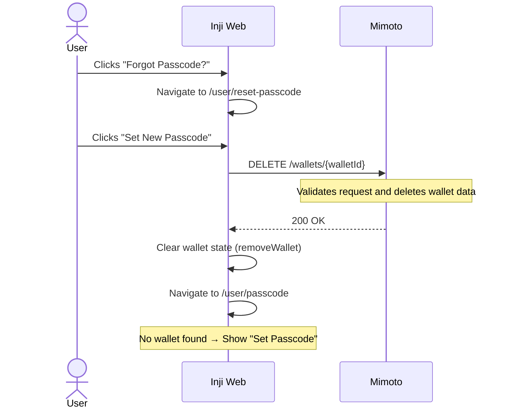

# Wallet Reset Flow (Forgot Passcode)

## 1. Overview

The **Forgot Passcode** flow in Inji Web is implemented as a **Wallet Reset** process. Since the user’s PIN is not stored, the existing Wallet Key cannot be recovered without it, making deletion and re-creation of the wallet the only recovery option.

## 2. Execution Flow

The flow is triggered when the user clicks the **"Forgot Passcode?"** link from the `/user/passcode` screen.

### Phase 1: User Initiation & Warning

1.  **Trigger:** User is on the `/user/passcode` screen and clicks the **"Forgot Passcode?"** link.
2.  **Navigation:** The browser routes to `/user/reset-passcode`.
3.  **Informed Consent:** The UI displays five critical security warnings:
    * Wallet will be securely reset.
    * All stored cards/credentials will be deleted.
    * User must set a brand-new passcode.
    * Cards must be re-downloaded from issuers.
    * This ensures data safety if the device is lost or the session is compromised.

### Phase 2: Wallet Reset

1.  **User Action:** The user clicks the **"Set New Passcode"** button.
2.  **API Request:** Inji Web sends a request to Mimoto to reset the wallet (`DELETE /wallets/{walletId}`).
3.  **Backend Handling:** Mimoto validates the request, deletes the wallet and associated data, and clears any related session attributes.

### Phase 3: Local State Reset & Re-routing

1.  **UI Cleanup:** On successful response, Inji Web clears wallet-related data from the application state.
2.  **Navigation:** The user is redirected back to the passcode setup screen.
3.  **Re-onboarding:** Because the backend no longer finds a wallet associated with the `USER_ID`, the user is greeted with the **"Set Passcode"** screen (Onboarding) instead of the "Enter Passcode" screen.

## 3. Architecture

Responsibilities are clearly separated between Inji Web and Mimoto.

* **Inji Web (UI & Orchestration):**
    * Provides the interface for initiating the **Forgot Passcode** flow and displaying security warnings.
    * Triggers the wallet deletion request via API.
    * Manages local application state, including clearing `walletId` and session context after reset.
    * Handles navigation and re-routing for user re-onboarding.

* **Mimoto (Backend & Persistence):**
    * Exposes APIs for wallet reset and related operations.
    * Validates the request and ensures secure deletion of wallet data.
    * Manages session state and clears any wallet-related context.
    * Handles persistence, including removal of wallet data and associated credentials.

## 4. Sequence Diagram

## 5. Integration

### API Reference

| API | Method | Stoplight Link                                                                        |
| :--- | :--- |:--------------------------------------------------------------------------------------|
| **Unlock Wallet** | `POST` | `/wallets/{walletId}/unlock`                                            |
| **Delete Wallet** | `DELETE` | `/wallets/{walletId}`                                                 |

For more details on the APIs listed above, visit the [Mimoto Stoplight documentation](https://mosip.stoplight.io/docs/mimoto)

## 6. Security Details

### PIN-Based Encryption

* The user’s **PIN is never stored**.
* A key derived from the PIN is used to encrypt and decrypt wallet data.
* Without the correct PIN, the data cannot be accessed.
* When the wallet is deleted, all associated encrypted data is permanently removed.

This ensures that even if database data is accessed, it cannot be used without the PIN.

### Session Security

* The wallet deletion request is tied to the user’s active session.
* The system validates that the request belongs to the correct user and wallet.
* Wallet-related session data is cleared after deletion.
* CSRF protection is enforced using an `X-XSRF-TOKEN`.

## 7. Inji Web Behavior

| Scenario | Logic | UI Feedback |
| :--- | :--- | :--- |
| **Success (200)** | Calls `removeWallet()` | Navigates to `/user/passcode` (Onboarding mode). |
| **Failure (4xx/5xx)** | Catch block triggers | Displays `resetFailure` message . |
| **Back Button** | Calls `handleBackNavigation()` | Navigates back to `/user/passcode` (Unlock mode). |

## 8. References

For low-level implementation details of the Mimoto wallet unlock and cryptographic flow, refer to:

* [Mimoto: Wallet Unlock Process](https://github.com/inji/mimoto/blob/master/docs/WalletUnlockProcess.md)
* [Mimoto: User Data Encryption with PIN-Based Key](https://github.com/inji/mimoto/blob/master/docs/UserDataEncryptionWithPinBasedKey.md)

For API documentation, refer to the Mimoto Stoplight:

* [Mimoto API Documentation](https://mosip.stoplight.io/docs/mimoto)