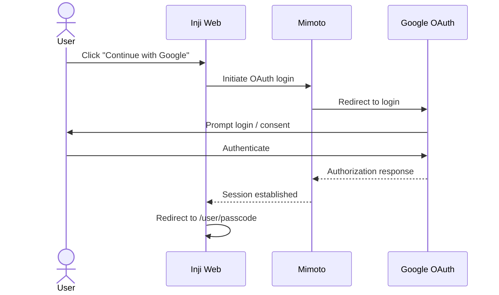

# OAuth2 Login & User Onboarding

## 1. Overview
The login flow allows users to log in using an **Identity Provider (IDP)** account and seamlessly access the application without creating a separate username or password.

> **Note:** The current implementation uses **Google** as the default Identity Provider.

When a user logs in:
- Their identity is verified by the Identity Provider.
- The system creates or retrieves an internal user profile.
- A secure session is established.
- The user is redirected to continue with wallet access (via passcode entry).

The system never stores IDP credentials and ensures that all sensitive user data is securely encrypted before being persisted.

This flow in Inji Web utilizes **Spring Security OAuth2** to provide a secure and seamless authentication experience. This process not only authenticates the user but also handles the automatic onboarding of new users.

The flow ensures that Personally Identifiable Information (PII) is protected at rest using encryption, while the user's identity is tied to a unique internal `userId` used for all subsequent wallet operations.

## 2. Prerequisites
To understand the underlying integration and environment setup required for this flow, please refer to the detailed [Mimoto OAuth2 Integration Guide](https://github.com/inji/mimoto/blob/master/docs/GoogleOauth2LoginIntegration.md).

**Core requirements include:**
* **OAuth2 Credentials**: Valid Client ID and Secret from your IDP (e.g., Google Cloud Console).
    * **Current Implementation**: For detailed steps on creating Google credentials, refer to the [Inji Web Google Credentials Guide](https://github.com/inji/inji-web/blob/master/docker-compose/README.md#how-to-create-google-client-credentials).
* **Redirect URIs**: Correctly configured callback URLs in both the IDP Console and Mimoto properties.

## 3. Execution Flow

### Phase 1: Login Start

1. The user clicks **"Continue with Google"** on Inji Web.
2. The app redirects the user to Google’s OAuth login page via Mimoto.

### Phase 2: Authentication

1. The user selects a Google account and provides consent (if required).
2. Google sends the response back to the backend.
3. The backend retrieves the user’s basic profile (name, email, picture).

### Phase 3: User Setup

1. The system checks if the user already exists.
2. If not, a new user profile is created.
3. The user is assigned a unique **userId** for future operations.

### Phase 4: Post-Login Handling

1. On successful login, a session is created.
2. The user is redirected to the **passcode page**.
3. If login fails, the user is redirected back with an error.

## 4. Architecture
The architecture ensures a clean separation between the user interface, security logic, and data persistence.
Mimoto owns the complete authentication lifecycle, while Inji Web only initiates the login and handles the final response.

* **Inji Web (UI)**: 
    * Starts the login process.
    * Handles redirects after login.
    * Does not manage authentication or sensitive data.
* **Mimoto (Security & Orchestration)**:
    * Handles the complete login and authentication flow.
    * Processes user information and manages sessions.
    * Ensures user data is securely handled and stored.
* **Storage & Security:**
    * User session data is maintained securely.
    * User profile data is stored in the database in a protected manner.

## 5. Sequence Diagram

For deeper understanding of the authorization flow, refer [Google OAuth2 Login Integration Guide](https://github.com/inji/mimoto/blob/master/docs/GoogleOauth2LoginIntegration.md)

## 6. Security
* **JSESSIONID Protection**: The session cookie is marked as **HttpOnly** and **Secure**, protecting against XSS-based session theft.
* **PII Privacy**: All user metadata (email, display name and profile picture) is encrypted before storage.

## 7. References
To understand the detailed steps for setting up the required credentials and the integration process, please refer to the following documentation:

* [How to create Google Client Credentials](https://github.com/inji/inji-web/blob/master/docker-compose/README.md#how-to-create-google-client-credentials)
* [Google OAuth2 Login Integration](https://github.com/inji/mimoto/blob/master/docs/GoogleOauth2LoginIntegration.md)