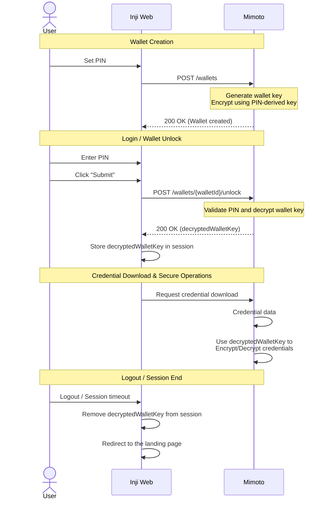

# User Data Encryption & PIN-Based Key Protection

## 1. Overview

The user's sensitive data is protected using a layered encryption model designed to ensure that sensitive information is never stored in plaintext. This mechanism ensures that Verifiable Credentials (VCs) and Personally Identifiable Information (PII) are never stored in plaintext. The core of this security is the **Wallet Key** - a master AES-256 key that is itself encrypted using a **Derived Key** generated from the user's **6-digit PIN**.

The primary goals are:

* Ensuring confidentiality of all sensitive data
* Protecting the Wallet Key through PIN-based encryption
* Securing data even if the database is compromised

## 2. Execution Flow

### Phase 1: PIN Setup & Wallet Key Creation

When a user sets a PIN, a secure **Wallet Key** is generated and encrypted using a key derived from that PIN.
The PIN itself is never stored, only its derived form is used.
* A random AES-256 Wallet Key is generated.
* A key is derived from the user’s PIN using a salt.
* The Wallet Key is encrypted using this derived key.
* The encrypted wallet key (with salt and IV) is stored securely.

### Phase 2: Wallet Unlock

When the user enters their PIN:
* The system derives the key again using the entered PIN and stored salt.
* This key is used to decrypt the Wallet Key.
* The decrypted Wallet Key is stored in the session for further operations.

### Phase 3: Secure Data Usage

Once unlocked:
* Credentials are encrypted using the Wallet Key before storage.
* User metadata is encrypted using a separate system-managed key.

For a detailed flow and deeper cryptographic understanding, refer to:
[User-data encryption with pin-based key](https://github.com/inji/mimoto/blob/master/docs/UserDataEncryptionWithPinBasedKey.md)

## 3. Architecture

Responsibilities are clearly separated between Inji Web and Mimoto.

* **Inji Web (UI & Orchestration):** 
    * Provides the interface for PIN setup and entry.
    * Initiates wallet creation and unlock requests
    * Maintains the authenticated session with Mimoto.
    * Does not perform cryptographic operations; it acts as the gateway to the user.
* **Mimoto (Crypto & Storage):**
    * Handles key derivation, encryption, and decryption operations.
    * Manages secure storage of wallet data, credentials, and user metadata.
    * Ensures sensitive data is encrypted before persistence.
    * Provides APIs for wallet lifecycle operations (create, unlock, reset).

## 4. Sequence Diagram: Secure Data Access

High-level sequence diagram illustrating the secure data access flow from wallet creation to credential usage is as follows:

To have a detailed understanding of the pin-derived key encryption flow, refer to the [following documentation](https://github.com/mosip/mimoto/blob/main/docs/UserDataEncryptionWithPinBasedKey.md)

## 5. Integration

### API Reference

| API | Method | Stoplight Link                      |
| :--- | :--- |:------------------------------------|
| **Unlock Wallet** | `POST` | `/wallets/{id}/unlock` |
| **User Metadata** | `GET` | `/users/metadata`     |

For more details on the APIs listed above, visit the [Mimoto Stoplight documentation](https://mosip.stoplight.io/docs/mimoto)

## 6. Security Specifications
Mimoto adheres to the following cryptographic standards to ensure security for the user data:

* **Algorithm:** AES-256 in GCM mode (`AES/GCM/NoPadding`).
* **Integrity:** GCM provides a 128-bit authentication tag to detect any tampering with the encrypted data.
* **Key Stretching:** PBKDF2 with **10,000 iterations** (configured via `mosip.kernel.crypto.hash-iteration`) to prevent brute-forcing of the 6-digit PIN. This property is defined in the `application-default.properties` file for the local setup, and in the `mimoto-default.properties` file for the environment setup.
* **Randomness:** Unique **32-byte salts** and **12-byte IVs** (Nonces) are generated for every encryption operation using `SecureRandom`.

## 8. References

For low-level implementation details of the Mimoto cryptographic layer, refer to:

* [Mimoto: User Data Encryption with PIN-Based Key](https://github.com/mosip/mimoto/blob/main/docs/UserDataEncryptionWithPinBasedKey.md)
* [Mimoto: Wallet Unlock Process](https://github.com/mosip/mimoto/blob/main/docs/WalletUnlockProcess.md)

For API documentation, refer to the Mimoto Stoplight:

* [Mimoto API Documentation](https://mosip.stoplight.io/docs/mimoto)